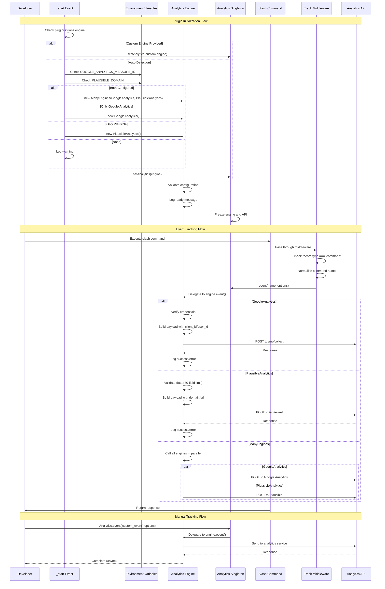

# @robojs/analytics Plugin - AI Agent Reference

This document is a deep technical reference for AI coding agents working on the `@robojs/analytics` plugin. It explains architecture, setup, flows, error handling, and gotchas. For user-facing documentation, see `README.md` in this package.

Note: This file is for AI agents and maintainers, not end users.

## Architecture Overview

- Core purpose: Integrate analytics services (Google Analytics, Plausible, custom) into Robo.js projects with a unified API.
- Key dependencies:
  - `robo.js` (peer, required) – Logger and framework integration
  - `discord.js` (dev) – Types for Discord interactions
- File roles:
  - `src/index.ts` – Public API exports (engines and Analytics object)
  - `src/core/analytics.ts` – Global Analytics singleton with frozen API
  - `src/core/loggers.ts` – Forked logger instance
  - `src/engines/base.ts` – Abstract BaseEngine class defining contract
  - `src/engines/google-analytics.ts` – Google Analytics implementation
  - `src/engines/plausible.ts` – Plausible implementation
  - `src/engines/many.ts` – Multi-engine wrapper
  - `src/events/_start.ts` – Lifecycle hook for engine initialization
  - `seed/middleware/track-commands.ts` – Middleware for tracking slash commands
  - `seed/commands/test-analytics.ts` – Test command demonstrating API usage
  - `seed/events/guildCreate.ts` – Event tracking bot server joins
  - `config/robo.mjs` – Plugin configuration

### High-level flow (Mermaid)



## Multi-Engine Architecture

### BaseEngine Abstract Class
- Location: `src/engines/base.ts`
- Purpose: Define the contract for all analytics engines
- Abstract methods:
  - `event(name: string, options?: EventOptions): Promise<void> | void`
  - `view(page: string, options?: ViewOptions): Promise<void> | void`
- EventOptions fields:
  - `action?`, `actionType?`, `data?`, `domain?`, `label?`, `name?`, `referrer?`,
    `revenue?: { currency: string; amount: number | string }`, `sessionId?`, `type?`, `url?`, `userId?`
- ViewOptions: extends EventOptions with `element?`, `elementId?`
- Usage: Extend BaseEngine and implement methods

### GoogleAnalytics Engine
- Location: `src/engines/google-analytics.ts`
- API: Google Analytics MP v4 – `https://www.google-analytics.com/mp/collect`
- Config: `{ measureId: string, token: string }` or env vars `GOOGLE_ANALYTICS_MEASURE_ID`, `GOOGLE_ANALYTICS_SECRET`
- Precedence: constructor options > env vars
- Event: maps options to GA params, uses `sessionId` → `client_id` (random if absent), `userId` → `user_id`
- View: `page_view` event with `page_title`
- Random ID: 30-character alphanumeric; not cryptographically secure
- Errors: logged with status; successes logged at debug
- Ready: logs "Google Analytics is ready to collect data."

### PlausibleAnalytics Engine
- Location: `src/engines/plausible.ts`
- API: Plausible Events API – `https://plausible.io/api/event`
- Config: `domain` via constructor or `PLAUSIBLE_DOMAIN` env var
- Event: requires `name`; payload `{ domain, name, url, props?: data }`; 30-field `data` limit (throws if exceeded)
- View: `pageview` name; url built from `domain` and `slugify(page)` if not provided
- Headers: fake `X-Forwarded-For` and `User-Agent`
- Errors: warnings; ready log "Plausible is ready to collect data."

### ManyEngines Wrapper
- Location: `src/engines/many.ts`
- Broadcasts `event()`/`view()` to all engines in parallel via `Promise.all()`
- Errors in one engine don’t block others; prefer engines to catch/log internally

## Global Analytics Object

- Location: `src/core/analytics.ts`
- `_analytics`: stores active engine instance
- `setAnalytics(engine)`: freezes and stores engine
- `Analytics` (frozen) methods:
  - `event(name, options?)`
  - `view(page, options?)`
  - `isReady()`
- Import usage: `import { Analytics } from '@robojs/analytics'`

## Environment Variable Configuration

### Google Analytics
- `GOOGLE_ANALYTICS_MEASURE_ID` (e.g., `G-XXXXXXXXX`)
- `GOOGLE_ANALYTICS_SECRET` (Measurement Protocol API Secret)
- Example:
```env
GOOGLE_ANALYTICS_MEASURE_ID="G-123456789"
GOOGLE_ANALYTICS_SECRET="abcdef123456"
```

### Plausible
- `PLAUSIBLE_DOMAIN` (e.g., `example.com`)
- Example:
```env
PLAUSIBLE_DOMAIN="example.com"
```

### Auto-Detection Logic (in `src/events/_start.ts`)
- Precedence: custom engine > both (ManyEngines) > Google only > Plausible only > warn
- Detects via env vars; logs warning if none configured with docs link

## Engine Initialization

- `_start` event handler: `export default (_client, options)`
- `PluginOptions`: `{ engine?: BaseEngine }`
- Steps:
  1) If custom engine provided, call `setAnalytics()` and return
  2) Else detect env vars and instantiate appropriate engine(s)
  3) Call `setAnalytics()` or warn if none
- Runs at Robo.js startup; analytics may be inactive but plugin still loads

### Plugin Configuration Examples

- Custom engine:
```ts
import { BaseEngine } from '@robojs/analytics'
class MyEngine extends BaseEngine { event(){} view(){} }
export default { engine: new MyEngine() }
```

- Multiple engines:
```ts
import { GoogleAnalytics, PlausibleAnalytics, ManyEngines } from '@robojs/analytics'
export default { engine: new ManyEngines(new GoogleAnalytics(), new PlausibleAnalytics()) }
```

## Seed Files

### Middleware: track-commands.ts
- Tracks all slash commands: normalizes name (`/` and `-` → `_`), calls `Analytics.event()`
- Data includes `{ type: 'slash_command' }`; uses `channelId`/`guildId` for sessionId and `user.id` as userId

### Command: test-analytics.ts
- Demonstrates all API methods; returns ephemeral confirmation

### Event: guildCreate.ts
- Tracks `server_join` with `{ name: guild.name, type: 'event' }` and sessionId = guild.id

### Seeding
- `config/robo.mjs` seeds the above for quick start during `npx robo add @robojs/analytics`

## Custom Engine Implementation

- Extend `BaseEngine`; implement `event()` and `view()`
- Read config from constructor and/or env vars; validate and log readiness
- Use `fetch()` for HTTP; catch and log errors; avoid throwing to prevent disruption
- Use `analyticsLogger` for consistent logs
- Consider rate limits, batching, retries, and privacy constraints

Example skeleton:
```ts
import { BaseEngine } from '@robojs/analytics'
import { analyticsLogger } from '../core/loggers.js'
import type { EventOptions, ViewOptions } from './base.js'

interface MyEngineOptions { apiKey: string; endpoint?: string }

export class MyEngine extends BaseEngine {
  constructor(private opts?: MyEngineOptions) {
    super()
    if (this.validate()) analyticsLogger.ready('MyEngine is ready to collect data.')
  }
  async event(name: string, options?: EventOptions) { if (!this.validate()) return }
  async view(page: string, options?: ViewOptions) { if (!this.validate()) return }
  private validate(): boolean { /* ... */ return true }
}
```

## Logging

- `src/core/loggers.ts`: `export const analyticsLogger = logger.fork('analytics')`
- Levels: `ready`, `debug`, `warn`, `error`
- Engines log configuration issues, API successes/failures, and readiness

## Critical Implementation Details

- Analytics object and engine instance are frozen (immutable).
- Google Analytics generates a random 30-char `client_id` if `sessionId` is missing (analytics use only).
- Plausible enforces 30-field limit on `data`; throws if exceeded.
- Plausible uses fake `X-Forwarded-For` and User-Agent headers.
- ManyEngines uses `Promise.all()`; ensure individual engines log their own errors.

## Common Gotchas & Pitfalls

1) Missing env vars → engine inert; check logs and use `Analytics.isReady()`.
2) Plausible `data` > 30 fields → error; reduce or split data.
3) Omitted `sessionId`/`userId` reduces accuracy; provide when possible.
4) Calling Analytics before init → guard with `Analytics.isReady()`.
5) Custom engine misconfigured → verify plugin config exports `{ engine }`.
6) Parallel engine errors → inspect per-engine logs.
7) Plausible domain mismatch → events not visible; ensure exact match.
8) Wrong GA measurement ID format → API errors; ensure it starts with `G-`.
9) Attempting to mutate Analytics → it’s frozen; do not modify.

## Testing Patterns

- Unit: mock `fetch()`, validate payloads, simulate failures, assert logs.
- Integration: use sandbox analytics; trigger seed command/middleware; verify dashboards.
- Mocks: replace logger, env vars, or inject a dummy engine.

## Performance Considerations

- Async, non-blocking operations; errors shouldn’t disrupt bot execution.
- Consider batching and retries for high throughput.
- Keep `data` small to reduce payload size.

## Maintenance & Updates

When core files change, update the corresponding sections here (Analytics singleton, BaseEngine, engine implementations, `_start`, seeds). Keep the environment variables, behaviors, and gotchas current.

Checklist for agents:
- Function/contract changed? Update docs accordingly.
- New gotcha? Add it.
- Initialization logic changed? Update Engine Initialization.
- New env var? Update Environment Variable Configuration.
- Seeds changed? Update Seed Files.
- New engine? Add section and exports.
- Logging changed? Update Logging.
- New tests? Update Testing Patterns.

## Quick Reference

Directory map:
```
packages/@robojs/analytics/
├── src/
│   ├── index.ts                  # Public API exports
│   ├── core/
│   │   ├── analytics.ts          # Analytics singleton
│   │   └── loggers.ts            # Forked logger
│   ├── engines/
│   │   ├── base.ts               # BaseEngine abstract class
│   │   ├── google-analytics.ts   # Google Analytics implementation
│   │   ├── plausible.ts          # Plausible implementation
│   │   └── many.ts               # ManyEngines wrapper
│   └── events/
│       └── _start.ts             # Engine initialization
├── seed/
│   ├── middleware/
│   │   └── track-commands.ts     # Command tracking middleware
│   ├── commands/
│   │   └── test-analytics.ts     # Test command
│   └── events/
│       └── guildCreate.ts        # Server join tracking
├── config/
│   └── robo.mjs                  # Plugin configuration
├── package.json                  # Dependencies, metadata
└── README.md                     # User-facing docs
```

Key functions:
- `setAnalytics()`, `Analytics.event()`, `Analytics.view()`, `Analytics.isReady()`, `randomId()`, `slugify()`

Key classes:
- `BaseEngine`, `GoogleAnalytics`, `PlausibleAnalytics`, `ManyEngines`

Key types:
- `EventOptions`, `ViewOptions`, `GoogleAnalyticsOptions`, `PluginOptions`

Env vars:
- `GOOGLE_ANALYTICS_MEASURE_ID`, `GOOGLE_ANALYTICS_SECRET`, `PLAUSIBLE_DOMAIN`

Endpoints:
- GA MP: `https://www.google-analytics.com/mp/collect`
- Plausible: `https://plausible.io/api/event`

Common patterns and examples are provided throughout this document.

---

Last Updated: 2025-10-18

Version: 0.1.1

Maintained By: AI coding agents and human contributors

Questions? See `README.md` for user docs, or explore the source files listed above.