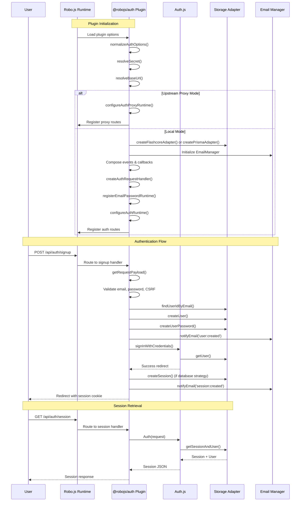

# AGENTS – @robojs/auth

Last Updated: 2025-10-18

This file is optimized for AI coding agents. It documents how the @robojs/auth plugin works end-to-end so agents can implement features, fix bugs, and write tests with minimal context switching.

References:

- `packages/@robojs/auth/README.md`
- `packages/@robojs/auth/package.json`
- `packages/@robojs/auth/src/index.ts`
- `packages/@robojs/auth/src/events/_start.ts`
- `packages/@robojs/auth/src/config/defaults.ts`
- `packages/@robojs/auth/src/config/schema.ts`
- `packages/@robojs/auth/src/adapters/flashcore.ts`
- `packages/@robojs/auth/src/adapters/prisma.ts`
- `packages/@robojs/auth/src/builtins/email-password/index.ts`
- `packages/@robojs/auth/src/builtins/email-password/types.ts`
- `packages/@robojs/auth/src/builtins/email-password/runtime.ts`
- `packages/@robojs/auth/src/builtins/email-password/signup.ts`
- `packages/@robojs/auth/src/emails/manager.ts`
- `packages/@robojs/auth/src/emails/types.ts`
- `packages/@robojs/auth/src/runtime/handler.ts`
- `packages/@robojs/auth/src/runtime/route-map.ts`
- `packages/@robojs/auth/src/runtime/server-helpers.ts`
- `packages/@robojs/auth/src/runtime/client-helpers.ts`
- `packages/@robojs/auth/src/runtime/session-helpers.ts`
- `packages/@robojs/auth/src/runtime/credentials-compat.ts`
- `packages/@robojs/auth/src/utils/request-payload.ts`
- `packages/@robojs/auth/src/utils/csrf.ts`
- `packages/@robojs/auth/src/utils/password-hash.ts`
- `packages/@robojs/auth/src/utils/cookies.ts`
- `packages/@robojs/auth/src/utils/tokens.ts`
- `packages/@robojs/auth/src/types.ts`

## 1. Overview & Purpose

- Modern authentication for Robo.js powered by Auth.js. 
- Capabilities:
  - 80+ OAuth providers, plus a built-in Email/Password flow
  - Session management (JWT or database-backed)
  - Comprehensive CSRF, cookies, and redirect handling
  - Upstream proxy mode to forward auth routes to another Robo instance
- Peer dependency: `@robojs/server` (required, not optional)
- Install via CLI: `npx robo add @robojs/auth`

## 2. Auth.js Integration Architecture

- Lifecycle initialization in `src/events/_start.ts`.
- Configuration normalization via `normalizeAuthOptions` in `src/config/defaults.ts`.
- Route registration through `@robojs/server` using `AUTH_ROUTES` from `src/runtime/route-map.ts`.
- Request handler creation via `createAuthRequestHandler` in `src/runtime/handler.ts`.
- Runtime configuration via `configureAuthRuntime` and `configureAuthProxyRuntime` in `src/runtime/server-helpers.ts`.
- Event composition to inject email notifications without stealing user hooks.
- Callback composition to enhance sessions with email verification status.
- Credentials/database compatibility patch in `src/runtime/credentials-compat.ts` (spoofs `Array.prototype.some` to bypass Auth.js assertion).

## 3. Provider System

- 80+ OAuth providers re-exported from `@auth/core/providers/*` via `src/providers/*.ts`.
- Custom `EmailPassword` provider in `src/builtins/email-password/index.ts`.
- Provider metadata attachment via `__roboEmailPassword` symbol.
- Custom authorize hooks with `EmailPasswordAuthorizeContext` (adapter, defaultAuthorize, request).
- Route overrides for `signup`, `passwordResetRequest`, `passwordResetConfirm`.
- Provider resolution and lazy factory support.
- `allowDangerousEmailAccountLinking` flag for linking accounts by email.

## 4. Adapter System

### Flashcore Adapter (`src/adapters/flashcore.ts`)
- Namespaced storage: `auth:users`, `auth:usersByEmail`, `auth:accounts`, `auth:sessions`, `auth:verification`, `auth:password`.
- User indexing with pagination (500 users per page by default).
- Password records with Argon2id hashes.
- Verification token hashing with SHA-256.
- Email normalization (toLowerCase).
- Account linking with per-user account refs.
- Session expiry checking and cleanup.
- Exported helpers: `createFlashcoreAdapter`, `listUsers`, `listUserIds`.

### Prisma Adapter (`src/adapters/prisma.ts`)
- Wraps `@auth/prisma-adapter` with password helpers.
- Requires `@auth/prisma-adapter` and `@prisma/client` peer dependencies.
- Password model schema: id, userId, email, hash, createdAt, updatedAt.
- Automatic password rehashing when parameters change.
- Case-insensitive email lookups (supports `@db.Citext`).
- Exported helpers: `createPrismaAdapter`, `listPrismaUsers`, `listPrismaUserIds`.
- Custom model names via `models.password` option.

### PasswordAdapter Interface
- `createUserPassword({ userId, email, password })` — Hash and store password.
- `verifyUserPassword({ userId, password })` — Timing-safe comparison.
- `findUserIdByEmail(email)` — Case-insensitive lookup.
- `deleteUserPassword(userId)` — Remove password record.
- `resetUserPassword({ userId, password })` — Replace hash.
- Validation via `assertPasswordAdapter` function.

## 5. Email System

### EmailManager (`src/emails/manager.ts`)
- Singleton instance via `setEmailManager` and `getEmailManager`.
- Mailer initialization: direct instance, lazy factory, or module spec `{ module: 'resend', export: 'Resend' }`.
- Template resolution: user overrides, React Email support, default templates.
- Event triggers: `user:created`, `session:created`, `email:verification-requested`, `email:verified`, `password:reset-requested`, `password:reset-completed`.
- Template types: inline (subject/html/text/react), templateId (provider-driven), false (disabled).
- Default templates in `src/emails/templates/*.ts`.
- React Email rendering via `renderReactTemplate` in `src/emails/react-renderer.ts`.
- Email notification via `notifyEmail(event, context)`.

### Email Configuration
- `emails.from` — Default sender (MailParty).
- `emails.mailer` — AuthMailer instance, factory, or module spec.
- `emails.templates` — Per-event template overrides.
- `emails.triggers` — Custom email builders (can be array).
- `email.expiresInMinutes` — Verification token TTL (default 60).

### Email Context
- `appName`, `user` (id, email, name), `session` (id, ip, userAgent), `tokens` (verifyEmail, resetPassword), `request` (origin), `links` (verifyEmail, resetPassword).

## 6. Email/Password Provider

### Built-in Routes (registered in `src/builtins/email-password/runtime.ts`)
- `POST /signup` — Create user, hash password, auto sign-in, attach DB session if needed.
- `POST /password/reset/request` — Generate token, send email.
- `GET /password/reset/confirm` — Render HTML form.
- `POST /password/reset/confirm` — Validate token, update password, send confirmation.
- `GET /verify-email` — Status page (HTML or JSON).
- `GET /verify-email/confirm` — Consume token, mark email verified.
- `POST /verify-email/request` — Generate new verification token.
- `POST /callback/credentials` — Intercept credentials callback for email notifications and DB session attachment.

### Signup Handler (`src/builtins/email-password/signup.ts`)
- Email validation (regex, required).
- Password validation (min 8 chars, confirmation match).
- Terms acceptance validation.
- CSRF token validation (cookie + payload).
- User creation with rollback on failure.
- Auto sign-in after signup.
- Database session attachment for database strategy.
- JSON and HTML error responses.
- Redirect to `callbackUrl` or default path.

### Request Payload Utilities (`src/utils/request-payload.ts`)
- `getRequestPayload(request)` — Parse and cache JSON/form bodies.
- Symbol-based storage on request object.
- Mutation support: `get()`, `replace(data)`, `assign(partial)`.
- Source tracking: `json`, `form`, `empty`.
- Shared across authorize, route overrides, and default handlers.

### Route Override Context
- `adapter`, `authConfig`, `basePath`, `baseUrl`, `cookies`, `defaultHandler`, `events`, `payload`, `request`, `secret`, `sessionStrategy`.

## 7. Upstream Proxy Mode

### Configuration (`upstream` option)
- `baseUrl` — Target Robo instance URL (required).
- `basePath` — Remote auth path (defaults to local `basePath`).
- `headers` — Additional headers for proxied requests.
- `cookieName` — Session cookie name (defaults to `authjs.session-token`).
- `secret` — For local JWT decoding (optional).
- `sessionStrategy` — `jwt` or `database`.
- `fetch` — Custom fetch implementation (optional).

### Behavior
- All `/api/auth/*` routes forward to upstream.
- Headers cleaned: `host`, `content-length`, `connection`, `accept-encoding`.
- Body forwarded for POST requests.
- `getServerSession` and `getToken` proxy to upstream.
- Local JWT decoding if secret provided.
- Configured via `configureAuthProxyRuntime` in `src/runtime/server-helpers.ts`.

## 8. CSRF Handling

### Implementation (`src/utils/csrf.ts`)
- Token generation: `createCsrfToken(secret, length=32)` returns `{ token, cookie }`.
- Cookie hashing: SHA-256 of `${token}${secret}`.
- Verification: `verifyCsrfToken(token, cookie, secret)` with timing-safe comparison.
- Used in signup, password reset, and Auth.js forms.

## 9. Session Management

### Session Strategies
- JWT (default when no adapter) — Stateless, signed tokens.
- Database (default when adapter present) — Server-side sessions.

### Session Helpers (`src/runtime/session-helpers.ts`)
- `isSuccessRedirect(response)` — Detects Auth.js success redirects (no error query param).
- `hasSessionCookie(response, cookieName)` — Checks `Set-Cookie` header.
- `attachDbSessionCookie({ response, adapter, cookies, config, userId })` — Creates DB session and appends cookie.

### Server Helpers (`src/runtime/server-helpers.ts`)
- `getServerSession(input?)` — Fetch current session (`Request`, `Headers`, or record).
- `getToken(input?, options?)` — Extract JWT or raw cookie value.
- Runtime state: `mode` (unconfigured/local/proxy), `authHandler`, `basePath`, `baseUrl`, `cookieName`, `secret`, `sessionStrategy`.

### Client Helpers (`src/runtime/client-helpers.ts`)
- `signIn(providerId, body?, options?)` — POST to `/signin`.
- `signOut(options?)` — POST to `/signout` with CSRF token.
- `getSession(options?)` — GET `/session`.
- `getProviders(options?)` — GET `/providers`.
- `getCsrfToken(options?)` — GET `/csrf`.
- Options: `basePath`, `baseUrl`, `fetch`, `headers`.

## 10. Cookie Configuration

### Default Cookies (`src/utils/cookies.ts`)
- `sessionToken`: `authjs.session-token` (httpOnly, secure, sameSite=lax).
- `csrfToken`: `authjs.csrf-token` (httpOnly, secure, sameSite=lax).
- `callbackUrl`: `authjs.callback-url` (httpOnly=false).
- `state`, `nonce`, `pkceCodeVerifier`, `webauthnChallenge`.

### Cookie Utilities
- `buildDefaultCookies()` — Generate default cookie config.
- `applyCookieOverrides(defaults, overrides)` — Merge user overrides.
- `applyCookiePrefix(name, secure, hostOnly)` — Add `__Secure-` or `__Host-` prefix.
- `chunkCookieValue(name, value, chunkSize=3800)` — Split large cookies.
- `unchunkCookieValue(name, values)` — Reassemble chunked cookies.
- `serializeCookie(name, value, options)` — Generate Set-Cookie header.

### Cookie Security Adjustment
- `adjustCookieSecurity` in `src/events/_start.ts` sets `secure=false` for `http://` URLs.

## 11. Password Hashing

### Argon2id Implementation (`src/utils/password-hash.ts`)
- WASM-based via `argon2id` package.
- Default parameters: `memorySize=4096 KiB`, `passes=3`, `parallelism=1`, `tagLength=32`.
- Salt length: 16 bytes.
- Unicode normalization: NFKC.
- Hash format: `$argon2id$v=19$m=4096,t=3,p=1$<salt_b64>$<hash_b64>`.

### Functions
- `hashPassword(password, options?)` — Generate hash with optional custom parameters.
- `verifyPasswordHash(password, storedHash)` — Timing-safe comparison.
- `parseArgon2idHash(hash)` — Extract algorithm, params, salt, hash.
- `needsRehash(hash, reference)` — Check if parameters changed.

### Rehashing
- Prisma adapter automatically rehashes on verify if parameters changed.
- Flashcore adapter does not auto-rehash (manual migration needed).

## 12. Configuration System

### Schema (`src/config/schema.ts`)
- Zod validation via `authPluginOptionsSchema`.
- Normalization via `normalizeAuthOptions`.
- Type: `AuthPluginOptions`.

### Key Options
- `secret` — Required in production (reads `AUTH_SECRET` or `NEXTAUTH_SECRET`).
- `url` — Canonical URL (reads `AUTH_URL` or `NEXTAUTH_URL`, fallback `http://localhost:3000`).
- `basePath` — Route prefix (default `/api/auth`).
- `appName` — Display name (default `Robo.js`).
- `adapter` — Storage adapter (default Flashcore).
- `providers` — Array of Auth.js providers.
- `session.strategy` — `jwt` or `database` (auto-detected from adapter).
- `session.maxAge` — Session TTL in seconds (default 30 days).
- `session.updateAge` — Session refresh interval (default 24 hours).
- `cookies` — Cookie overrides.
- `callbacks` — Auth.js callbacks (`signIn`, `redirect`, `session`, `jwt`).
- `events` — Auth.js events (`createUser`, `updateUser`, `linkAccount`, `session`, `signIn`, `signOut`).
- `pages` — Custom page paths (`signIn`, `signOut`, `error`, `verifyRequest`, `newUser`).
- `email` / `emails` — Email configuration.
- `upstream` — Proxy configuration.
- `redirectProxyUrl` — Preview deployment proxy (`AUTH_REDIRECT_PROXY_URL`).
- `allowDangerousEmailAccountLinking` — Link accounts by email.
- `debug` — Enable Auth.js debug logging.

## 13. Built-in Routes

### Auth.js Routes (`src/runtime/route-map.ts`)
- `GET /providers` — List configured providers.
- `GET /session` — Current session.
- `GET /csrf` — CSRF token.
- `GET /signin`, `GET /signin/:provider` — Sign-in pages.
- `POST /signin`, `POST /signin/:provider` — Sign-in handlers.
- `POST /signout` — Sign-out handler.
- `GET /callback/:provider`, `POST /callback/:provider` — OAuth callbacks.
- `GET /verify-request` — Email verification page.
- `GET /error` — Error page.

### Email/Password Routes (when EmailPassword provider enabled)
- `POST /signup`.
- `POST /password/reset/request`.
- `GET /password/reset/confirm`.
- `POST /password/reset/confirm`.
- `GET /verify-email`.
- `GET /verify-email/confirm`.
- `POST /verify-email/request`.
- `POST /callback/credentials` (intercepted).

## 14. Hidden Gotchas & Edge Cases

### Secret Generation
- If no secret provided, generates temporary random secret.
- Warns in development, errors in production.
- Sets `AUTH_SECRET` env var for Auth.js compatibility.

### Base URL Resolution
- Reads `AUTH_URL`, `NEXTAUTH_URL`, or falls back to `http://localhost:3000`.
- Warns in production if using fallback.
- Sets `AUTH_URL` env var.

### Cookie Security
- Automatically sets `secure=false` for `http://` URLs.
- Prevents cookie rejection in local development.

### Email Normalization
- All email lookups use `toLowerCase()`.
- Flashcore and Prisma adapters normalize consistently.
- Postgres users can use `@db.Citext` for case-insensitive columns.

### CSRF Validation
- Signup and password reset require valid CSRF token.
- Token must match cookie hash.
- Cookie format: `${token}|${hash}`.

### Credentials/Database Compatibility
- Auth.js 0.40 prevents database sessions with only credentials provider.
- Plugin patches `Array.prototype.some` to bypass assertion.
- Implemented in `src/runtime/credentials-compat.ts`.
- Cached on config object to avoid repeated patching.

### Session Strategy Detection
- Defaults to `jwt` when no adapter.
- Defaults to `database` when adapter present.
- Can be overridden via `session.strategy`.

### Database Session Attachment
- Credentials provider requires manual DB session creation.
- Interceptor in `src/builtins/email-password/runtime.ts` attaches session cookie.
- Only for database strategy.

### Email Verification Status
- Session callback enhanced to include `emailVerified` from adapter.
- Requires `adapter.getUser` support.

### Recent User Tracking
- Prevents duplicate welcome emails for new users.
- Uses `Set` to track recent signups and sign-ins.
- Cleared after first notification.

### Error Handling
- Credentials errors return JSON for API clients.
- Credentials errors redirect to sign-in page for browsers.
- Error code extraction from nested cause objects.

### Flashcore Pagination
- Default page size: 500 users.
- Out-of-range pages return empty array with metadata.
- User index maintained separately from user records.

### Prisma Pagination
- Default page size: 500 users.
- Supports custom `where`, `orderBy` clauses.
- Returns empty array when `page >= pageCount`.

### Provider Resolution
- Lazy provider factories resolved before type inspection.
- Metadata attached via non-enumerable symbol properties.

### Email Manager Initialization
- Only initialized if mailer configured.
- Lazy module imports for mailer specs.
- `verify` called on mailer if supported.

### React Email Rendering
- Requires `@react-email/components` peer dependency.
- Renders to HTML string via `react-dom/server`.
- Falls back to html/text templates if React not available.

### Upstream Proxy Headers
- Removes `host`, `content-length`, `connection`, `accept-encoding`.
- Merges custom headers from config.
- Preserves cookies for session forwarding.

### Token Utilities
- Verification tokens hashed with SHA-256 before storage.
- Access token expiry checking with buffer window.
- Refresh token helpers for OAuth providers.

## 15. Integration with @robojs/server

### Requirements
- Peer dependency (required, not optional).
- Must call `Server.ready()` before route registration.
- Routes registered via `Server.get()?.registerRoute(path, handler)`.

### Route Registration
- Collects methods per path from `AUTH_ROUTES`.
- Registers single handler per path.
- Validates HTTP method before invoking Auth.js.
- Returns 405 for disallowed methods.

### Request/Response Types
- Uses `RoboRequest` and `RoboReply` from `@robojs/server`.
- Compatible with standard `Request`/`Response`.

## 16. Type Exports

### From Auth.js (`src/types.ts`)
- `Session`, `DefaultSession`, `User`, `Account`, `Profile`, `Theme`, `TokenSet`.
- `CookiesOptions`, `CookieOption`, `PublicProvider`.
- `JWT`, `AuthConfig`.
- `Adapter`, `AdapterAccount`, `AdapterSession`, `AdapterUser`, `VerificationToken`.

### From Plugin
- `AuthPluginOptions`, `EmailsOptions`.
- `AuthEmailEvent`, `AuthMailer`, `MailParty`, `MailMessage`, `EmailContext`, `TemplateConfig`, `TemplateOverride`, `EmailBuilder`.
- `RequestPayloadHandle`.
- `ConfigureAuthRuntimeOptions`, `ConfigureAuthProxyRuntimeOptions`.
- `PasswordAdapter`, `PasswordRecord`.
- `EmailPasswordAuthorize`, `EmailPasswordAuthorizeContext`, `EmailPasswordProviderOptions`, `EmailPasswordRouteContext`, `EmailPasswordRouteHandler`, `EmailPasswordRouteOverrides`.
- `PrismaAdapterOptions`, `PrismaAdapterModelOptions`, `PrismaClientLike`.

## 17. File Structure Reference

### Core Files
- `src/index.ts` — Main exports.
- `src/client.ts` — Client helper exports.
- `src/server.ts` — Server helper exports.
- `src/types.ts` — Type re-exports.
- `src/events/_start.ts` — Plugin lifecycle.

### Configuration
- `src/config/defaults.ts` — Normalization and defaults.
- `src/config/schema.ts` — Zod schema.

### Adapters
- `src/adapters/flashcore.ts` — Flashcore adapter.
- `src/adapters/prisma.ts` — Prisma adapter.

### Email/Password
- `src/builtins/email-password/index.ts` — Provider factory.
- `src/builtins/email-password/types.ts` — Type definitions.
- `src/builtins/email-password/runtime.ts` — Route registration.
- `src/builtins/email-password/signup.ts` — Signup handler.

### Email System
- `src/emails/manager.ts` — EmailManager class.
- `src/emails/types.ts` — Email type definitions.
- `src/emails/react-renderer.ts` — React Email rendering.
- `src/emails/templates/*.ts` — Default templates.

### Runtime
- `src/runtime/handler.ts` — Auth.js request handler.
- `src/runtime/route-map.ts` — Route definitions.
- `src/runtime/server-helpers.ts` — Server-side helpers.
- `src/runtime/client-helpers.ts` — Client-side helpers.
- `src/runtime/session-helpers.ts` — Session utilities.
- `src/runtime/credentials-compat.ts` — Compatibility patch.

### Utilities
- `src/utils/request-payload.ts` — Request body parsing.
- `src/utils/csrf.ts` — CSRF token handling.
- `src/utils/password-hash.ts` — Argon2id hashing.
- `src/utils/cookies.ts` — Cookie utilities.
- `src/utils/tokens.ts` — Token utilities.
- `src/utils/logger.ts` — Logger instance.
- `src/utils/path.ts` — Path utilities.

### Providers
- `src/providers/*.ts` — Re-exported Auth.js providers.
- `src/providers/email-password.ts` — EmailPassword provider export.

## Mermaid Diagram

## 18. ⚠️ IMPORTANT: Keep This File Updated

When modifying the @robojs/auth plugin, you MUST update this AGENTS.md file to reflect your changes. This includes:

- New configuration options or environment variables
- Changes to adapter interfaces or implementations
- New routes, handlers, or middleware
- Modified email events or template system
- Updates to CSRF, session, or cookie handling
- New utilities, helpers, or exported functions
- Changes to type definitions or interfaces
- New hidden gotchas, edge cases, or behaviors
- Integration changes with `@robojs/server` or other plugins
- Deprecations, breaking changes, or migration notes

Why this matters: AI coding agents rely on this documentation to understand the plugin's architecture and make informed decisions. Stale documentation leads to incorrect implementations and bugs.

How to update: When making changes, review the relevant sections in this file and update them with the new behavior, cross-references to modified files, and any new gotchas or edge cases introduced by your changes.
