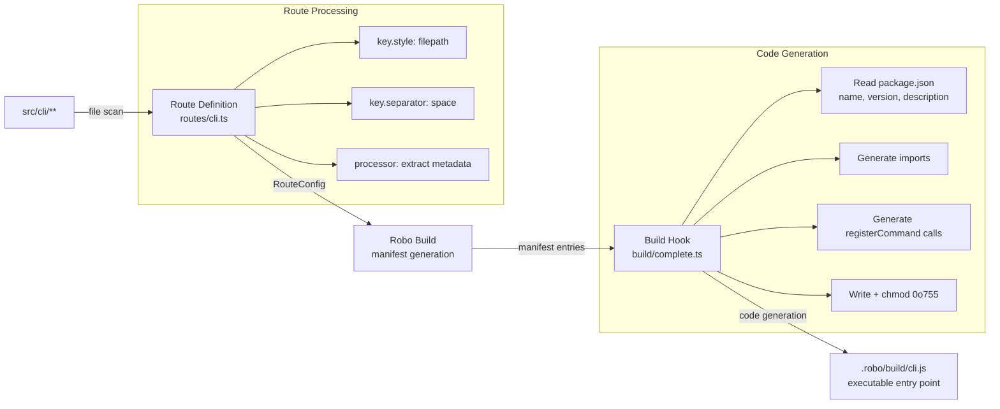

# @robojs/cli -- Agent Notes

> **Keep this living.** Any time the route config, build hook, or public API changes, circle back and update this brief so the next pass is not working with stale intel.

This document is a deep technical reference for AI coding agents working on the `@robojs/cli` plugin. It explains architecture, build pipeline, routing, code generation, and gotchas. For user-facing documentation, see `README.md` in this package.

Note: This file is for AI agents and maintainers, not end users.

## 1. Mission & Scope

- Enables Robo.js projects to build **standalone CLI applications** with file-based routing.
- Commands placed in `src/cli/` are scanned, processed, and code-generated into an executable entry point at `.robo/build/cli.js`.
- Build-time: code generation happens during the `build/complete` phase. No runtime lifecycle hooks (`start`, `stop`, `restart`).
- Dev-time: provides interactive terminal commands (`/cli`, `/cli list`, `/cli run`) for testing CLI commands during `robo dev`.

## 2. Architecture Overview

### File Roles

| File | Purpose |
|------|---------|
| `src/index.ts` | Public API -- re-exports CLI primitives from `robo.js/cli.js` |
| `src/robo/routes/cli.ts` | Route definition -- tells Robo how to scan and process CLI command files |
| `src/robo/build/complete.ts` | Build hook -- generates the `.robo/build/cli.js` entry point after build |
| `config/robo.ts` | Plugin config -- sets `namespace: 'cli'` and `type: 'plugin'` |

### Key Dependencies

- `robo.js` (peer, required `>=0.11.0`) -- Framework core, build pipeline, portal, types
- No other runtime or peer dependencies

### Build Pipeline (Mermaid)



## 3. Route Definition (`src/robo/routes/cli.ts`)

This file tells Robo's manifest generator how to discover, key, and process CLI command files.

### Exported Types

- `Handler = CliHandler` -- the handler function type for CLI commands
- `Controller = null` -- no per-handler controller needed (unlike `plugin-api` which has `ApiController`)

### NamespaceController

Factory function receiving `PortalAPI`, providing portal access to CLI commands:

- `get(name: string): Promise<CliHandler | null>` -- retrieves a single command handler via `portal.getHandler('cli', 'cli', name)`, returns `handler.default` or `null`
- `list(): string[]` -- returns all registered CLI command keys via `portalApi.getByType('cli:cli')`

Portal access path: `portal.cli.cli.get(name)` and `portal.cli.cli.list()`

### RouteConfig

```typescript
export const config: RouteConfig = {
  key: {
    style: 'filepath',    // File path segments become the key
    separator: ' '         // Segments joined with spaces: config/set.ts -> "config set"
  },
  nesting: {
    maxDepth: 3,           // Up to 3 levels of subcommands
    allowIndex: false      // No index.ts -> root command mapping
  },
  exports: {
    named: [],             // No named exports expected
    default: 'required',   // Must export a default handler
    config: 'optional'     // Optional CliCommandConfig export
  },
  description: 'CLI commands'
}
```

### Processor Function (default export)

The processor receives a `ScannedEntry` and returns a `ProcessedEntry`:

1. Reads `entry.exports.config` as `CliCommandConfig | undefined`
2. Splits `entry.key` by spaces to determine parent-child relationships
3. Returns:
   - `key` -- the command key (e.g., `"db migrate"`)
   - `path` -- file path with `.ts` replaced by `.js`
   - `exports` -- which exports exist (`default`, `config`, named)
   - `metadata` -- extracted `description`, `options`, `positionalArgs` from config
   - `extra` -- `{ parent }` if this is a subcommand (key contains spaces)

## 4. Build Hook (`src/robo/build/complete.ts`)

### Lifecycle Phase

Runs during `build/complete` -- after Robo has finished compiling all source files and generating the manifest.

### Entry Reading

```typescript
const cliEntries = entries.get('cli', 'cli') ?? []
```

Retrieves all processed CLI command entries from the manifest. Early-returns if no commands found.

### Package Metadata

Reads `package.json` from `paths.root` to extract:
- `name` -- stripped of npm scope (`@scope/name` becomes `name`), defaults to `'cli'`
- `version` -- defaults to `'1.0.0'`
- `description` -- defaults to `''`

### Auto-`bin` Field

After generating the CLI entry point, the build hook checks if `package.json` has a `bin` field. If missing, it auto-adds one mapping the CLI name to `.robo/build/cli.js`. Indentation is detected from the original file to preserve formatting. A one-time hint is logged suggesting `npm link` or `/cli link`. If `bin` already exists, it is not overwritten.

### Code Generation

For each entry, generates:
- **Variable name**: `cmd_` + sanitized key (non-alphanumeric replaced with `_`), e.g., `cmd_db_migrate`
- **Import statement**: `import * as cmd_db_migrate from './path/to/db/migrate.js'`
- **Registration call**:
  - Top-level commands: `registerCommand(command, 'hello', cmd_hello)`
  - Nested commands: `registerNestedCommand(command, 'db migrate', cmd_db_migrate)`

The generated file includes two helper functions:
- `registerCommand(parent, name, mod)` -- creates a `Command`, wires up config options, sets handler
- `registerNestedCommand(root, cmdPath, mod)` -- walks or creates the parent chain, then calls `registerCommand` for the leaf

### Output

- Written to `path.join(paths.output, 'cli.js')` -- typically `.robo/build/cli.js`
- Made executable with `chmod 0o755` (silently ignored on Windows)
- Includes `#!/usr/bin/env node` shebang
- Ends with `command.parse()` to execute

## 5. Public API (`src/index.ts`)

Re-exports from `robo.js/cli.js` for consumer convenience:

**Values:**
- `Command` -- the CLI command class (from `packages/robo/src/cli/utils/cli-handler.ts`)
- `parseCliOptions` -- option parsing utility (from `packages/robo/src/cli/utils/cli-shared.ts`)

**Types:**
- `CliCommandConfig` -- command configuration shape (description, options, positionalArgs)
- `CliContext` -- handler context object (args, options, logger, cwd, argv)
- `CliHandler` -- handler function signature
- `CliOptionConfig` -- individual option config (alias, name, description, type, required, default)
- `ParseCliOptionsConfig` -- configuration for `parseCliOptions`

Consumers typically import from `robo.js/cli.js` directly. This re-export exists for discoverability and potential future additions.

## 6. Core Framework Dependencies

| Dependency | Location | Purpose |
|-----------|----------|---------|
| `Command` class | `packages/robo/src/cli/utils/cli-handler.ts` | CLI command builder with option parsing, subcommand support, help generation |
| `parseCliOptions` | `packages/robo/src/cli/utils/cli-shared.ts` | Standalone option parser for raw argv arrays |
| `createCliCommandConfig` | `packages/robo/src/core/cli-config-helpers.ts` | Type-safe config factory enabling TypeScript inference with `as const` |
| Type inference helpers | `packages/robo/src/types/cli-helpers.ts` | Conditional types for inferring option types from config |
| `RouteConfig`, `ScannedEntry`, `ProcessedEntry` | `packages/robo/src/types/routes.ts` | Route system types used by the route definition |
| `BuildCompleteContext` | `packages/robo/src/types/lifecycle.ts` | Context passed to `build/complete` hooks |
| `PortalAPI` | `packages/robo/src/types/portal.ts` | Portal access interface used by NamespaceController |

## 7. File-Based Routing

### Directory Conventions

| Directory | Purpose |
|-----------|---------|
| `src/cli/` | CLI command handlers |
| `src/cli/extend/` | Command extensions (before/after hooks, additional options) |

### Mapping Rules

| File Path | Command |
|-----------|---------|
| `src/cli/hello.ts` | `mycli hello` |
| `src/cli/db/migrate.ts` | `mycli db migrate` |
| `src/cli/config/set.ts` | `mycli config set` |
| `src/cli/extend/build.ts` | Extends `mycli build` |
| `src/cli/extend/auth/login.ts` | Extends `mycli auth login` |

### Key Characteristics

- Filepath segments are joined with spaces (not `/` like API routes)
- Maximum nesting depth of 3 levels
- `allowIndex: false` -- no `index.ts` to root-command mapping in the route config
- Default export is required; config export is optional
- No dynamic segments (`[param]`), catch-all segments, or optional patterns -- CLI commands are static

## 8. Build Pipeline Integration

The full pipeline from source files to executable:

1. **Route Discovery** -- Robo's manifest generator scans `src/cli/` using the `RouteConfig` from `routes/cli.ts`
2. **Processing** -- Each discovered file is passed through the processor function, which extracts metadata and parent-child relationships
3. **Manifest Storage** -- Processed entries are stored in the build manifest under the `cli:cli` namespace
4. **Code Generation** -- The `build/complete` hook reads entries via `entries.get('cli', 'cli')`, generates JavaScript, and writes the entry point
5. **Executable Output** -- `.robo/build/cli.js` is created with shebang and executable permissions

## 9. Generated Entry Point

The generated `.robo/build/cli.js` file has this structure:

```javascript
#!/usr/bin/env node
/**
 * Auto-generated CLI entry point
 * Generated by @robojs/cli
 */

import { Command } from 'robo.js/cli.js'

import * as cmd_hello from './cli/commands/hello.js'
import * as cmd_db_migrate from './cli/commands/db/migrate.js'

const command = new Command('my-cli')
command.version('1.0.0')
command.description('My CLI description')
command.option('-h', '--help', 'Shows this help menu')

function registerCommand(parent, name, mod) {
  const config = mod.config || {}
  const handler = mod.default ?? mod
  const sub = new Command(name)
  sub.description(config.description || '')
  sub.option('-h', '--help', 'Shows help for this command')
  if (config.options) {
    for (const opt of config.options) {
      sub.option(opt)
    }
  }
  if (config.positionalArgs) sub.positionalArgs(true)
  sub.handler(handler)
  parent.addCommand(sub)
  return sub
}

function registerNestedCommand(root, cmdPath, mod) {
  const parts = cmdPath.split(' ')
  let current = root
  for (let i = 0; i < parts.length - 1; i++) {
    const name = parts[i]
    let child = current.getChildCommands().find(c => c.getName() === name)
    if (!child) {
      child = new Command(name)
      child.option('-h', '--help', 'Shows help for this command')
      current.addCommand(child)
    }
    current = child
  }
  registerCommand(current, parts[parts.length - 1], mod)
}

registerCommand(command, 'hello', cmd_hello)
registerNestedCommand(command, 'db migrate', cmd_db_migrate)

command.parse()
```

Key implementation details:
- `registerNestedCommand` lazily creates parent Command nodes as needed
- Parent nodes created implicitly get a help option but no handler
- Import paths are relative to the output directory
- The root command name comes from `package.json` name (scope stripped)

## 10. Comparison with plugin-api

Both `@robojs/cli` and `@robojs/server` use the same Robo route system but with different configurations:

| Aspect | @robojs/cli | @robojs/server (plugin-api) |
|--------|------------|---------------------------|
| `key.style` | `'filepath'` | `'filepath'` |
| `key.separator` | `' '` (space) | `'/'` (slash) |
| `nesting.maxDepth` | `3` | `10` |
| `nesting.allowIndex` | `false` | `true` |
| `nesting.dynamicSegment` | Not used | `/\[([^\]]+)\]/` |
| `nesting.catchAllSegment` | Not used | `/\[\.\.\.\w+\]/` |
| `exports.default` | `'required'` | `'optional'` |
| `exports.named` | `[]` | `['GET', 'POST', ...]` |
| Controller type | `null` | `ApiController` (with `execute`) |
| Runtime behavior | Build-time code generation | Runtime request routing |
| Handler type | `CliHandler` | `ApiHandler` / `ApiHandlerModule` |

The key architectural difference: `plugin-api` routes are resolved at runtime via the portal and radix router, while `@robojs/cli` routes are resolved at build time and baked into a standalone JavaScript file.

## 11. Logging

- The build hook uses `context.logger` (passed via `BuildCompleteContext`) for build-time logging
- Log messages: `info` for generation start, `debug` for per-command details, `ready` for completion
- The `/cli run` terminal command uses `logger.fork('cli')` from `robo.js/logger.js` -- this is the single forked logger for this plugin per project standards
- Logger instance: `cliLogger` in `src/robo/terminal/commands/cli/run.ts`

## 12. Persistence

None. This plugin:
- Does not use Flashcore
- Does not store runtime state
- Does not read/write configuration at runtime
- All output is a generated file (`.robo/build/cli.js`) written during the build step

## 13. Known Gaps

1. **No tests** -- The plugin has no test files. Unit tests should cover the processor function (parent-child detection, metadata extraction) and the build hook (code generation, edge cases).

2. **`allowIndex: false` vs README showing index usage** -- The `RouteConfig` sets `allowIndex: false`, but the README shows `db/index.ts` mapping to `mycli db`. This is a documentation-code mismatch. Either the config should enable `allowIndex: true` or the README examples should be updated to remove index file usage.

3. **robo.js runtime dependency** -- The generated entry point imports `Command` from `robo.js/cli.js` at runtime. Users publishing their CLI as a standalone package must include `robo.js` as a dependency (not just devDependency) in their project's `package.json`.

4. **Variable name collision edge case** -- The variable name generation (`cmd_` + sanitized key) could produce collisions for commands whose keys differ only in non-alphanumeric characters. For example, `foo-bar` and `foo_bar` would both become `cmd_foo_bar`. In practice this is unlikely with the space separator, but it is not guarded against.

5. **No extensions in generated output** -- The README documents an `extend/` directory for before/after hooks, but the build hook (`build/complete.ts`) only processes entries from `entries.get('cli', 'cli')`. Extension integration may be handled elsewhere in the framework or may be incomplete.

6. **Single-quote escaping in description** -- The build hook escapes single quotes in the CLI description (`replace(/'/g, "\\'")`), but does not escape other special characters (backslashes, template literals). Edge case for descriptions containing these characters.

## 14. Quick Reference

### Directory Map

```
packages/@robojs/cli/
├── src/
│   ├── index.ts                    # Public API re-exports
│   └── robo/
│       ├── build/
│       │   └── complete.ts         # Build hook: code generation
│       ├── routes/
│       │   └── cli.ts              # Route definition: scan + process
│       └── terminal/
│           └── commands/
│               ├── cli.ts          # /cli parent command
│               └── cli/
│                   ├── link.ts     # /cli link -- link CLI for local dev
│                   ├── list.ts     # /cli list -- list registered commands
│                   └── run.ts      # /cli run -- execute a command inline
├── config/
│   └── robo.ts                     # Plugin config (namespace: 'cli')
├── package.json                    # Package metadata
├── README.md                       # User-facing docs
├── DEVELOPMENT.md                  # Development notes
└── tsconfig.json                   # TypeScript config
```

### Key Functions

- `processor(entry: ScannedEntry): ProcessedEntry` -- default export of `routes/cli.ts`; extracts metadata and parent hierarchy
- `buildComplete(context: BuildCompleteContext): Promise<void>` -- default export of `build/complete.ts`; generates entry point
- `NamespaceController(portal: PortalAPI)` -- factory for portal access (`get`, `list`)
- `registerCommand(parent, name, mod)` -- generated helper; creates and registers a Command
- `registerNestedCommand(root, cmdPath, mod)` -- generated helper; walks/creates parent chain

### Key Types

- `CliHandler` -- `(context: CliContext) => unknown | Promise<unknown>`
- `CliContext<T>` -- handler context with typed `options` when using `createCliCommandConfig`
- `CliCommandConfig` -- `{ description?, options?, positionalArgs? }`
- `CliOptionConfig` -- `{ alias, name, description?, type?, required?, default? }`
- `RouteConfig` -- Robo framework type defining scan/process behavior
- `BuildCompleteContext` -- `{ entries, logger, paths }` passed to build hooks

### Portal Access

- Namespace: `cli`
- Route type: `cli`
- Full path: `portal.cli.cli`
- Methods: `.get(name)`, `.list()`

## 15. Terminal Commands

Interactive terminal commands available during `robo dev`. These follow the same patterns as `@robojs/discordjs` and `@robojs/server` terminal commands.

### /cli

Parent command that lists available subcommands (`/cli list`, `/cli run`, `/cli link`).

### /cli list

Lists all registered CLI commands from the manifest via `Manifest.routeSummaries('cli', 'cli')`. Separates top-level commands from subcommands, groups subcommands under their parents, and displays a paginated table with COMMAND and DESCRIPTION columns.

Options: `--page` (page number), `--per-page` (items per page, default 15).

### /cli link

Links the CLI package for local development by detecting the package manager from `process.env.npm_config_user_agent` and running the appropriate link command (`npm link`, `pnpm link --global`, `yarn link`, or `bun link`). Uses `spawn` with `stdio: 'inherit'` so output flows to the terminal. On success, prints the CLI name for reference.

### /cli run \<command\> [args...]

Executes a CLI command inline within the dev terminal. Flow:

1. Gets summaries via `Manifest.routeSummaries('cli', 'cli')`
2. Matches longest command key from args (tries 3 tokens, then 2, then 1)
3. Resolves handler path: `path.join(process.cwd(), '.robo', 'build', summary.path)`
4. Dynamic imports with cache-busting (`?t=${Date.now()}`) for HMR support
5. Reads `mod.config` for option definitions
6. Parses remaining args with `parseCliOptions` from `robo.js/cli.js`
7. Constructs `CliContext` and calls `mod.default(cliContext)`

Handler `console.log` output flows naturally to stdout since readline is paused during terminal command execution.

---

Last Updated: 2026-03-14

Maintained By: AI coding agents and human contributors

Questions? See `README.md` for user docs, or explore the source files listed above.
