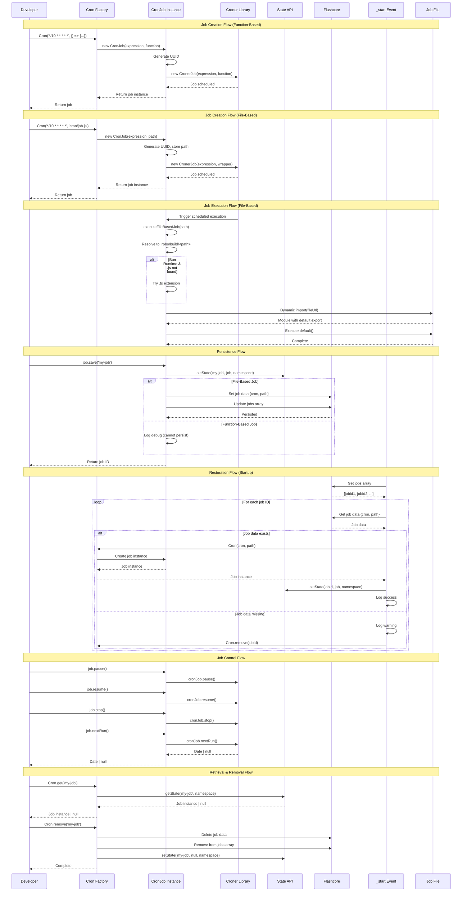

# @robojs/cron Plugin - AI Agent Reference

This document is a deep technical reference for AI coding agents working on the `@robojs/cron` plugin. It explains architecture, scheduling patterns, persistence, lifecycle integration, and gotchas. For user-facing documentation, see `README.md` in this package.

Note: This file is for AI agents and maintainers, not end users.

## Architecture Overview

- Core purpose: Schedule and manage recurring tasks using cron expressions with optional persistence.
- Key dependencies:
  - `croner` v9.0.0 – Core cron scheduling library
  - `uuid` v10.0.0 – Unique identifier generation
  - `robo.js` (peer, required) – State API, Flashcore, logger, color utilities
- File roles:
  - `src/index.ts` – Public API exports (Cron factory and Patterns helper)
  - `src/core/cron.ts` – CronJob class and Cron factory function
  - `src/core/patterns.ts` – Patterns helper with predefined cron expressions and builders
  - `src/core/loggers.ts` – Forked logger instance
  - `src/core/utils.ts` – Utilities (Bun/runtime, package manager detection)
  - `src/events/_start.ts` – Startup restoration of persisted jobs
  - `config/robo.mjs` – Plugin configuration

### High-level flow (Mermaid)



## Job Scheduling

### Cron Factory Function
- Location: `src/core/cron.ts`
- Signature: `Cron(cronExpression: string, jobFunction: string | (() => void)): CronJob`
- Purpose: Create and start a cron job immediately
- Params:
  - `cronExpression` – six-field cron string (sec min hour dom mon dow)
  - `jobFunction` – a function or a string path to a job file
- Returns: a `CronJob` instance with control methods

### CronJob Class
- Location: `src/core/cron.ts`
- Private fields: `cronJob: CronerJob`, `id: string`, `path?: string`, `expression: string`
- Constructor behavior:
  - Generates UUID for job ID
  - Creates underlying `CronerJob`
  - For file-based jobs, wraps execution with `executeFileBasedJob()`
- Instantiation: via `Cron()` factory

### Cron Expressions
- Format: `sec min hour dom mon dow`
- Special characters: `*`, `*/N`, `N,M,O`, `N-M`, `N-M/O`
- Examples: every second `* * * * * *`, every 10 sec `*/10 * * * * *`, every day at midnight `0 0 0 * * *`
- Reference: Use crontab.guru and Wikipedia for validation/examples

## Patterns Helper

- Location: `src/core/patterns.ts` (sourced from Elysia.js – MIT)
- Export: `Patterns` combining Days, ConstantExpressions, and FunctionExpressions

### Days enum
- SUNDAY=0 to SATURDAY=6 (note typo WEDNESAY in source)

### ConstantExpressions
- 72 presets spanning seconds, minutes, hours, daily, weekly, monthly, quarterly/yearly, business hours
- Usage: `Cron(Patterns.EVERY_DAY_AT_MIDNIGHT, () => { ... })`

### FunctionExpressions
- Builders like:
  - `everySenconds(seconds=1)`; `everyMinutes(minutes=1)`; `everyHours(hours=1)`
  - `everyHoursAt(hours, minutes=0)`; `everyDayAt('HH:mm')`
  - `everyWeekOn(day, 'HH:mm')`; `everyWeekdayAt('HH:mm')`; `everyWeekendAt('HH:mm')`
  - Aliases: `everySecond`, `everyMinute`, `hourly`, `daily`, `weekly`, `monthly`, `everyQuarter`, `yearly`, `everyWeekday`, `everyWeekend`
- Usage: `Cron(Patterns.everyDayAt('14:30'), () => { ... })`

## File-Based vs Function-Based Jobs

### Function-Based
- Example: `Cron('*/10 * * * * *', () => { ... })`
- Not persistable; lives only in memory

### File-Based
- Example: `Cron('*/10 * * * * *', 'cron/job.js')`
- Requirements: default export function; compiled into `.robo/build/`
- Execution: resolves `.robo/build/<path>`; on Bun, falls back from `.js` to `.ts` if needed; dynamic `import()` then invoke default
- Persistable via `save()` (stores `{ cron, path }`)
 - Path guidance: pass a relative path like `cron/job.js` (no leading `/`). Leading slashes are treated as absolute paths and will not be resolved under `.robo/build/`.

## Persistence with Flashcore

- Namespace: `__plugin_cron_`
- Keys: `jobs` array (index) and `<jobId>` → `{ cron, path }`

### save(id?)
- Stores instance in State API; for file-based jobs: writes Flashcore entry and updates index
- Returns `jobId`; idempotent and supports custom IDs

### Cron.get(id)
- Reads from State API (runtime only); returns `CronJob | null`

### Cron.remove(id)
- Deletes Flashcore entry and index reference; clears State API entry

Example – stop then remove for complete cleanup:

```ts
const id = 'my-job'
const job = Cron.get(id)
// Stop the underlying scheduled job first
job?.stop()
// Then remove persistence and clear State
await Cron.remove(id)
```

### State API
- Runtime in-memory store for job instances; used by `Cron.get()`

## Job Control Methods

- `pause()` – delegates to croner’s `pause()`; temporary halt
- `resume()` – delegates to `resume()`; resumes paused job
- `stop()` – delegates to `stop()`; permanent stop (doesn’t remove persistence)
- `nextRun()` – delegates to `nextRun()`; returns `Date | null`

## Bun Runtime Compatibility

- `IS_BUN_RUNTIME` from `process.versions.bun`
- File extension fallback: if `.js` missing and on Bun, try `.ts`
- Package manager detection: `getPackageManager()` and `IS_BUN_PM` (exported utility)

## Integration with Robo.js Lifecycle

- `_start` event (`src/events/_start.ts`) restores jobs at startup:
  1) Load `jobs` index
  2) For each id: load `{ cron, path }`
  3) If data exists: `Cron(cron, path)` then `setState(id, job)`
  4) If missing or failing: log and `Cron.remove(id)`
- Errors don’t block startup; individual failures cleaned up

## Logging

- `src/core/loggers.ts`: `cronLogger = logger.fork('cron')`
- Levels: `debug` (execution/restoration), `warn` (missing data), `error` (file missing/export missing, restore failure)
- Common messages documented for quick grep

## Critical Implementation Details

- UUIDs via `uuid` v10.0.0 (`v4()`); default job identifiers
- Croner v9.0.0 integration for scheduling and control
- Namespace constant `__plugin_cron_` used for both State and Flashcore
- File import uses `pathToFileURL()` and ESM dynamic import
- Job index uses functional updates and deduping

## Common Gotchas & Pitfalls

1) Function-based jobs can’t be persisted – convert to file-based for persistence.
2) Paths must be relative to `.robo/build/` – e.g., `cron/job.js` (no leading slash).
3) Missing default export in job file – must export default function.
4) Custom ID collisions overwrite earlier jobs – ensure unique IDs.
5) `stop()` doesn’t remove persistence – call `Cron.remove(id)` as well.
6) Bun fallback only for `.js`→`.ts` – always use `.js` suffix in paths when targeting Bun.
7) Restore failures don’t stop startup – check logs for missing jobs.
8) `Cron.get()` is runtime-only – relies on `_start` restoration after restart.
9) Invalid cron expressions throw – validate with Patterns or external tools.
10) Time zone differences – Croner uses system TZ; consider UTC.

## Testing Patterns

- Unit test job handlers directly; avoid relying on real timing.
- Integration tests with short intervals; assert side effects; ensure cleanup by stopping jobs.
- Persistence tests: save → simulate restart → restore and assert.
- Mock Flashcore/State/cron/file system as needed.

## Performance Considerations

- File-based jobs dynamically import modules; benefit from module cache; prefer function-based for very frequent schedules.
- Persistence adds read/write I/O; limit persisted job count for faster startups.
- Each job has a Croner instance and in-memory state; clean up when no longer needed.

## Maintenance & Updates

- Keep this doc updated when changing: CronJob, Patterns, `_start` restoration, utils, logging, or dependencies.
- Add new features/engines/patterns and document quirks and examples.

## Quick Reference

Directory map:
```
packages/@robojs/cron/
├── src/
│   ├── index.ts                  # Public API exports
│   ├── core/
│   │   ├── cron.ts               # CronJob class and Cron factory
│   │   ├── patterns.ts           # Patterns helper
│   │   ├── loggers.ts            # Forked logger
│   │   └── utils.ts              # Utility functions
│   └── events/
│       └── _start.ts             # Job restoration
├── config/
│   └── robo.mjs                  # Plugin configuration
├── package.json                  # Dependencies, metadata
└── README.md                     # User-facing docs
```

Key functions:
- `Cron(expression, jobFunction)`; `Cron.get(id)`; `Cron.remove(id)`; `job.save(id?)`; `job.pause()`; `job.resume()`; `job.stop()`; `job.nextRun()`

Key classes/constants:
- `CronJob`; `Patterns`; `__plugin_cron_`; `IS_BUN_RUNTIME`; `IS_BUN_PM`

Dependencies:
- `croner` v9.0.0; `uuid` v10.0.0; `robo.js`

---

Last Updated: 2025-10-18

Version: 0.1.1

Maintained By: AI coding agents and human contributors

Questions? See `README.md` for user docs, or explore the source files listed above.