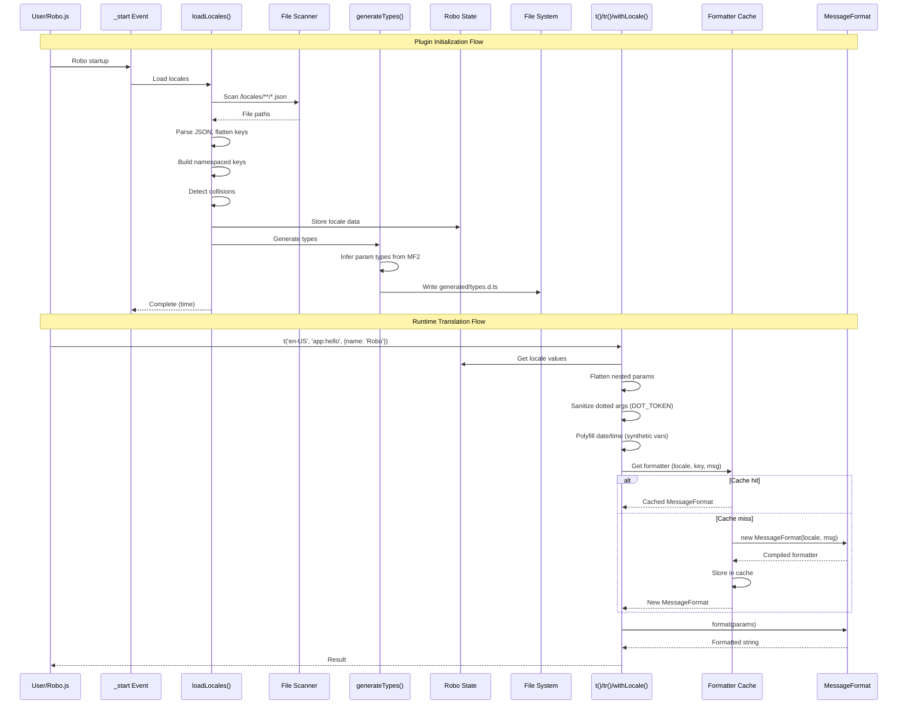

# @robojs/i18n – AI Agent Guide

**Purpose:** Type-safe internationalization via MessageFormat 2 (MF2) with automatic type generation from locale JSON files. This document is for AI coding agents. Human-facing docs live in the [README](README.md).

---

## Architecture Overview

- **Core Purpose:** Provide runtime translations with MF2, generate TypeScript types automatically, integrate with Robo.js state/logger APIs.
- **Key Dependencies:** `messageformat@4.0.0-12`, Robo.js State API, Robo.js Logger API.
- **File Map:**
  - `src/index.ts` – Public API exports.
  - `src/core/lib.ts` – Runtime APIs (`t()`, `tr()`, `withLocale()`, `createCommandConfig()`).
  - `src/core/formatter.ts` – MessageFormat cache management.
  - `src/core/codegen.ts` – TypeScript generation from locale files.
  - `src/core/utils.ts` – Locale loading, path scanning, parameter flattening.
  - `src/core/types.ts` – Type definitions and helpers.
  - `src/core/loggers.ts` – Forked plugin logger.
  - `src/events/_start.ts` – Lifecycle hook to load locales on startup.
  - `src/cli/index.ts` – `npx i18n` entry point.

---

## Locale File System & Namespacing

- Directory structure: `/locales/<locale>/<folders>/<file>.json`.
- Namespace generation examples:
  - `/locales/en-US/app.json` → namespace `app:`.
  - `/locales/en-US/shared/common.json` → `shared/common:` prefix.
  - Deeper paths keep slash-separated folders plus filename (minus `.json`) followed by `:`.
- Key flattening: nested JSON becomes dot notation (`{"greetings":{"hello":""}}` → `app:greetings.hello`).
- Collision detection (`utils.ts` → `forEachLeaf()`): the same file cannot contain both a literal dotted key and a nested object that flatten to the same key; detected via `seenFlat` `Set`, throws descriptive error.

---

## Type Generation System

- Generated types path: when running via TS/CLI it writes to `src/generated/types.d.ts`; the built plugin outputs to `.robo/build/generated/types.d.ts`. Consumers should import the re-exported types from `@robojs/i18n` instead of touching these files directly.
- Generated types:
  - `Locale` – union of locale strings.
  - `LocaleKey` – union of namespaced keys.
  - `LocaleParamsMap` – map of key → param type.
  - `ParamsFor<K>` – parameter type lookup.
  - `ReturnOf<K>` – `string[]` for array messages, `string` otherwise.
  - `LocaleIsArrayMap` – tracks array-returning keys.
- Inference logic (`codegen.ts`):
  - Default variables inferred as `string`.
  - `number` if annotated `:number|:integer|:decimal|:cardinal|:ordinal`.
  - `Date | number` if annotated `:date|:time|:datetime`.
  - Type widening when locales disagree (numeric beats string, date/time upgrades to `Date | number`).
- Nested params: `Node` type builds tree representing nested objects.
- Key regexes:
  - `ANY_VAR_RE`: `/\{\s*\$([^\s:}]+)\s*(?:[:}])/g`.
  - `NUMERIC_RE`: `/\{\s*\$([^\s:}]+)\s*:(?:number|integer|decimal|cardinal|ordinal)\b/g`.
  - `DATETIME_RE`: `/\{\s*\$([^\s:}]+)\s*:(?:datetime|date|time)\b/g`.

---

## Runtime APIs

### `t(locale, key, params?)`
- Signature: `<K extends LocaleKey>(locale: LocaleLike, key: K, params?: ParamsFor<K>): ReturnOf<K>`.
- LocaleLike: string, `{ locale: string }`, `{ guildLocale: string }`, Discord `Interaction`.
- Params flattened via `flattenParams()` (nested objects → dotted keys).
- Supports string arrays; returns `string[]` when locale value is array.
- Throws when locale or key missing.

### `tr(locale, key, ...args)`
- Strict variant; requires all params.
- Signature: `<K>(locale: LocaleLike, key: K, ...args: MaybeArgs<K>): ReturnOf<K>`.
- Uses `StrictParamsFor<K>` (deep-required params).

### `withLocale(locale, opts?)`
- Loose mode default: `(key, params?) => translation`.
- Strict mode with `{ strict: true }`: `(key, ...args) => translation`.
- Useful for reusing locale across calls.

### `createCommandConfig(config)`
- Enhances Robo.js command config with localization.
- Loads locales on first call if `_isLoaded` flag false.
- Pulls defaults from `defaultLocale` option (defaults to `en-US`).
- Populates `nameLocalizations`/`descriptionLocalizations` for all locales.
- Treats `descriptionKey` (top level & options) as optional; descriptions/localizations are only generated when provided.
- Removes `nameKey`/`descriptionKey` from final output.
- Options still require `name` for TS inference.

---

## Critical Implementation Details

### DOT_TOKEN Escaping
- Constant: `DOT_TOKEN = '__RJSI18N_DOT__'`.
- `sanitizeDottedArgs()` replaces dots in MF2 variables; `mapKeysToSanitized()` mirrors for params.
- Regex: `/\{(\s*[^,}\s:]+)(?=\s*:|[,}])/g`.

### Date/Time Polyfill
- Handling in `lib.ts` (lines 222-273).
- Regex: `/\{\s*\$([^\s:}]+)\s*:(date|time|datetime)\b([^}]*)\}/g`.
- Formats values via `Intl.DateTimeFormat`.
- Synthetic variables: `__RJSI18N_DT__${varName}_${idx}` to avoid clobbering.
- Supports `Date`, number (epoch), string.
- `origValues` snapshot retains raw params.

### Formatter Cache
- Implemented in `formatter.ts` as `Map<string, MessageFormat>` keyed by `${locale}||${key}||${sanitizedMsg}`.
- `clearFormatterCache()` clears all entries.
- Cache stores compiled MF2 per locale/key/message.

### State Management
- Namespace: `'@robojs/i18n'`.
- Stored keys: `localeKeys`, `localeNames`, `localeValues`.
- Access via Robo.js `State.get`/`State.set`.
- Data persists across restarts.

### Locale Loading Flow (`loadLocales()`)
1. Trigger: `_start` event, CLI, or `createCommandConfig()` first call.
2. Scan `/locales` for `.json` files (recursive).
3. Extract locale from path segment after `/locales`.
4. Build namespace from folders + filename.
5. Parse JSON, flatten keys, detect collisions.
6. Update state (`localeKeys`, `localeNames`, `localeValues`).
7. Run `generateTypes()` to write `generated/types.d.ts`.
8. Return elapsed time in milliseconds.

---

## Array Message Support

- Locale values may be `string[]`; each element formatted via MF2.
- `ReturnOf<K>` becomes `string[]` when `LocaleIsArrayMap[K]` true.
- Shape tracking (`codegen.ts`): `string`, `array`, `mixed`. `mixed` widens to `boolean`, and `ReturnOf<K>` resolves to `string` in that case.
- Non-string arrays skipped with warning.

---

## Plugin Configuration

- Plugin option: `defaultLocale` (string, default `'en-US'`).
- Accessed via `getPluginOptions(join('@robojs', 'i18n'))`.
- Interface: `PluginConfig` (`types.ts`).

---

## CLI Tool

- Binary `i18n` defined in `package.json`.
- Entry `src/cli/index.ts` (`#!/usr/bin/env node`).
- Runs `loadLocales()` and logs timing.
- Use cases: regenerate types (`npx i18n` or package script).

---

## Logging

- `i18nLogger` from `logger.fork('i18n')` (`loggers.ts`).
- Levels: `debug` (load details), `warn` (skipped values, parse issues), `error` (collisions), `ready` (completion).

---

## Integration with Robo.js

- `_start` lifecycle loads locales after Robo init, before commands.
- `createCommandConfig()` populates Discord command localizations.
- `t()`/`tr()` accept Discord Interaction objects (`locale`, `guildLocale`).
- Uses Robo.js State/Logger APIs.

---

## Testing Patterns

- Tests: `__tests__/i18n.test.ts` (runtime) and `__typetests__/` (type-level via `tstyche`).
- Utilities: `clearFormatterCache()`, temp dirs for locales, `deBidi()` to strip `\u2068|\u2069`.
- Coverage: simple messages, plurals, date/time formatting, nested params, arrays, collisions, missing keys/locales, `createCommandConfig()`.

---

## Common Gotchas & Pitfalls

1. **Namespaced keys required:** Always include namespace (e.g., `app:hello`). Missing namespace triggers key-not-found.
2. **Collision between dotted keys and nested objects:** Same file cannot mix both forms; `forEachLeaf()` enforces.
3. **Generated types location:** During TS/dev runs the file lives at `src/generated/types.d.ts`; in builds it ends up in `.robo/build/generated/types.d.ts`. Always import the re-exported types from `@robojs/i18n` rather than referencing the path.
4. **Date/time synthetic variables:** Multiple typed uses of same variable rely on synthetic placeholders.
5. **Bidi characters:** MessageFormat may insert `\u2068/\u2069`; strip when comparing in tests (`deBidi()`).
6. **Plugin config timing:** `createCommandConfig()` loads locales on first call using `_isLoaded` guard.
7. **Array/string mismatches:** Mixed shapes across locales widen `LocaleIsArrayMap` to `boolean`, so `ReturnOf<K>` resolves to `string`.
8. **MF2 syntax errors:** Parse failures warn and skip key; key unavailable at runtime.
9. **Locale path structure:** Must follow `/locales/<locale>/**/*.json`; mismatches skipped with warning.
10. **State namespace clashes:** Namespace fixed (`'@robojs/i18n'`); avoid external reuse.

---

## Performance Considerations

- **Formatter Cache:** Grows with `(locale, key, msg)` combinations; clear via `clearFormatterCache()` as needed.
- **Type Generation:** Runs on every `loadLocales()`; typically fast (<100ms) relative to keycount.
- **Locale Loading:** Reads all locale JSON on startup; stores entire data in memory state.
- **Parameter Flattening:** Recursive flatten per call; negligible unless extremely deep.

---

## Maintenance & Updates

When modifying core files:

- `lib.ts` – Update Runtime APIs section, adjust tests/type tests.
- `codegen.ts` – Update Type Generation System, document regex/type rules.
- `formatter.ts` – Update Formatter Cache section.
- `utils.ts` – Update Locale Loading Flow, collision rules.
- `types.ts` – Update type descriptions, type tests.
- `_start.ts` – Update Integration section.
- `cli/index.ts` – Update CLI Tool section.

Feature additions:
- Add relevant sections, update tests, update README for users.

Bug fixes:
- Document new gotchas/workarounds, add regression tests.

Dependency changes:
- Update Architecture Overview (versions, compatibility) and integration notes.

### Update Checklist

Before merging changes, ensure this file reflects modifications:
- Functions added/removed/changed? Update relevant section.
- Type generation logic changed? Update Type Generation.
- New quirks/gotchas? Add to Gotchas list.
- Locale loading changes? Update Locale Loading Flow.
- Cache behavior changed? Update Formatter Cache.
- New integration? Update Integration section.
- File structure changed? Update Architecture Overview.
- New tests? Update Testing Patterns.
- Plugin config changed? Update Plugin Configuration.
- CLI behavior changed? Update CLI Tool.

**Failure to update this document leads to stale guidance for future agents.**

---

## Quick Reference

```
packages/@robojs/i18n/
├── src/
│   ├── index.ts
│   ├── core/
│   │   ├── lib.ts
│   │   ├── formatter.ts
│   │   ├── codegen.ts
│   │   ├── utils.ts
│   │   ├── types.ts
│   │   └── loggers.ts
│   ├── events/_start.ts
│   └── cli/index.ts
├── generated/types.d.ts
├── config/robo.ts
├── __tests__/i18n.test.ts
├── __typetests__/
├── package.json
└── README.md
```

**Key constants:** `DOT_TOKEN`, `_isLoaded`, state namespace `'@robojs/i18n'`, default locale `'en-US'`.

**Key functions:** `t`, `tr`, `withLocale`, `createCommandConfig`, `loadLocales`, `clearFormatterCache`, `getFormatter`, `generateTypes`, `flattenParams`, `sanitizeDottedArgs`, `mapKeysToSanitized`.

**Key types:** `Locale`, `LocaleKey`, `ParamsFor`, `ReturnOf`, `LocaleLike`, `StrictParamsFor`, `MaybeArgs`, `LocaleCommandConfig`, `PluginConfig`.

**Key regex patterns:** See Type Generation and DOT_TOKEN sections.

---

**Sequence Overview**



---

**Last Updated:** 2025-10-17

**Version:** 0.1.0

**Maintainers:** AI coding agents and human contributors. Keep this file accurate.
