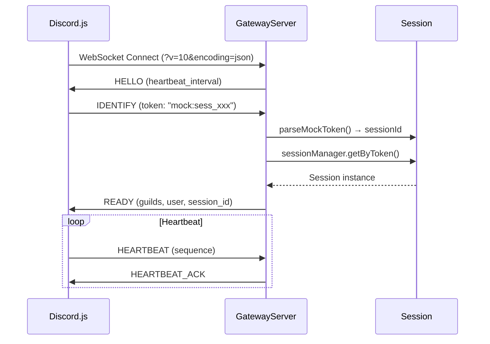

# @robojs/mock Plugin - AI Agent Reference

This document is a deep technical reference for AI coding agents working on the `@robojs/mock` plugin. It explains architecture, contracts, flows, error handling, and gotchas. For user-facing documentation, see `README.md` in this package.

Note: This file is for AI agents and maintainers, not end users.

## Package Purpose

`@robojs/mock` is a Discord Gateway mock server for testing Discord bots without needing a real Discord connection. It provides:

- Full Discord Gateway v10 WebSocket implementation
- Complete REST API v10 endpoints
- Voice Gateway support (port 50001)
- Session-based isolation for parallel testing
- "Stage" UI for visual testing and DevTools
- Recording and replay capabilities

**Key dependencies:**

- robo.js (plugin system, lifecycle hooks, logger)
- @robojs/server (WebSocket + REST server infrastructure)
- discord.js v14 (client compatibility target)
- discord-api-types/v10 (type definitions)

## Architecture Overview

### Two-Layer Architecture

```
┌─────────────────────────────────────────────────────────────────────────────┐
│                              MCP Layer (Future)                              │
│            (User-facing - handles AI tool integration)                       │
│                                                                              │
│  • Provides tools to AI (create_session, send_message, etc.)                │
│  • Tracks "current session" per user/connection                             │
│  • Translates simple tool calls into session-aware API calls                │
└─────────────────────────────────────────────────────────────────────────────┘
                                     │
                                     │ HTTP API (always explicit session_id)
                                     ▼
┌─────────────────────────────────────────────────────────────────────────────┐
│                              Mock Server Layer                               │
│            (Backend - simulates Discord)                                     │
│                                                                              │
│  • Simulates Discord Gateway (WebSocket) and REST API                       │
│  • Manages isolated sessions (state, connections, recordings)               │
│  • No "current session" concept - always requires explicit session_id       │
│  • Can run embedded (same process) or standalone (remote)                   │
└─────────────────────────────────────────────────────────────────────────────┘
```

### Session-Based Isolation

Each test gets its own isolated session with independent state:

```
┌────────────────────────────────────────────────────────────────────────────┐
│                              Mock Server                                    │
│                    (single process, single port pair)                       │
│                                                                             │
│   Session A (test 1)     Session B (test 2)     Session C (test 3)         │
│   ┌─────────────────┐   ┌─────────────────┐   ┌─────────────────┐          │
│   │ • Isolated State│   │ • Isolated State│   │ • Isolated State│          │
│   │ • Own Guilds    │   │ • Own Guilds    │   │ • Own Guilds    │          │
│   │ • Own Channels  │   │ • Own Channels  │   │ • Own Channels  │          │
│   │ • Own Sequence  │   │ • Own Sequence  │   │ • Own Sequence  │          │
│   │ • Bot Connection│   │ • Bot Connection│   │ • Bot Connection│          │
│   │ • Action Log    │   │ • Action Log    │   │ • Action Log    │          │
│   └─────────────────┘   └─────────────────┘   └─────────────────┘          │
│                                                                             │
│   Gateway: ws://localhost:3000    REST: http://localhost:3000               │
│   Control: http://localhost:3000/api/control                                │
└────────────────────────────────────────────────────────────────────────────┘
```

### Token Routing

Session routing uses the token format `mock:<session_id>`:

```typescript
// Token format: "mock:<session_id>"
// Example: "mock:sess_abc123"

// Bot uses this as DISCORD_TOKEN
// Gateway: Extracted from IDENTIFY payload
// REST: Extracted from "Authorization: Bot mock:sess_abc123" header
```

### Stateless Design

The mock server is **fully stateless** with all state held in-memory:

- **No database required** - sessions, messages, interactions all in memory
- **No Redis required** - unless horizontally scaling a hosted deployment
- **Ephemeral by design** - state doesn't persist across restarts

## Core Components

### Session Management

#### SessionManager (`src/session/manager.ts`)

Singleton managing all active sessions:

- TTL-based cleanup (default: 1 hour)
- 60-second cleanup interval
- Session lookup by ID or token

```typescript
// Key methods
sessionManager.create(options) // Create new session
sessionManager.get(sessionId)  // Get by ID
sessionManager.getByToken(token) // Get by "mock:<id>" token
sessionManager.delete(sessionId) // End session
sessionManager.getAll()        // List all sessions
```

#### Session (`src/session/session.ts`)

Isolated test session with its own state:

```typescript
class Session {
  readonly id: string              // Unique session ID
  readonly token: string           // "mock:<id>" format
  readonly name?: string           // Optional display name
  readonly createdAt: number       // Creation timestamp
  readonly expiresAt: number       // TTL expiration
  readonly state: MockServerState  // Centralized entity storage
  readonly connections: Map<string, ConnectionState>  // Gateway connections
  readonly voiceServers: Map<string, VoiceServerState> // Voice state
  readonly recorder: ActionRecorder // Action recording
  readonly config?: SessionConfig  // Initial configuration

  // Loop detection
  private loopDetected: boolean
  private messageCreateTimestamps: number[]

  // Rate limit simulation
  private _simulateRateLimit: boolean
}
```

#### SessionConfig Options

```typescript
interface SessionConfig {
  botUser?: MockUserConfig         // Bot identity
  applicationId?: Snowflake        // App ID
  guilds?: MockGuildConfig[]       // Pre-seeded guilds
  users?: MockUserConfig[]         // Pre-seeded users
  enforceIntents?: boolean         // Enforce privileged intents check
  approvedPrivilegedIntents?: bigint
  maxActions?: number              // Recording limit (default: 10,000)
}
```

### Gateway Server (`src/core/gateway.ts`)

Discord Gateway v10 WebSocket server:

- **WebSocket Path:** `/` with query params `?v=10&encoding=json`
- **Protocol:** Discord Gateway v10, JSON encoding only (no ETF/zlib-stream)
- **Heartbeat:** 41,250ms default (customizable per session)

**Opcodes Handled:**

| Opcode | Name | Direction | Purpose |
|--------|------|-----------|---------|
| 0 | DISPATCH | Server→Client | Event delivery |
| 1 | HEARTBEAT | Client→Server | Keep-alive ping |
| 2 | IDENTIFY | Client→Server | Authentication |
| 4 | VOICE_STATE_UPDATE | Client→Server | Voice channel join/leave |
| 8 | REQUEST_GUILD_MEMBERS | Client→Server | Member fetching |
| 10 | HELLO | Server→Client | Initial handshake |
| 11 | HEARTBEAT_ACK | Server→Client | Keep-alive response |

**Connection Lifecycle:**



### Voice Gateway (`src/core/voice-gateway.ts`)

Voice Gateway on port 50001:

- **Port:** 50001 (separate from main server)
- **Protocol:** WSS/TLS (required by @discordjs/voice)
- **Certificates:** Self-signed, generated at runtime
- **Heartbeat:** 41.25 seconds default

**Why separate port?** @discordjs/voice requires secure WebSocket connections. The Voice Gateway runs on a dedicated port with TLS.

### Stage Server (`src/core/stage.ts`)

WebSocket server for the Stage UI:

- **WebSocket Path:** `/stage/ws` (and `/mock/stage/ws` with plugin prefix)
- **Authentication:** `?token=mock:session_xxx` or `?session=sess_xxx`
- **Event Buffering:** 1000 events max per session
- **Reconnection:** Supports `?last_seq=N` for event replay

### Stage Bridge (`src/core/stage-bridge.ts`)

Observer that forwards session events to Stage UI clients:

```typescript
class StageBridge {
  onSessionDispatch(sessionId, event, data)  // Forward Discord events
  onInteractionResponse(sessionId, interactionId, response)
  onInteractionFollowup(sessionId, interactionId, message)
  onInteractionEdit(sessionId, interactionId)
  onBotReady(sessionId, botUser, connectionId)
  onBotDisconnected(sessionId, connectionId, code, reason)
  onEventFiltered(sessionId, event, reason, intentRequired)
  onLoopDetected(sessionId, eventType, count, windowMs)
}
```

## Robo.js Lifecycle Hooks

The plugin uses four lifecycle hooks in `src/robo/`:

### init.ts - Early Mock Mode Detection

Runs BEFORE prepare hooks:

```typescript
// Detects ROBO_MOCK_MODE=true environment variable
// Pre-generates ROBO_MOCK_SESSION_ID for later use
// Stores state for start hook to consume
```

### prepare.ts - WebSocket Handler Registration

Runs during server preparation:

```typescript
// Registers WebSocket handlers with @robojs/server engine
// Sets up handlers at:
//   - '/' (root) - Gateway WebSocket
//   - '/stage/ws' - Stage UI WebSocket
// Uses engine.registerWebsocket() callback system
```

### start.ts - Server Startup

Main initialization:

```typescript
// 1. Fallback WebSocket registration if prepare didn't work
// 2. Initialize Stage bridge
// 3. Start Voice Gateway on port 50001
// 4. If mock mode enabled:
//    - Resolve bot user (config → Discord API → default)
//    - Create mock mode session with pre-generated ID
//    - Register commands to mock server via HTTP
//    - Log Stage UI URL
```

### stop.ts - Cleanup

Graceful shutdown:

```typescript
// Clean up sessions and connections
// Stop Voice Gateway
```

## REST API Structure

Uses @robojs/server file-based routing. Files in `src/api/` map to HTTP routes.

### Control API (`src/api/control/`)

Session management endpoints:

| Method | Route | File | Purpose |
|--------|-------|------|---------|
| POST | `/api/control/sessions` | `sessions.ts` | Create session |
| GET | `/api/control/sessions` | `sessions.ts` | List sessions |
| GET | `/api/control/sessions/:id` | `sessions/[id].ts` | Get session |
| DELETE | `/api/control/sessions/:id` | `sessions/[id].ts` | Delete session |
| POST | `/api/control/sessions/:id/dispatch` | `sessions/[id]/dispatch.ts` | Inject event |
| GET | `/api/control/sessions/:id/state` | `sessions/[id]/state.ts` | Get state |
| GET | `/api/control/sessions/:id/actions` | `sessions/[id]/actions.ts` | Get recordings |
| POST | `/api/control/sessions/:id/reset` | `sessions/[id]/reset.ts` | Reset state |
| POST | `/api/control/sessions/:id/intents` | `sessions/[id]/intents.ts` | Set intents |
| GET | `/api/control/sessions/:id/commands` | `sessions/[id]/commands.ts` | List commands |

### Discord API v10 (`src/api/v10/`)

Emulates Discord REST API:

| Route Pattern | Purpose |
|---------------|---------|
| `/api/v10/gateway/bot` | Gateway URL info |
| `/api/v10/channels/[id]` | Channel CRUD |
| `/api/v10/channels/[id]/messages` | Message operations |
| `/api/v10/channels/[id]/messages/[messageId]` | Single message |
| `/api/v10/channels/[id]/messages/[messageId]/reactions` | Reactions |
| `/api/v10/guilds/[id]` | Guild operations |
| `/api/v10/guilds/[id]/members` | Member operations |
| `/api/v10/guilds/[id]/roles` | Role operations |
| `/api/v10/users/@me` | Current user |
| `/api/v10/applications/[app_id]/commands` | Command registration |
| `/api/v10/interactions/[id]/[token]/callback` | Interaction responses |
| `/api/v10/webhooks/[id]` | Webhook operations |

### CDN Routes (`src/api/cdn/`)

Attachment hosting:

```
GET /api/cdn/attachments/[channelId]/[attachmentId]/[filename]
```

## State Management

### MockServerState (`src/session/state.ts`)

Centralized entity storage per session:

```typescript
class MockServerState {
  // Entity storage
  readonly guilds: Map<string, MockGuild>
  readonly channels: Map<string, MockChannel>
  readonly users: Map<string, MockUser>
  readonly members: Map<string, Map<string, MockGuildMember>>  // guildId → userId → member
  readonly roles: Map<string, MockRole>
  readonly messages: Map<string, MockMessage>
  readonly commands: Map<string, MockCommand>
  readonly emojis: Map<string, MockEmoji>
  readonly stickers: Map<string, MockSticker>

  // Special state
  readonly botUser: MockUser
  readonly applicationId: string

  // Factory methods
  addGuild(guild)
  addChannelToGuild(guildId, channel)
  createMessage(options)
  getMessage(messageId)
  // ... etc
}
```

### Factory Functions

```typescript
// Create entities with defaults
createMockUser(overrides)
createMockGuild(overrides)
createMockChannel(overrides)
createMockRole(overrides)
createMockMessage(overrides)
createMockGuildMember(overrides)
createDefaultGuildWithChannel(state)
```

## Intent Filtering System

### Intent Mapping (`src/core/intents.ts`)

Maps 30+ Discord events to required intents:

```typescript
const EVENT_INTENTS: Record<string, GatewayIntentBits> = {
  MESSAGE_CREATE: GatewayIntentBits.GuildMessages | GatewayIntentBits.DirectMessages,
  MESSAGE_UPDATE: GatewayIntentBits.GuildMessages | GatewayIntentBits.DirectMessages,
  GUILD_MEMBER_ADD: GatewayIntentBits.GuildMembers,
  GUILD_MEMBER_UPDATE: GatewayIntentBits.GuildMembers,
  PRESENCE_UPDATE: GatewayIntentBits.GuildPresences,
  TYPING_START: GatewayIntentBits.GuildMessageTyping | GatewayIntentBits.DirectMessageTyping,
  // ... 30+ more
}
```

### Privileged Intents

```typescript
const PRIVILEGED_INTENTS =
  GatewayIntentBits.GuildMembers |
  GatewayIntentBits.GuildPresences |
  GatewayIntentBits.MessageContent
```

### Filtering Logic

```typescript
// shouldDispatchEvent() filters events per connection's intents
// If connection lacks required intent:
//   - Event is NOT dispatched
//   - Stage UI shows "filtered event" warning
//   - DevTools logs the filter reason

// MESSAGE_CONTENT intent handling:
// Without MessageContent intent, message.content is stripped to empty string
```

## Recording & Replay

### ActionRecorder (`src/session/recorder.ts`)

Records all session actions:

```typescript
class ActionRecorder {
  private actions: RecordedAction[]
  private maxActions: number  // Default: 10,000

  record(action: RecordedAction)
  getActions(): RecordedAction[]
  clear()
  export(): SessionRecording
}
```

**LRU Eviction:** When actions exceed `maxActions`, oldest 10% are removed.

### Action Types

```typescript
type ActionType =
  | 'gateway_identify'
  | 'gateway_heartbeat'
  | 'gateway_presence_update'
  | 'gateway_voice_state_update'
  | 'gateway_resume'
  | 'gateway_request_guild_members'
  | 'gateway_message'
  | 'rest_request'
  | 'dispatch'
  | 'interaction_response'
  | 'interaction_followup'
```

## Stage UI Architecture (Detailed)

### Layout Structure

The Stage UI uses **CSS Grid** with responsive breakpoints:

```
Desktop (>1024px):
┌─────┬──────────┬────────────────────┬──────────┐
│ SVR │ CHANNELS │    MESSAGE AREA    │ MEMBERS  │
│ LST │   LIST   │  (Virtualized)     │  LIST    │
│     │          │                    │ (toggle) │
│     │──────────│  ┌──────────────┐  │          │
│     │ USER     │  │ MessageInput │  │          │
│     │ AREA     │  └──────────────┘  │          │
├─────┴──────────┴────────────────────┴──────────┤
│    PLAYBACK CONTROLS + STATUS BAR              │
└────────────────────────────────────────────────┘
         ┌─────────────────────────────┐
         │   DevTools Panel (floating) │
         └─────────────────────────────┘
```

Mobile (<768px): Single column, sidebar becomes overlay.

### Provider Stack (`src/app/index.tsx`)

```
ToasterProvider
  └─ DevToolsProvider
      └─ PlaybackProvider
          └─ SessionProvider
              └─ WebSocketProvider
                  └─ App
```

### Component Hierarchy

```
App.tsx
├── KeyboardShortcuts
├── ConnectionStatusOverlay
├── AppShell
│   ├── ServerList (guild icons)
│   ├── ChannelList
│   │   ├── Guild header
│   │   ├── Category groups (collapsible)
│   │   ├── Text/Voice channels
│   │   ├── Threads
│   │   └── UserArea (bot profile)
│   ├── Header (channel info, member toggle)
│   ├── MessageArea (virtualized with @tanstack/react-virtual)
│   │   ├── VirtualizedMessageList
│   │   │   └── Message x N (grouped by author + 5min window)
│   │   │       ├── Avatar + header
│   │   │       ├── Content (Markdown)
│   │   │       ├── Embeds, Attachments
│   │   │       ├── Reactions
│   │   │       └── Buttons/SelectMenus
│   │   ├── PendingMessages (sending/failed states)
│   │   ├── ThinkingIndicator (deferred responses)
│   │   ├── TypingIndicator
│   │   ├── MessageInput (contentEditable + autocomplete)
│   │   └── ContextMenu (right-click)
│   ├── MemberList (toggleable right sidebar)
│   │   ├── Role groups
│   │   └── Member items with presence
│   ├── PlaybackControls (record/replay controls)
│   ├── StatusBar (heartbeat, event count)
│   └── DevToolsPanel (floating, 5 tabs)
├── Modal (interaction modals)
└── ConnectionScreen (overlay when reconnecting)
```

### State Management

#### SessionStore (`stores/sessionStore.tsx`)

~30 reducer actions managing all UI state:

```typescript
interface SessionState {
  // Connection
  sessionId: string | null
  isConnected: boolean
  isConnecting: boolean
  error: string | null

  // Discord data
  guilds: StageGuild[]
  channels: StageChannel[]
  members: StageMember[]
  roles: StageRole[]
  voiceStates: StageVoiceState[]
  users: StageUser[]
  messages: Record<string, StageMessage[]>  // channelId → messages
  commands: StageApplicationCommand[]
  botUser: StageUser | null

  // UI state
  selectedGuildId: string | null
  selectedChannelId: string | null
  showMembers: boolean

  // Pending states
  typingUsers: Record<string, TypingUser[]>
  pendingInteractions: PendingInteraction[]
  pendingMessages: PendingMessage[]
  activeModal: ModalData | null
  replyingTo: StageMessage | null

  // Diagnostics
  filteredEvents: FilteredEvent[]
  loopWarning: LoopWarning | null
  eventCount: number
  lastHeartbeat: number | null
}
```

#### WebSocketContext (also in `sessionStore.tsx`)

Manages WebSocket connection:

```typescript
interface WebSocketContextValue {
  connect(): void
  disconnect(): void
  sendCommand<T>(type: string, data: unknown): Promise<T>
  isConnected: boolean
  isConnecting: boolean
  error: string | null
  hasGivenUp: boolean
  isSessionInvalid: boolean
  retryCount: number
  retry(): void
}
```

**Reconnection:** Exponential backoff (1s→30s), max 5 attempts.

#### PlaybackStore (`stores/playbackStore.tsx`)

Event recording and replay:

```typescript
interface PlaybackState {
  mode: 'live' | 'playback'
  isPlaying: boolean
  currentTime: number
  duration: number
  speed: number  // 0.5x, 1x, 2x, etc.
  events: RecordedEvent[]
}
```

### DevTools Panel

**File:** `components/devtools/DevToolsPanel.tsx`

- **Toggle:** Ctrl/Cmd + Shift + D
- **Persisted:** localStorage (`stage_devtools_open`)

| Tab | Component | Purpose |
|-----|-----------|---------|
| Events | `EventLog.tsx` | All WebSocket events, filterable, JSON expand |
| State | `StateViewer.tsx` | Current state tree (guilds, channels, messages) |
| Network | `NetworkLog.tsx` | Commands sent + responses, JSON inspection |
| Performance | `PerformanceMetrics.tsx` | Render times, latency, memory |
| Tools | `ToolsPanel.tsx` | Clear events, export JSON, inject test data |

### User Action Flows

**Send Message:**

```
MessageInput → handleSubmit() → ADD_PENDING_MESSAGE
  → sendCommand('send_message') → Server
  → message_create event → HANDLE_MESSAGE_CREATE
  → REMOVE_PENDING_MESSAGE → Message appears
```

**Button Click:**

```
Button component → onButtonClick()
  → sendCommand('click_button', {message_id, custom_id})
  → interaction_response event
  → Type 4: Update message / Type 5: Show "thinking..."
```

**Slash Command:**

```
MessageInput (autocomplete) → invokeCommand()
  → sendCommand('invoke_command', {command_name, options})
  → Server processes → interaction_response
```

**Modal Submit:**

```
Bot sends Type 9 response → SHOW_MODAL → Modal overlay
  → User fills form → submitModal()
  → sendCommand('submit_modal') → Response in chat
```

### Key Technical Details

- **Message Virtualization:** `@tanstack/react-virtual` for 100+ messages
- **Message Grouping:** By author + 5-minute window (reduces avatar repetition)
- **Height Estimation:** Content, embeds, attachments, code blocks
- **Playback:** Records all events with timestamps for replay/debugging
- **Intent Diagnostics:** Shows filtered events in DevTools when bot missing intents
- **Loop Detection:** Warns in DevTools when circuit breaker triggers

### Component File Locations

| Component | File Path |
|-----------|-----------|
| App | `src/app/App.tsx` |
| AppShell | `src/app/components/layout/AppShell.tsx` |
| ServerList | `src/app/components/sidebar/ServerList.tsx` |
| ChannelList | `src/app/components/sidebar/ChannelList.tsx` |
| UserArea | `src/app/components/sidebar/UserArea.tsx` |
| Header | `src/app/components/layout/Header.tsx` |
| StatusBar | `src/app/components/layout/StatusBar.tsx` |
| MessageArea | `src/app/components/messages/MessageArea.tsx` |
| Message | `src/app/components/messages/Message.tsx` |
| ForumChannelView | `src/app/components/messages/ForumChannelView.tsx` |
| VoiceChannelView | `src/app/components/messages/VoiceChannelView.tsx` |
| MessageInput | `src/app/components/messages/MessageInput.tsx` |
| PendingMessage | `src/app/components/messages/PendingMessage.tsx` |
| ThinkingIndicator | `src/app/components/messages/ThinkingIndicator.tsx` |
| TypingIndicator | `src/app/components/messages/TypingIndicator.tsx` |
| Embed | `src/app/components/messages/Embed.tsx` |
| Attachments | `src/app/components/messages/Attachments.tsx` |
| Reactions | `src/app/components/messages/Reactions.tsx` |
| Button | `src/app/components/messages/Button.tsx` |
| SelectMenu | `src/app/components/messages/SelectMenu.tsx` |
| MemberList | `src/app/components/members/MemberList.tsx` |
| UserProfilePopout | `src/app/components/members/UserProfilePopout.tsx` |
| DevToolsPanel | `src/app/components/devtools/DevToolsPanel.tsx` |
| EventLog | `src/app/components/devtools/EventLog.tsx` |
| StateViewer | `src/app/components/devtools/StateViewer.tsx` |
| NetworkLog | `src/app/components/devtools/NetworkLog.tsx` |
| PerformanceMetrics | `src/app/components/devtools/PerformanceMetrics.tsx` |
| ToolsPanel | `src/app/components/devtools/ToolsPanel.tsx` |
| JsonViewer | `src/app/components/devtools/JsonViewer.tsx` |
| Modal | `src/app/components/modals/Modal.tsx` |
| PlaybackControls | `src/app/components/playback/PlaybackControls.tsx` |
| ConnectionScreen | `src/app/components/layout/ConnectionScreen.tsx` |
| SessionStore | `src/app/stores/sessionStore.tsx` |
| PlaybackStore | `src/app/stores/playbackStore.tsx` |
| useSession | `src/app/hooks/useSession.ts` |
| useStageWebSocket | `src/app/hooks/useStageWebSocket.ts` |

## Discord.js Integration

### @robojs/discordjs Mock Mode

When `ROBO_MOCK_MODE=true`:

1. `@robojs/discordjs` waits for `@robojs/server` to be ready
2. Discord.js connects to local gateway instead of Discord
3. Environment variables configure the connection:
   - `DISCORD_REST_API` points to mock server REST API
   - `DISCORD_TOKEN` uses `mock:<session_id>` format

### Bot User Resolution

The `resolveBotUser()` function (`src/utils/bot-user-resolver.ts`) uses a fallback chain:

1. Explicit config from `defaultSessionConfig.botUser`
2. Fetch from Discord API using real token (if available)
3. Default "MockBot" user

### Command Registration

At startup, commands are registered to the mock server via HTTP:

```typescript
// Uses Discord.js REST client pointed at mock server
const rest = new REST({ version: '10' }).setToken(session.token)
rest.options.api = process.env.DISCORD_REST_API
await rest.put(Routes.applicationCommands(clientId), { body: commandData })
```

## Critical Quirks & Gotchas

### Connection & Protocol

1. **Gateway v10 only** - validates `?v=10` query param, rejects others
2. **JSON encoding only** - no ETF/zlib-stream support
3. **Token format must be `mock:<session_id>`** - parsed by `parseMockToken()`
4. **Heartbeat interval customizable** via session config or URL hint `?session_id=<id>`

### Loop Protection

5. **Detects 10+ MESSAGE_CREATE events in 1 second** - triggers circuit breaker
6. **5-second cooldown** when loop detected (configurable)
7. **Can be disabled per session** via `loopProtectionEnabled` property
8. **Stage UI warns** when loop is detected

### Voice

9. **Voice Gateway on port 50001** - separate from main server
10. **Requires WSS/TLS** - self-signed certs generated at runtime
11. **@discordjs/voice requires secure connections** - this is why separate port

### State & Sessions

12. **Sessions expire after 1 hour** by default (TTL configurable)
13. **State is ephemeral** - doesn't persist across restarts
14. **Deleted threads/channels are recreated** if referenced again
15. **Action recording has LRU eviction** at 10k actions (oldest 10% removed)

### Stage UI

16. **Stage WebSocket reconnects** with exponential backoff (max 5 attempts)
17. **Event buffering: 1000 events max** per session
18. **Supports `?last_seq=N`** for event replay on reconnect
19. **DevTools toggle: Ctrl/Cmd + Shift + D**
20. **Message virtualization** uses `@tanstack/react-virtual`

### Intents

21. **Privileged intents can be enforced or allowed** per session
22. **Event filtering applies per-connection**, not per-session
23. **MESSAGE_CONTENT stripped** without proper intent (content becomes empty string)
24. **Filtered events shown in DevTools** for debugging

### REST API

25. **Routes use @robojs/server file-based routing** - files map to paths
26. **Session resolved from `Authorization: Bot mock:<id>` header**
27. **Multipart form-data supported** for file uploads
28. **CDN routes serve attachments** from in-memory storage

### Testing

29. **30 integration test phases** covering all Discord.js functionality
30. **Test utilities in `__tests__/integration/setup/`** and `utils/`
31. **Factory functions** for test data creation
32. **Jest with ESM support** via `NODE_OPTIONS="--experimental-vm-modules"`

## Logging Standards

**The plugin uses a single shared logger instance: `mockLogger` from `src/core/logger.ts`.**

**All files must import and use this logger - do not create additional logger forks.**

```typescript
// src/core/logger.ts
import { logger } from 'robo.js'
export const mockLogger = logger.fork('mock')

// All other files:
import { mockLogger } from '../core/logger.js'
mockLogger.info('Message')
mockLogger.debug('Debug info')
mockLogger.error('Error:', error)
```

**Log levels:**

- `debug`: Operations and state changes
- `info`: Completions and milestones
- `warn`: Non-critical failures and degraded functionality
- `error`: Critical failures that require attention

## Testing Patterns

### Test Structure

- **30 integration test phases** in `__tests__/integration/`
- **Unit tests** in `__tests__/*.test.ts`
- **~20,000+ lines** of test code

### Test Utilities

Location: `__tests__/integration/setup/` and `utils/`

```typescript
// Factory functions
createTestClient()
createSession(config)
destroyClient(client)

// Event helpers
waitForEvent(client, eventName, timeout, predicate?)
waitForReady(client, timeout)

// Snowflake generation
generateSnowflake()
resetSnowflakeCounter()

// Control API helpers
controlAPI<T>(endpoint, {method, body})
```

### Running Tests

```bash
# Run all tests
NODE_OPTIONS="--experimental-vm-modules" npx jest

# Run specific phase
NODE_OPTIONS="--experimental-vm-modules" npx jest --testPathPattern=phase-1
```

## Directory Map

```
packages/@robojs/mock/
├── __tests__/                 # Jest tests
│   ├── *.test.ts              # Unit tests (29 files)
│   └── integration/           # 30 phase integration tests
│       ├── phase-1/           # Basic connection
│       ├── phase-2A/          # Gateway READY
│       ├── phase-2B/          # Heartbeat
│       ├── ...                # More phases
│       ├── setup/             # Test utilities
│       │   ├── constants.ts   # Config values
│       │   ├── control-api.ts # API helpers
│       │   └── helpers.ts     # Event waiters
│       └── INTEGRATION_TESTING_GUIDE.md
├── config/
│   ├── plugins/               # Plugin configs
│   │   └── robojs/
│   │       └── server.ts      # @robojs/server config
│   ├── robo.ts                # Robo.js config
│   └── vite.stage.mjs         # Stage UI Vite config
├── public/stage/              # Built Stage UI (Vite output)
├── src/
│   ├── api/                   # REST API routes
│   │   ├── control/           # Mock control endpoints
│   │   │   ├── sessions.ts    # POST/GET /sessions
│   │   │   ├── sessions/
│   │   │   │   ├── [id].ts    # GET/DELETE /sessions/:id
│   │   │   │   └── [id]/      # Session sub-routes
│   │   │   │       ├── state.ts
│   │   │   │       ├── actions.ts
│   │   │   │       ├── dispatch.ts
│   │   │   │       ├── reset.ts
│   │   │   │       └── ...
│   │   │   └── utils.ts       # Control API helpers
│   │   ├── v10/               # Discord API v10 routes
│   │   │   ├── gateway/
│   │   │   ├── channels/
│   │   │   ├── guilds/
│   │   │   ├── users/
│   │   │   ├── applications/
│   │   │   ├── interactions/
│   │   │   └── webhooks/
│   │   ├── cdn/               # CDN/attachment routes
│   │   │   └── attachments/
│   │   └── stage/             # Stage-specific routes
│   ├── app/                   # Stage UI React app
│   │   ├── App.tsx            # Root component
│   │   ├── index.tsx          # Entry + provider stack
│   │   ├── components/
│   │   │   ├── layout/        # AppShell, Header, StatusBar, ConnectionScreen
│   │   │   ├── sidebar/       # ServerList, ChannelList, UserArea, VoiceChannel
│   │   │   ├── messages/      # MessageArea, Message, MessageInput, Embed, etc.
│   │   │   ├── members/       # MemberList, UserProfilePopout
│   │   │   ├── devtools/      # DevToolsPanel, EventLog, StateViewer, NetworkLog
│   │   │   ├── playback/      # PlaybackControls
│   │   │   ├── modals/        # Modal
│   │   │   └── common/        # ErrorBoundary, Toaster, EmojiPicker, Markdown
│   │   ├── stores/            # sessionStore.tsx, playbackStore.tsx
│   │   ├── hooks/             # useSession.ts, useStageWebSocket.ts, useContextMenu.ts
│   │   ├── styles/            # discord-theme.css, globals.css
│   │   ├── types/             # Stage types (stage.ts, css.d.ts)
│   │   └── utils/             # Helpers (avatar.ts, format.ts, time.ts)
│   ├── core/                  # Core mock functionality
│   │   ├── gateway.ts         # Gateway WebSocket server
│   │   ├── stage.ts           # Stage WebSocket server
│   │   ├── voice-gateway.ts   # Voice Gateway server (port 50001)
│   │   ├── stage-bridge.ts    # Event forwarding to Stage clients
│   │   ├── manager.ts         # Session manager singleton
│   │   ├── intents.ts         # Intent filtering logic
│   │   ├── permissions.ts     # Permission utilities
│   │   └── logger.ts          # Shared mockLogger
│   ├── discord/               # Discord protocol
│   │   ├── opcodes.ts         # Gateway opcodes, constants
│   │   ├── payloads.ts        # Payload builders (READY, MESSAGE_CREATE, etc.)
│   │   └── index.ts           # Exports
│   ├── robo/                  # Lifecycle hooks
│   │   ├── init.ts            # Mock mode detection
│   │   ├── prepare.ts         # WebSocket handler registration
│   │   ├── start.ts           # Server startup
│   │   └── stop.ts            # Cleanup
│   ├── session/               # Session management
│   │   ├── session.ts         # Session class
│   │   ├── manager.ts         # SessionManager singleton
│   │   ├── state.ts           # MockServerState (entity storage)
│   │   ├── recorder.ts        # ActionRecorder
│   │   ├── player.ts          # Recording replay
│   │   ├── storage.ts         # Storage interface
│   │   └── index.ts           # Exports
│   ├── storage/               # Data storage
│   │   └── attachment-storage.ts
│   ├── types/                 # TypeScript types
│   │   ├── index.ts           # Main types
│   │   ├── plugin.ts          # Plugin config types
│   │   └── stage.ts           # Stage event types
│   ├── utils/                 # Utilities
│   │   ├── snowflake.ts       # Snowflake generation
│   │   ├── id.ts              # ID generation helpers
│   │   ├── multipart.ts       # Form-data parsing
│   │   ├── image.ts           # Image processing
│   │   ├── permission-check.ts
│   │   ├── server.ts          # Server URL helpers
│   │   └── bot-user-resolver.ts
│   ├── auth/                  # Auth utilities
│   │   └── index.ts
│   └── index.ts               # Package entry point
├── docs/                      # Integration test documentation
│   └── discord-mock-integration-tests-part*.md (30 files)
├── package.json
├── tsconfig.json
├── jest.config.ts
└── README.md
```

## Maintenance & Updates

When modifying core files, update this document:

| File Changed | Update Section |
|--------------|----------------|
| `src/core/gateway.ts` | Gateway Server, Connection & Protocol quirks |
| `src/core/voice-gateway.ts` | Voice Gateway, Voice quirks |
| `src/core/stage.ts` | Stage Server |
| `src/core/stage-bridge.ts` | Stage Bridge |
| `src/core/intents.ts` | Intent Filtering System, Intents quirks |
| `src/session/session.ts` | Session class, State & Sessions quirks |
| `src/session/state.ts` | State Management |
| `src/session/recorder.ts` | Recording & Replay |
| `src/robo/*.ts` | Lifecycle Hooks |
| `src/api/**` | REST API Structure |
| `src/app/**` | Stage UI Architecture |
| `src/types/**` | Update relevant type references |
| `__tests__/**` | Testing Patterns |

**Update checklist:**

- [ ] Function changed? Update the relevant section
- [ ] New quirk discovered? Add to Quirks & Gotchas
- [ ] New component added? Add to Component File Locations
- [ ] API endpoint changed? Update REST API Structure
- [ ] State shape changed? Update State Management
- [ ] New test pattern? Update Testing Patterns
- [ ] Directory changed? Update Directory Map

---

**Last Updated:** 2025-01-15

**Version:** 1.0.0

**Maintained By:** AI coding agents and human contributors

Questions? See `README.md` for user docs, or explore the source files listed above.
