# @robojs/roadmap Plugin - AI Agent Reference

This document is a deep technical reference for AI coding agents working on the `@robojs/roadmap` plugin. It explains architecture, contracts, flows, error handling, and gotchas. For user-facing documentation, see `README.md` in this package.

Note: This file is for AI agents and maintainers, not end users.

## Architecture Overview

- Core purpose: Sync roadmap data from external providers (e.g., Jira) to Discord forum channels organized by column (Backlog, In Progress, Done), with commands and an optional REST API.
- Key dependencies:
  - robo.js (State API, Logger API, Discord client integration)
  - discord.js v14
  - @robojs/server (optional, only when REST API routes are enabled)
- File structure and roles:
  - `src/index.ts` – Public API exports and top-level wiring
  - `src/types.ts` – Core type definitions
  - `src/providers/` – Provider implementations (`base.ts`, `jira.ts`)
  - `src/core/` – Core modules (`sync-engine.ts`, `forum-manager.ts`, `settings.ts`, `constants.ts`)
  - `src/commands/` – Discord slash commands (`roadmap/setup.ts`, `roadmap/sync.ts`, `roadmap/add.ts`, `roadmap/edit.ts`)
  - `src/events/` – Lifecycle and interaction handlers (`_start.ts`, `interactionCreate/*`)
  - `src/api/` – REST API endpoints (requires `@robojs/server`)

### High-level flow (Mermaid)

```mermaid
sequenceDiagram
    participant User as User/Admin
    participant Cmd as Discord Command
    participant Init as Plugin Init
    participant Provider as RoadmapProvider
    participant Sync as Sync Engine
    participant Forum as Forum Manager
    participant Settings as Flashcore Settings
    participant Discord as Discord API

    Note over User,Discord: Plugin Initialization Flow
    Init->>Provider: resolveProviderConfig()
    Provider->>Provider: Check plugin options
    Provider->>Provider: Check environment vars
    Provider->>Init: Return config or null
    Init->>Provider: validateConfig()
    Provider->>Init: Valid/Invalid
    Init->>Provider: init() (authenticate)
    Provider->>Init: Ready/Error
    Init->>Init: Store in global state

    Note over User,Discord: Setup Command Flow
    User->>Cmd: /roadmap setup
    Cmd->>Provider: getColumns()
    Provider-->>Cmd: [Backlog, In Progress, Done]
    Cmd->>Forum: createOrGetRoadmapCategory()
    Forum->>Settings: getSettings(guildId)
    Settings-->>Forum: Existing settings
    Forum->>Discord: Check existing category/forums
    alt Category exists
        Forum->>Forum: Return existing
    else Create new
        Forum->>Discord: Create category
        Forum->>Discord: Create forum channels
        Forum->>Settings: updateSettings()
    end
    Forum-->>Cmd: Category + Forums
    Cmd->>User: Setup message with buttons

    Note over User,Discord: Sync Command Flow
    User->>Cmd: /roadmap sync
    Cmd->>Provider: fetchCards()
    Provider-->>Cmd: [Card1, Card2, ...]
    Cmd->>Provider: getColumns()
    Provider-->>Cmd: [Column1, Column2, ...]
    Cmd->>Sync: syncRoadmap()
    Sync->>Forum: getAllForumChannels()
    Forum->>Settings: getSettings(guildId)
    Settings-->>Forum: Forum channel IDs
    Forum->>Discord: Fetch forum channels
    Discord-->>Forum: Forum objects
    Forum-->>Sync: Map of forums

    loop For each column
        Sync->>Forum: updateForumTagsForColumn()
        Forum->>Discord: setAvailableTags()
    end

    loop For each card
        Sync->>Settings: getSyncedPostId(cardId)
        Settings-->>Sync: Thread ID or null
        alt Thread exists
            Sync->>Discord: Fetch thread
            Note over Sync,Discord: Column Change Handling
            alt Column changed (thread.parentId ≠ forum.id)
                Sync->>Sync: Check hasUserMessages(thread)
                alt Has user messages (messageCount > 1)
                    Sync->>Sync: Build link: "📜 See X messages in previous discussion"
                    Sync->>Sync: Prepend link to card content
                end
                Sync->>Discord: Create new thread in target forum
                Sync->>Discord: Lock and archive old thread
                Sync->>Settings: addThreadToHistory(entry with messageCount)
                Sync->>Settings: setSyncedPost(cardId, newThreadId)
            else Same forum
                Sync->>Discord: Edit thread name/tags
                Sync->>Discord: Edit starter message
            end
        else Create new
            Sync->>Discord: Create thread
            Sync->>Settings: setSyncedPost(cardId, threadId)
        end
    end

    Sync->>Settings: updateSettings(lastSyncTimestamp)
    Sync-->>Cmd: SyncResult with stats
    Cmd->>User: Success message

    Note over User,Discord: Add Card Flow
    User->>Cmd: /roadmap add
    Cmd->>Cmd: Check authorization
    Cmd->>Provider: createCard(input)
    Provider->>Provider: Map to provider format
    Provider->>Provider: Call provider API
    Provider-->>Cmd: CreateCardResult
    Cmd->>Sync: syncRoadmap()
    Sync->>Discord: Create thread for new card
    Sync->>Settings: setSyncedPost()
    Cmd->>User: Success message
```



## Documentation and Error Handling Standards

This section codifies the standards for all future development in this plugin.

### JSDoc Documentation Standards

Public API functions (exported from `src/index.ts`) must have focused, practical JSDoc:

**Required elements:**

- Purpose in 1-2 sentences
- `@param` tags with brief descriptions
- `@returns` tag with type and description
- `@throws` tags for errors that callers must handle
- 1-2 simple `@example` blocks showing typical usage

**What to avoid:**

- Excessive remarks about implementation details
- Performance characteristics, caching strategies, timezone handling
- Edge cases, provider-specific internals, pagination mechanisms
- Flashcore/Discord API internals

**Internal functions** should have concise JSDoc (1-2 lines) or inline comments for complex logic.

**Good example:**

````typescript
/**
 * Fetches cards from the last 7 days (inclusive of today).
 *
 * @param provider - The roadmap provider instance.
 * @param dateField - The date field to filter on (defaults to 'updated').
 * @returns Array of cards from the last 7 days.
 * @throws Error if provider is null/undefined or doesn't support date filtering.
 *
 * @example
 * ```typescript
 * const cards = await getCardsFromLastWeek(provider);
 * ```
 */
````

**Bad example:**

```typescript
/**
 * Fetches Jira issues filtered by date range using JQL date queries.
 *
 * @remarks
 * Retrieves issues matching the specified date range criteria. Supports filtering by both
 * 'created' and 'updated' date fields, with 'updated' as the default. Results are ordered
 * by the selected date field in descending order (most recent first).
 *
 * Accepts both Date objects and ISO 8601 strings (e.g., '2025-01-01'). Results are cached
 * for 5 minutes to improve performance. Returns an empty array on error instead of throwing.
 *
 * The Jira API returns paginated results which are automatically handled internally...
 * [10 more lines of implementation details]
 */
```

### Error Handling Standards

Public API functions must throw meaningful errors with context, never fail silently.

**Required patterns:**

- Validate inputs early and throw descriptive errors with actionable messages
- Wrap external calls (provider methods, Discord API, Flashcore operations) in try-catch blocks
- Log errors with full context (function name, relevant parameters like guildId/cardId, error message) using `roadmapLogger`
- Throw or re-throw with additional context for callers

**Internal functions** may return fallback values (empty arrays, null, default objects) with logging for non-critical failures.

**Error messages should be actionable:**

```typescript
// ✅ Good - tells users what went wrong and how to fix it
throw new Error('Jira authentication failed. Check JIRA_EMAIL and JIRA_API_TOKEN environment variables.')

// ❌ Bad - vague, not actionable
throw new Error('Auth failed')
```

**Good error handling example (from JiraProvider):**

```typescript
try {
	const response = await fetch(url, options)
	if (!response.ok) {
		const errorMessage = await this.safeReadError(response)
		if (response.status === 401) {
			throw new Error('Jira authentication failed during issue retrieval.')
		}
		throw new Error(`Failed to fetch issue (status ${response.status}): ${errorMessage}`)
	}
	// Process response
} catch (error) {
	roadmapLogger.error('getCard: Failed to fetch card %s: %s', cardId, (error as Error).message)
	throw error
}
```

**Bad error handling example:**

```typescript
// ❌ Silent failure - returns empty array without logging
if (!provider?.fetchCardsByDateRange) {
	return []
}
```

### Logging Standards

**The plugin uses a single shared logger instance: `roadmapLogger` exported from `src/core/logger.ts`.**

**All files must import and use this logger - do not create additional logger forks.**

The logger is created with `logger.fork('roadmap')` for consistent namespacing.

**Log levels:**

- `debug`: Operations and state changes
- `info`: Completions and milestones
- `warn`: Non-critical failures and degraded functionality
- `error`: Critical failures that require user action
- `ready`: Initialization success

**Logs should include context** (guild ID, card ID, operation name, relevant parameters) to aid debugging.

**Good logging patterns:**

```typescript
roadmapLogger.info('Successfully created Jira issue: %s (%s)', issueKey, input.title)
roadmapLogger.error('Failed to sync card %s (title: %s): %s', card.id, card.title, error.message)
roadmapLogger.warn('No transition found for issue %s to status %s', issueKey, targetStatus)
```

Follow these standards for all new code and update existing code during maintenance.

## Provider Architecture

### RoadmapProvider Base Class

- Location: `src/providers/base.ts`
- Purpose: Abstract contract for roadmap data providers
- Abstract methods:
  - `fetchCards(): Promise<readonly RoadmapCard[]>`
  - `getColumns(): Promise<readonly RoadmapColumn[]>`
  - `getCard(cardId: string): Promise<RoadmapCard | null>`
  - `createCard(input: CreateCardInput): Promise<CreateCardResult>`
  - `updateCard(cardId: string, input: UpdateCardInput): Promise<UpdateCardResult>`
  - `getProviderInfo(): Promise<ProviderInfo>`
- Optional methods:
  - `validateConfig(config?: TConfig): boolean` (default: true)
  - `init(): Promise<void>` (default: no-op)
- Type parameter: `TConfig extends ProviderConfig`
- Usage: Extend and implement abstract methods

### JiraProvider Implementation

- Location: `src/providers/jira.ts`
- Configuration sources (precedence):
  1. Explicit config properties
  2. Plugin options
  3. Environment variables
- Required configuration: `url`, `email`, `apiToken`, `projectKey`
- Optional configuration: `jql`, `maxResults` (1-100), `defaultIssueType` (default: `Epic`), `columnConfig`
- Authentication: Basic auth using `email:apiToken` (base64)
- API: Jira REST API v3 with cursor-based pagination
- Status mapping:
  - Default behavior: Jira category To Do → `Backlog`, In Progress → `In Progress`, Done → `Done`, Fallback: `Backlog`
  - Customizable via `columnConfig.statusMapping` (provider-level) or guild settings (runtime-level)
  - Supports many-to-one mappings (multiple statuses to one column)
  - Supports null mappings (status tracked but not synced to forum)
- ADF conversion:
  - ADF → text: recursive visitor (paragraphs, headings, lists, code blocks)
  - text → ADF: paragraph-per-line
  - Limitation: complex formatting not preserved (tables, media, mentions)
- Assignees:
  - Single assignee supported by Jira
  - First assignee used; extras ignored with a warning
  - IDs must be Jira `accountId`
  - **Redaction Contract:** `mapAssignee()` stores Jira's `displayName` directly as `RoadmapCard.assignees[].name`. This field must never be displayed directly to end users. It is intended only as a key for guild-specific mapping to Discord user identities. UI/Discord surfaces must not render `name` directly unless it has been redacted or mapped to Discord. See "Critical Implementation Details" below for more information.
- Status transitions:
  - Fetch transitions, match by target status, warn if not found
  - Workflow-specific transition IDs; not guaranteed direct transitions
- Error handling:
  - 401 auth failed; 400 invalid JQL/request; 404 not found (return null from `getCard`); network errors wrapped descriptively

### Configuration Precedence (Initialization)

- Location: `src/events/_start.ts`
- Order:
  1. Pre-instantiated provider in `pluginOptions.provider`
  2. Provider config object in `pluginOptions.provider`
  3. Environment variables (`JIRA_URL`, `JIRA_EMAIL`, `JIRA_API_TOKEN`, `JIRA_JQL`)
  4. `null` (inactive plugin)
- Behavior:
  - Graceful degradation when missing config (plugin loads but stays inactive)
  - `validateConfig()` before `init()`, throws if invalid
  - Provider stored globally; exposed via `getProvider()` and `isProviderReady()`

## Sync Engine

### `syncRoadmap(options: SyncOptions)`

- Location: `src/core/sync-engine.ts`
- Purpose: Orchestrate provider-to-Discord synchronization
- Options:
  - `guild: Guild`
  - `provider: RoadmapProvider`
  - `dryRun?: boolean = false`
- Workflow:
  1. Validate forum prerequisites
  2. Fetch provider cards and columns
  3. Group cards by column
  4. Update forum tags per column (merge + dedupe)
  5. Refresh forums to get latest tags and build tag maps
  6. For each card, decide op (create/update/archive/skip), map tags (≤5), format content (≤2000 for forum thread starters), execute and track stats
  7. Update last sync timestamp
  8. Return `SyncResult`
- Idempotent: existing threads updated without duplication
- Error recovery:
  - Per-card failures don’t abort the run
  - Deleted threads are recreated automatically
  - Rate limits logged with guidance
  - Missing permissions abort with clear message
- Stats: `total`, `created`, `updated`, `archived`, `errors`

### Sync Cancellation

- Overview: Syncs can be canceled mid-operation via a cancel button in the progress UI.
- Sync ID System: Each sync uses the Discord interaction ID as a unique `syncId`, tracked in the in-memory `activeSyncs` map within `src/commands/roadmap/sync.ts`.
- AbortController Pattern:
  - A single `AbortController` is created when the sync starts and stored in `activeSyncs` alongside metadata (`startedBy`, `guildId`, `dryRun`, `startedAt`).
  - The `AbortSignal` is passed into `syncRoadmap()` via `SyncOptions` and is checked within the per-card loop inside `src/core/sync-engine.ts`.
  - When the signal is aborted, the engine throws `Error('Sync canceled by user')`, which is caught by the command handler.
- Authorization: Only administrators or the user who initiated the sync can cancel it.
- Cancel Button Handler: Implemented in `src/events/interactionCreate/button-cancel-sync.ts`.
  - Custom ID prefix is `Buttons.CancelSync.id`; the concrete ID format is `${prefix}-${syncId}`.
  - Extracts `syncId`, validates authorization (admin or starter match), then calls `controller.abort()`.
- Cleanup Flow:
  - Abort triggers an error from the sync engine that is handled in the command’s catch block.
  - The command builds a cancellation UI showing partial stats and removes the entry from `activeSyncs`.
  - The auto-cleanup timeout is cleared before deletion.
- Auto-Cleanup:
  - A 15-minute timeout is scheduled on sync start using `setTimeout`; the timeout ID is stored as `cleanupTimeoutId` on the `SyncData`.
  - On normal completion, cancellation, or error, the timeout is cleared with `clearTimeout`.
  - If the timeout triggers, the entry is pruned and a warning is logged (indicates abnormal termination).
  - This prevents memory leaks from abandoned syncs and aligns with Discord interaction expiry.
- Partial Results:
  - The command tracks `lastProgressUpdate` (current index and total) and displays partial stats on cancel.
  - UI emphasizes: “Partial sync: X/Y cards processed.”
- Concurrent Syncs:
  - Each sync is isolated by `syncId`; canceling one doesn’t affect others.
  - The map prevents cross-cancellation.

```mermaid
sequenceDiagram
    participant User
    participant Button as Cancel Button Handler
    participant Map as activeSyncs Map
    participant Controller as AbortController
    participant Engine as syncRoadmap()
    participant Command as /roadmap sync
    participant Discord

    User->>Button: Click "Cancel Sync" button
    Button->>Button: Extract syncId from customId
    Button->>Map: get(syncId)
    Map-->>Button: SyncData with controller
    
    Button->>Button: Verify authorization (admin or starter)
    
    alt Authorized
        Button->>Controller: abort()
        Note over Controller: Signal becomes aborted
        
        Engine->>Engine: Check signal?.aborted in card loop
        Engine->>Engine: Throw Error('Sync canceled by user')
        
        Engine-->>Command: Error propagates to catch block
        
        Command->>Command: Detect cancellation error message
        Command->>Command: Build cancellation UI with partial stats
        Command->>Map: Clear timeout and delete(syncId)
        
        Command->>Discord: editReply(cancellation UI)
        Discord-->>User: "⚠️ Sync Canceled - Partial sync: X/Y cards"
        
        Button->>Discord: deferUpdate()
    else Not Authorized
        Button->>Discord: followUp("Not authorized", ephemeral)
    end
```



### Thread Movement Functions

**`hasUserMessages(thread: ThreadChannel): boolean`**

- Location: `src/core/sync-engine.ts` (lines 145-149)
- Purpose: Determine if a thread has user activity beyond the starter message
- Logic: Returns `true` if `thread.messageCount > 1` (starter message counts as 1)
- Used by: `moveThreadToNewForum()` to decide whether to link to old threads

**`moveThreadToNewForum(card, existingThread, targetForum, appliedTags, guildId): Promise<ThreadChannel>`**

- Location: `src/core/sync-engine.ts` (lines 171-255)
- Purpose: Orchestrate thread movement when a card's column changes
- Process:
  1. Validate inputs and check if thread is already in target forum (early return if so)
  2. Check if old thread has user messages via `hasUserMessages()`
  3. Format new thread content:
     - If user messages exist: prepend link "📜 See X message(s) in previous discussion: [url]" where X = messageCount - 1
     - Otherwise: use standard `formatCardContent()`
  4. Create new thread in target forum with name, content, and tags
  5. Lock and archive old thread (non-critical, logs warning if fails)
  6. Record history entry via `addThreadToHistory()` with threadId, column, forumId, movedAt, messageCount
  7. Update `syncedPosts` mapping via `setSyncedPost()` to point to new thread
  8. Return new thread
- Error handling: Throws if inputs invalid or thread creation fails; logs warning if lock/archive fails
- Integration: Called by `syncCard()`, `/roadmap edit` command, and REST API PUT endpoint

### `syncCard()` details

- Column mapping resolution (before column change detection):
  - Apply guild-level column mapping overrides first (via `getColumnMapping()`)
  - Then apply provider-level mappings (via `provider.resolveColumn()`)
  - If mapping resolves to `null`, card is marked with `metadata.trackOnly: true` and skipped (no forum thread created)
  - Original status preserved in `card.metadata.originalStatus` for queryability
- Column change detection (before operation selection):
  - Fetch existing thread if `existingThreadId` exists
  - Compare `thread.parentId` with target `forum.id`
  - If different, call `moveThreadToNewForum()` and return 'create' operation
  - Handles thread moves before normal create/update/archive flow
- Operation selection (when no column change):
  - create: no mapped thread and column not archived and `createForum !== false`
  - update: mapped thread exists and column not archived
  - archive: mapped thread exists and column archived
  - skip: no thread and column archived, or `createForum === false`, or `trackOnly === true`
- Thread lifecycle:
  - Create: `forum.threads.create()` (name, starter message, tags)
  - Update: `thread.edit()` (name/tags) + `starterMessage.edit()` (content)
  - Archive: `thread.setArchived(true)`
- Tag mapping: case-insensitive, up to 5 applied thread tags
- Names and content limits: 100 chars for name; 2000 chars for forum thread starter messages (Discord limit)
- Thread name formatting: Uses `formatThreadName(card, guildId)` which applies `threadTitleTemplate` from guild settings (or plugin default). Template supports `{id}` and `{title}` placeholders. Smart truncation preserves template structure while respecting 100-char limit.
- Error handling:
  - 10008 (Unknown message/thread): recreate
  - 403 (Missing permissions): bubble up with clear message
  - 429 (Rate limit): warn

### `formatCardContent(card: RoadmapCard)`

- Structure:
  1. Description
  2. `---` separator
  3. Metadata: Assigned to, Labels, Last Updated
- Truncation strategy prioritizes metadata; description gets truncated first if over 2000 total (forum thread starter message limit)
- Status/provider URL sections intentionally omitted

### `formatThreadName(card: RoadmapCard, guildId: string)`

- Location: `src/core/sync-engine.ts`
- Purpose: Format Discord thread names using configurable template strings
- Template placeholders: `{id}` (card ID) and `{title}` (card title)
- Configuration precedence: Guild-specific `threadTitleTemplate` setting overrides plugin default from `options.threadTitleTemplate`
- Fallback: If no template or empty, uses just `card.title` (backward compatible)
- Truncation logic:
  - If template contains `{title}`: Only truncates the title portion while preserving template structure (including `{id}`)
  - If template doesn't contain `{title}`: Truncates entire result
  - Always respects Discord's 100 character limit
- Used by: All thread creation/update operations (sync, edit command, API endpoints, thread moves, thread reuse)

### Discord API limits

- 20 forum tags per forum (excess warned)
- 5 thread tags per thread
- 100-char thread names (truncate with `...`)
- 2000-char limit for forum thread starter messages (Discord API restriction)
- Rate limits vary by endpoint (typically 5–50 rps)

## Forum Management

### Category-based structure

- One category with multiple forums (one per column)
- Settings store `categoryId` and a map `forumChannels[columnName] = forumId`

### `createOrGetRoadmapCategory(options)`

- Location: `src/core/forum-manager.ts`
- Idempotent: checks existing category/forums first
- Options: `{ guild, columns }`
- Process:
  1. Read settings for existing IDs
  2. If all forums that should exist already exist, return (checks `createForum !== false` and `!archived`)
  3. Build permission overwrites for category
  4. Create category if missing
  5. Create forums for columns where `!archived && createForum !== false`
  6. Persist IDs to settings
- Column filtering: Skips columns with `createForum: false` or `archived: true`
- Default permissions (private mode):
  - `@everyone`: `ViewChannel: false`
  - Guild owner: `ViewChannel: true`
  - Bot: `ViewChannel`, `CreatePublicThreads`, `SendMessagesInThreads`, `ManageThreads`
  - Moderator/Admin roles: `ViewChannel`, `CreatePublicThreads`, `SendMessagesInThreads`
- Forum topics auto-generated from column name

### Permission modes: `toggleForumAccess(guild, mode)`

- Private mode (default): restrict `@everyone`
- Public mode: `@everyone` can view and comment in threads (no new thread creation)
- Implementation: set category permission overwrites, cascade to forums; persist `isPublic` flag

### Tag management: `updateForumTagsForColumn(guild, columnName, tagNames)`

- Merge with existing tags, case-insensitive dedupe, cap at 20
- Non-critical failures are warnings; don’t abort sync

### Helpers

- `getRoadmapCategory(guild)`
- `getForumChannelForColumn(guild, columnName)`
- `getAllForumChannels(guild)`

## Settings Persistence

- Storage: Flashcore via Robo.js State API
- Namespace: `@robojs/roadmap:{guildId}`
- Key: `settings` with `persist: true`

### `RoadmapSettings` (see `src/core/settings.ts`)

- `categoryId?: string`
- `forumChannels?: Record<string, string>`
- `isPublic?: boolean`
- `lastSyncTimestamp?: number`
- `syncedPosts?: Record<string, string>`
- `authorizedCreatorRoles?: string[]`
- `threadHistory?: Record<string, ThreadHistoryEntry[]>`
- `assigneeMapping?: Record<string, string>`
- `threadTitleTemplate?: string` - Per-guild template for formatting Discord thread titles (overrides plugin default)
- `columnMapping?: Record<string, string | null>` - Per-guild status-to-column mapping overrides
- `customColumns?: Array<{id: string, name: string, order: number, archived?: boolean, createForum?: boolean}>` - Per-guild custom column definitions

### CRUD utilities

- `getSettings(guildId)`
- `updateSettings(guildId, settings)`
- `getCategoryId(guildId)`
- `getForumChannelIdForColumn(guildId, columnName)`
- `getAllForumChannels(guildId)`
- `isForumPublic(guildId)`
- `getSyncedPostId(guildId, cardId)`
- `setSyncedPost(guildId, cardId, threadId)`
- `getAuthorizedCreatorRoles(guildId)`
- `setAuthorizedCreatorRoles(guildId, roleIds)`
- `getThreadHistory(guildId, cardId)`
- `addThreadToHistory(guildId, cardId, entry)`
- `getCurrentThreadInfo(guildId, cardId, threadParentId)`
- `getAssigneeMapping(guildId)`
- `setAssigneeMapping(guildId, jiraName, discordUserId)`
- `removeAssigneeMapping(guildId, jiraName)`
- `getDiscordUserIdForJiraName(guildId, jiraName)`
- `getColumnMapping(guildId)` - Get guild-level column mapping overrides
- `setColumnMapping(guildId, status, column)` - Set status-to-column mapping (column can be null for track-only)
- `removeColumnMapping(guildId, status)` - Remove column mapping override
- `getCustomColumns(guildId)` - Get custom column definitions for guild
- `setCustomColumns(guildId, columns)` - Set custom column definitions for guild

### Thread History Tracking

- `threadHistory` maps card IDs to arrays of `ThreadHistoryEntry` objects
- Each entry captures: `threadId`, `column`, `forumId`, `movedAt` (timestamp), `messageCount` (optional)
- `getThreadHistory(guildId, cardId)` returns array of historical entries (empty if none)
- `addThreadToHistory(guildId, cardId, entry)` appends new entry when thread is moved
- `getCurrentThreadInfo(guildId, cardId, threadParentId)` returns current thread ID and column by looking up which forum the thread belongs to
- Message count is used to determine if linking is worthwhile (threads with only starter message typically not linked)
- Multiple entries can exist for cards that move through multiple columns over time
- `canUserCreateCards(guildId, userRoleIds, isAdmin)`

- Authorization: admins always allowed; otherwise must have any authorized role. Empty roles means admins-only.

## REST API Layer

### Utilities (`src/api/roadmap/utils.ts`)

- Responses:
  - `ApiSuccessResponse<T>` → `{ success: true, data: T }`
  - `ApiErrorResponse` → `{ success: false, error: { code, message } }`
- Helpers: `success`, `error`, `getGuildFromRequest`, `validateMethod`, `wrapHandler`
- Error codes (mapped to HTTP):
  - `MISSING_GUILD_ID` (400)
  - `GUILD_NOT_FOUND` (404)
  - `METHOD_NOT_ALLOWED` (405)
  - `PROVIDER_NOT_READY` (503)
  - `FORUM_NOT_SETUP` (404)
  - `INVALID_REQUEST` (400)
  - `MISSING_PERMISSIONS` (403)
  - `PROVIDER_AUTH_FAILED` (401)
  - `NETWORK_ERROR` (503)
  - `SYNC_FAILED` (500)
  - `CARD_CREATION_FAILED` (500)
  - `CARD_NOT_FOUND` (404)
  - `CARD_UPDATE_FAILED` (500)
  - `INTERNAL_ERROR` (500)

### Endpoints

- Health & Provider
  - `GET /api/roadmap/health`
  - `GET /api/roadmap/provider/status`
  - `GET /api/roadmap/provider/info`
  - `GET /api/roadmap/provider/cards?limit=N`
  - `GET /api/roadmap/provider/columns`
- Forum
  - `GET /api/roadmap/forum/:guildId`
  - `POST /api/roadmap/forum/:guildId/setup`
  - `PUT /api/roadmap/forum/:guildId/access`
  - `PUT /api/roadmap/forum/:guildId/tags`
- Settings
  - `GET /api/roadmap/settings/:guildId`
  - `PUT /api/roadmap/settings/:guildId`
  - `GET /api/roadmap/settings/:guildId/posts`
- Sync
  - `POST /api/roadmap/sync/:guildId?dryRun=true`
  - `GET /api/roadmap/sync/:guildId/status`
- Cards
  - `POST /api/roadmap/cards/:guildId` (⚠️ no auth — secure before prod)
  - `GET /api/roadmap/cards/:guildId/:cardId`
  - `PUT /api/roadmap/cards/:guildId/:cardId`

### Security warning

- Card creation endpoint lacks auth by default; implement auth (Discord OAuth, API keys, JWT, mTLS) and then use `canUserCreateCards()` post-auth.

## Command Layer

### `/roadmap setup` (Admin only)

- Location: `src/commands/roadmap/setup.ts`
- Creates/gets forums and writes settings; builds a stateful setup message with toggle and role select.

### `/roadmap sync` (Admin only)

- Location: `src/commands/roadmap/sync.ts`
- Option: `dry-run`
- Triggers `syncRoadmap()` and returns stats; guards for missing provider/setup/permissions.
- Cancellation:
  - A cancel button appears during sync; only administrators or the sync starter can cancel.
  - Cancellation stops after the current card finishes processing; partial results are preserved.
  - UI surfaces: “Partial sync: X/Y cards processed” plus stats (created, updated, archived, errors).
  - Abandoned syncs are auto-cleaned after 15 minutes with a warning log.
  - Multiple concurrent syncs are supported and isolated by `syncId`.

### `/roadmap add` (Admins or authorized roles)

- Location: `src/commands/roadmap/add.ts`
- Options: `title`, `description`, `column`, `labels`
- Creates a card via provider then runs a sync; validates column and authorization.

### `/roadmap edit` (Admins or authorized roles)

- Location: `src/commands/roadmap/edit.ts`
- Options: `card` (autocomplete), `title`, `description`, `column` (autocomplete), `labels`
- Updates provider card and adjusts Discord thread if synced
- Column changes trigger thread movement: creates new thread in target forum, locks/archives old thread, links if user messages exist
- 60s per-guild cache for autocomplete

## Interaction Handlers

### Button: Toggle Public Access

- Location: `src/events/interactionCreate/button-toggle-public.ts`
- Custom ID: `@robojs/roadmap:button-toggle-public`
- Admin-only; `deferUpdate()`, toggle mode, apply `toggleForumAccess()`, refresh setup message.

### Select: Authorized Creator Roles

- Location: `src/events/interactionCreate/select-authorized-creator-roles.ts`
- Custom ID: `@robojs/roadmap:select-authorized-creator-roles`
- Admin-only; `deferUpdate()`, persist selected roles, refresh setup message.

## Type System (see `src/types.ts`)

### `RoadmapCard`

- `id: string`
- `title: string`
- `description: string`
- `labels: string[]`
- `column: string`
- `assignees: Array<{ id: string; name: string; avatarUrl?: string }>`
- `url: string`
- `updatedAt: Date`
- `metadata?: Record<string, unknown>`

### Thread History

- `ThreadHistoryEntry` with `threadId`, `column`, `forumId`, `movedAt`, `messageCount?`

### `RoadmapColumn`

- `id: string`
- `name: string`
- `order: number`
- `archived: boolean`

### `ProviderInfo`

- `name: string`
- `version: string`
- `capabilities: readonly string[]`
- `metadata?: Record<string, unknown>`

### `ProviderConfig`

- `type: string`
- `options: Record<string, unknown>`

### Create/Update

- `CreateCardInput`, `CreateCardResult`
- `UpdateCardInput`, `UpdateCardResult`

### Sync

- `SyncResult` with `cards`, `columns`, `syncedAt`, `stats`

## Configuration

### Plugin Options (`RoadmapPluginOptions` in `src/events/_start.ts`)

- `provider?: ProviderConfig | RoadmapProvider`
- `autocompleteCacheTtl?: number` (default: 300000 = 5 minutes)
- `ephemeralCommands?: boolean` (default: true)
- `threadTitleTemplate?: string` - Default template for formatting Discord thread titles (see Thread Title Templates below)
- `autoSync?: boolean` (reserved)
- `syncInterval?: number` (reserved)
- Example:

```ts
export default {
	provider: {
		type: 'jira',
		options: {
			url: process.env.JIRA_URL,
			email: process.env.JIRA_EMAIL,
			apiToken: process.env.JIRA_API_TOKEN,
			jql: '(issuetype = Epic AND (labels NOT IN ("Private") OR labels IS EMPTY)) OR labels IN ("Public")',
			columnConfig: {
				columns: [
					{ id: 'planning', name: 'Planning', order: 0 },
					{ id: 'development', name: 'Development', order: 1 }
				],
				statusMapping: {
					'To Do': 'Planning',
					'In Progress': 'Development'
				}
			}
		}
	},
	threadTitleTemplate: "[{id}] {title}" // Default format for all guilds
}
```

### Column Mapping Configuration

- **Provider-level:** Configure `columnConfig` in provider options with custom `columns` and `statusMapping`
- **Runtime-level:** Use `setColumnMapping()`, `getColumnMapping()`, `removeColumnMapping()` from settings API
- **Custom columns:** Use `setCustomColumns()`, `getCustomColumns()` to override provider columns per-guild
- **Many-to-one:** Multiple statuses can map to the same column
- **Track-only:** Map status to `null` to track without creating forum thread (useful for changelogs)
- **Original status preserved:** Cards maintain `metadata.originalStatus` for queryability

### Environment Variables (Jira)

- `JIRA_URL`, `JIRA_EMAIL`, `JIRA_API_TOKEN`, `JIRA_JQL`
- Optional: `JIRA_MAX_RESULTS`, `JIRA_PROJECT_KEY`, `JIRA_DEFAULT_ISSUE_TYPE`

### Validation

- JiraProvider validates URL/email/required fields; logs structured errors; inactive but loaded if invalid.

## Critical Implementation Details

### JiraProvider quirks

- Single assignee only; use first `assignees[]` entry, warn on extras; IDs must be `accountId`.
- Status transitions require workflow-specific transition IDs; warn if none found.
- ADF conversion is basic; complex formatting is lost; consider storing original ADF in `metadata`.
- Config precedence: explicit > options > env; URL normalized; results clamped; defaults via constants.

### Assignee Name Redaction Contract

**Critical Security Contract:** The `RoadmapCard.assignees[].name` field stores provider display names (e.g., Jira's `displayName`) and must never be displayed directly to end users. This field is intended only as a key for guild-specific mapping to Discord user identities.

**Implementation Requirements:**
- Provider implementations (e.g., `JiraProvider.mapAssignee()`) store provider display names in `name` without modification.
- UI/Discord surfaces must not render `name` directly unless it has been redacted or mapped to Discord.
- The assignee mapping system (`getDiscordUserIdForJiraName()`) performs the redaction by mapping provider names to Discord user IDs.
- If no mapping exists, assignees should be hidden entirely rather than showing the provider name.
- Admin-only UIs (e.g., setup commands) may display provider names for configuration purposes, but this is an exception to the general rule.

**Current Implementation:**
- `formatCardContent()` in `sync-engine.ts` properly redacts names by using `getDiscordUserIdForJiraName()` and only displaying Discord mentions.
- Setup UI displays provider names in admin-only contexts for mapping configuration.
- All non-admin-facing code should use the mapping system or hide assignees without mappings.

**Future Provider Implementations:**
- Follow the same pattern: store provider display names in `name`, document the redaction requirement, and ensure UI code uses mapping/redaction helpers.

### Discord integration patterns

- Thread lifecycle: `create`, `edit`, `setArchived(true/false)`; unknown-thread (10008) → recreate.
- Permissions: Category-level cascade; public mode allows viewing/commenting by `@everyone`.
- Tags: forum tags via `setAvailableTags()`, apply up to 5 per thread; case-insensitive dedupe.
- Rate limiting: 429 detection; recommend backoff in production.

## Error Handling

### Categories

- Provider: 401, 403, 404, 400, network
- Discord: 403, 404, 10008, 429
- Internal: invalid state/configuration

### Responses

- Commands: ephemeral strings with targeted guidance; detailed logs.
- API: `ApiErrorResponse` with code/message; map to HTTP; `Allow` header for 405.

### Logging

- Levels: `debug`, `info`, `warn`, `error`, `ready`
- Use forked plugin logger (e.g., `logger.fork('roadmap')`)
- Include context (guildId, cardId, op) and log full errors for debugging.

## Common Gotchas & Pitfalls

1. Archived columns skip thread creation; only archive existing threads. Move back to active column to create.
2. Deleted threads are recreated on sync (error 10008). Remove/move the card to avoid recreation.
3. Forum tags are only added/merged, not removed; cap 20. Manually prune in Discord UI.
4. Jira single assignee; extras ignored. Consider labels or custom fields for others.
5. Status transitions may fail silently if no path; card updated but status unchanged.
6. ADF conversion loses complex formatting; rely on provider link for full detail.
7. Card creation API lacks auth; must add before production.
8. Provider initialization is graceful; commands show not-configured until fixed.
9. Settings are per-guild; each guild requires setup.
10. Thread name truncation at 100 chars. Template system (`formatThreadName()`) handles truncation intelligently: if template contains `{title}`, only the title portion is truncated while preserving the template structure (including `{id}`). If template doesn't contain `{title}`, the entire result is truncated.
11. Content truncation preserves metadata over description.
12. Autocomplete cache TTL ~60s; recent changes may lag.
13. Thread movement creates new threads when columns change; old threads are locked/archived, not deleted.
14. Links to old threads only appear when `messageCount > 1` (user messages beyond starter message).
15. Message count in links excludes the starter message (e.g., "See 5 messages" = 5 user replies).
16. Thread history is tracked per card in `settings.threadHistory` for audit trail.
17. Lock/archive failures on old threads are non-critical; new thread creation is prioritized.
18. Column change detection compares `thread.parentId` with target `forum.id` before operation selection.
19. Canceled syncs show partial results, not zero; stats reflect processed cards prior to cancellation.
20. Auto-cleanup timeout (15 minutes) triggers only for abandoned syncs; normal flows clear it on exit.
21. Cancel button authorization checks admin permission or sync starter; non-admins can only cancel their own sync.
22. Bot restarts clear the `activeSyncs` map; interactions expire in 15 minutes, so this is acceptable.
23. Concurrent syncs are isolated by `syncId`; canceling one does not impact others.
24. Abort signal is checked per-card; typical cancellation latency is <1s (time to finish current card).
25. Thread title templates: `threadTitleTemplate` can be set globally in plugin options or per-guild in settings. Guild settings override plugin default. Template supports `{id}` and `{title}` placeholders. Empty/undefined template uses just the card title. Running `/roadmap sync` updates all existing thread titles to match current template configuration.

## Testing Patterns

- Framework: check package `package.json` for Jest/Vitest; unit test core functions and integration test sync flow.
- Mocking: discord.js Guild/Forum/Thread, provider methods, Flashcore state, fetch for Jira.
- Scenarios: sync idempotency/recovery/stats; forum modes/tags; settings CRUD; command auth/validation; Jira config/ADF/mapping.
- Cancellation scenarios:
  - Concurrent syncs in different guilds; cancel one, ensure the other continues.
  - Dry-run cancel behaves identically to regular cancel in terms of UI/stats.
  - Invalid clicks after sync completes produce “sync already ended” UX.
  - Authorization failures show “not authorized” message for non-admin, non-starter.
  - Partial stats correctness when canceling mid-sync (X/Y, stats counters).
  - Auto-cleanup fires after 15 minutes for an intentionally abandoned sync.
  - Bot restart during sync resets the map; acceptable due to interaction expiry.

## Integration Patterns for Custom Providers

1. Extend `RoadmapProvider` and implement abstract methods.
2. Define a `CustomProviderConfig extends ProviderConfig` with concrete `options`.
3. Implement: `fetchCards`, `getColumns`, `getCard`, `createCard`, `updateCard`, `getProviderInfo`.
4. Optionally implement `validateConfig()` and `init()`.
5. Support multi-source configuration with precedence and validation.
6. Provide clear, actionable errors and map to plugin types.
7. Register via plugin options (instance or config object).

Best practices:

- Ensure idempotency and pagination handling; respect rate limits; cache hot data; fork your logger; validate inputs; attach helpful error messages; use `metadata` for provider-specific fields.

Common patterns:

- Auth: store credentials in resolved config; build auth headers centrally; verify in `init()`; handle 401s
- Mapping: normalize names and statuses; build deep links; gracefully handle missing fields
- Partial updates: read current card, merge, send minimal patch; return finalized card

## Maintenance & Updates

When modifying core files, always reflect changes here:

- Providers (`src/providers/base.ts`, `src/providers/jira.ts`): update contracts, configs, quirks
- Sync engine (`src/core/sync-engine.ts`): update workflow, idempotency, recovery, stats
- Forum manager (`src/core/forum-manager.ts`): permissions, tags, helpers
- Settings (`src/core/settings.ts`): schema and CRUD changes; authorization patterns
- Commands (`src/commands/**`): options, flows, auth
- API (`src/api/**`): endpoints, error codes, security notes
- Types (`src/types.ts`): any new/changed interfaces
- Initialization (`src/events/_start.ts`): provider resolution and options

Update checklist for agents:

- Function changed? Update the relevant section
- Provider contract changed? Update Provider Architecture and all providers
- New gotcha? Add to Common Gotchas
- Sync logic changed? Update Sync Engine
- Forum logic changed? Update Forum Management
- API endpoints changed? Update REST API
- Commands changed? Update Command Layer
- Settings schema changed? Update Settings
- New types? Update Type System
- Config or error handling changed? Update respective sections
- Documentation or error handling patterns changed? Update Documentation and Error Handling Standards section
- New tests? Update Testing Patterns

## Quick Reference

Directory map:

```
packages/@robojs/roadmap/
├── src/
│   ├── index.ts                    # Public API exports
│   ├── types.ts                    # Core type definitions
│   ├── providers/
│   │   ├── base.ts                 # RoadmapProvider abstract class
│   │   └── jira.ts                 # JiraProvider implementation
│   ├── core/
│   │   ├── sync-engine.ts          # syncRoadmap(), syncCard(), formatCardContent()
│   │   ├── forum-manager.ts        # Forum creation, permissions, tags
│   │   ├── settings.ts             # Flashcore CRUD operations
│   │   └── constants.ts            # ID_NAMESPACE, Buttons, Selects
│   ├── commands/
│   │   └── roadmap/
│   │       ├── setup.ts            # /roadmap setup
│   │       ├── sync.ts             # /roadmap sync
│   │       ├── add.ts              # /roadmap add
│   │       └── edit.ts             # /roadmap edit
│   ├── events/
│   │   ├── _start.ts               # Plugin initialization
│   │   └── interactionCreate/
│   │       ├── button-toggle-public.ts
│   │       └── select-authorized-creator-roles.ts
│   └── api/
│       └── roadmap/
│           ├── utils.ts            # API utilities
│           ├── health.ts           # Health check
│           ├── provider/           # Provider endpoints
│           ├── forum/              # Forum endpoints
│           ├── settings/           # Settings endpoints
│           ├── sync/               # Sync endpoints
│           └── cards/              # Card endpoints
├── config/
│   └── robo.ts                     # Plugin config
├── package.json                    # Dependencies, scripts
└── README.md                       # User-facing docs
```

Key constants:

- `ID_NAMESPACE = '@robojs/roadmap:'`
- `DEFAULT_JQL`
- `DEFAULT_MAX_RESULTS = 100`
- Settings namespace pattern: `@robojs/roadmap:{guildId}`

Key helpers:

- Provider: `getProvider()`, `isProviderReady()`
- Sync: `syncRoadmap()`, `formatCardContent()`, `formatThreadName()`
- Forum: `createOrGetRoadmapCategory()`, `toggleForumAccess()`, `updateForumTagsForColumn()`
- Settings: `getSettings()`, `updateSettings()`, `getSyncedPostId()`, `setSyncedPost()`, `canUserCreateCards()`
- API utils: `success()`, `error()`, `getGuildFromRequest()`, `validateMethod()`, `wrapHandler()`

Types:

- `RoadmapCard`, `RoadmapColumn`, `ProviderInfo`, `ProviderConfig`
- `CreateCardInput`, `CreateCardResult`, `UpdateCardInput`, `UpdateCardResult`
- `SyncResult`, `RoadmapSettings`, `RoadmapPluginOptions`
- `ThreadHistoryEntry`

Discord limits:

- Forum tags: 20; Thread tags: 5; Thread name: 100 chars; Forum thread starter messages: 2000 chars; Rate limits vary.

Error codes:

- `MISSING_GUILD_ID`, `GUILD_NOT_FOUND`, `METHOD_NOT_ALLOWED`, `PROVIDER_NOT_READY`, `FORUM_NOT_SETUP`, `INVALID_REQUEST`, `MISSING_PERMISSIONS`, `PROVIDER_AUTH_FAILED`, `NETWORK_ERROR`, `SYNC_FAILED`, `CARD_CREATION_FAILED`, `CARD_NOT_FOUND`, `CARD_UPDATE_FAILED`, `INTERNAL_ERROR`

---

Last Updated: 2025-10-17

Version: 1.0.0

Maintained By: AI coding agents and human contributors

Questions? See `README.md` for user docs, or explore the source files listed above.
