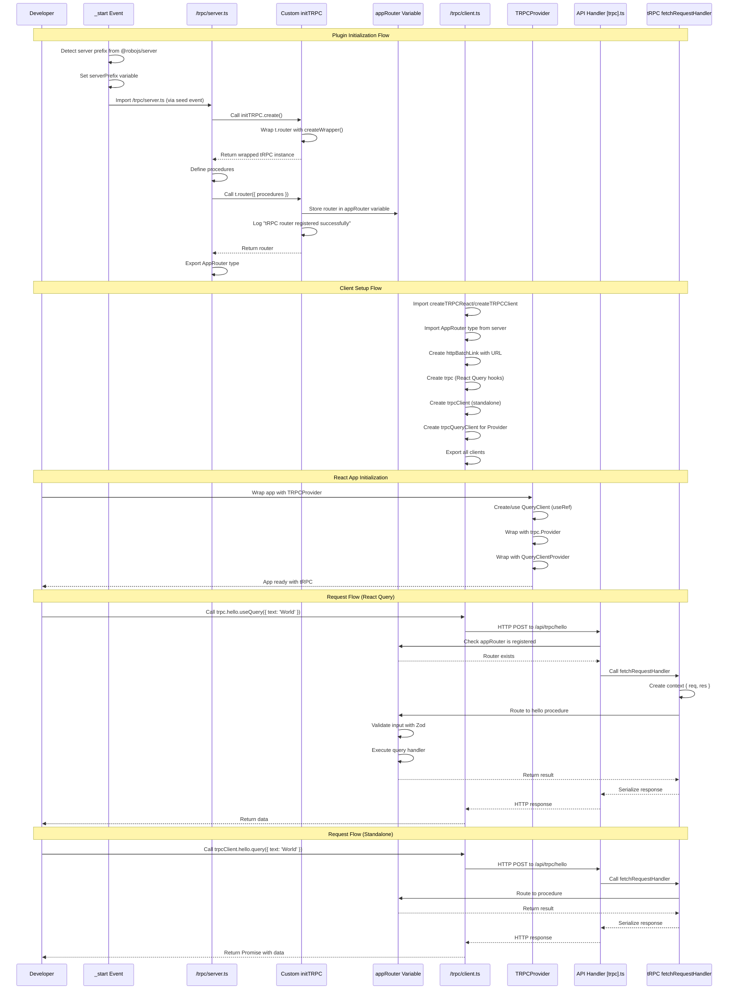

# @robojs/trpc Plugin - AI Agent Reference

This document is a deep technical reference for AI coding agents working on the `@robojs/trpc` plugin. It explains architecture, setup, flows, error handling, and gotchas. For user-facing documentation, see `README.md` in this package.

Note: This file is for AI agents and maintainers, not end users.

## Architecture Overview

- Core purpose: Integrate tRPC server and client into Robo.js with automatic router registration and type-safe RPC.
- Key dependencies:
  - `@trpc/server` v11.4.3 – Core tRPC server library
  - `@trpc/client` v11.4.3 – Core tRPC client library
  - `@trpc/react-query` v11.4.3 – React Query integration for tRPC
  - `@tanstack/react-query` v5.84.1 – React Query library
  - `@robojs/server` (peer, required) – Web server for API routing
  - `react` (peer, optional) – Only needed for TRPCProvider and React Query hooks
- File roles:
  - `server.js` – Entry point exporting `initTRPC` from built API route handler
  - `client.js` – Entry point exporting client utilities and `TRPCProvider`
  - `server.d.ts` – Type definitions for server exports
  - `client.d.ts` – Type definitions for client exports
  - `src/index.ts` – Main plugin exports (TRPCProvider, client utilities, Context type)
  - `src/api/trpc/[trpc].ts` – Catch-all API route handler with custom initTRPC wrapper
  - `src/core/types.ts` – Context type definition with RoboRequest/RoboReply
  - `src/core/Provider.tsx` – TRPCProvider React component
  - `src/core/loggers.ts` – Forked logger instance
  - `src/events/_start.ts` – Lifecycle hook for server prefix detection
  - `seed/trpc/server.ts` – Boilerplate tRPC router with example procedures
  - `seed/trpc/client.ts` – Boilerplate client setup (both modes)
  - `seed/events/_start/trpc.ts` – Stub event to trigger router registration
  - `config/robo.mjs` – Plugin configuration

### High-level flow (Mermaid)



## Dependency on @robojs/server

### Required Peer Dependency
- Requirement: `@robojs/server` >= 0.6.0 must be installed
- Purpose: Provides API routing infrastructure for the tRPC endpoint
- Installation: `npx robo add @robojs/server @robojs/trpc`
- Rationale: tRPC needs an HTTP endpoint; `@robojs/server` supplies file-based API routes

### Server Prefix Detection
- Location: `src/events/_start.ts`
- Process:
  1. Get plugin options for `@robojs/server` via `getPluginOptions()`
  2. Extract `prefix` option from server plugin config
  3. Set `serverPrefix` variable based on precedence:
     - If `prefix` is `undefined` → use `/api` (default)
     - If `prefix` is empty string `''` → use `/` (root)
     - Otherwise → use provided prefix value
  4. Export `serverPrefix` for use in API route handler
- Default value: `/api`
- Customization: Set `prefix` in `@robojs/server` plugin options
- Example config:
  ```ts
  // config/plugins/@robojs/server.ts
  export default {
    prefix: '/api' // or '' for root, or custom like '/v1'
  }
  ```
- Impact: tRPC endpoint becomes `${serverPrefix}/trpc`
  - Default: `/api/trpc`
  - Root: `/trpc`
  - Custom: `/v1/trpc`

### Integration with API Routes
- Route pattern: Catch-all route at `src/api/trpc/[trpc].ts`
- Mapping: `@robojs/server` maps this to `${serverPrefix}/trpc/*`
- Handler: Uses `fetchRequestHandler` from `@trpc/server/adapters/fetch`
- Request flow:
  1. Client sends request to `${serverPrefix}/trpc/<procedure>`
  2. `@robojs/server` routes to `[trpc].ts` handler
  3. Handler passes request to `fetchRequestHandler`
  4. tRPC router processes request and returns response

## Server Setup

### Custom initTRPC Export
- Location: `server.js` → built from `src/api/trpc/[trpc].ts`
- Export: `export { init as initTRPC }`
- Purpose: Provide custom `initTRPC` that captures router instance
- Critical: Users MUST import from `@robojs/trpc/server.js`, NOT from `@trpc/server`

### Router Registration Mechanism
- Implementation: `src/api/trpc/[trpc].ts`
- Key components:
  - `appRouter` variable – Stores the registered router instance
  - `createWrapper<F>()` – Wraps `t.router` to capture router
  - `init.create()` – Custom initTRPC that applies wrapper
- Workflow:
  1. User imports `initTRPC` from `@robojs/trpc/server.js`
  2. User calls `initTRPC.create()` which returns wrapped tRPC instance
  3. When user calls `t.router({ ... })`, wrapper intercepts the call
  4. Wrapper stores router in `appRouter` variable
  5. Wrapper returns router to user (transparent)
  6. Logger logs "tRPC router registered successfully"
- Wrapper pattern:
  - `createWrapper<F>()` takes a function and returns wrapped version
  - Wrapped function calls original, stores result in `appRouter`, returns result
  - Applied to `t.router` via `t.router = createWrapper(originalRouter)`
- Error handling: If `appRouter` is null when handler is called, throw with guidance to use `@robojs/trpc/server.js`

### API Route Handler
- Location: `src/api/trpc/[trpc].ts`
- Export: Default async function `(req: RoboRequest, res: RoboReply) => Promise<Response>`
- Implementation:
  1. Check `appRouter` is registered (throw if null)
  2. Call `fetchRequestHandler` with:
     - `createContext: () => ({ req, res })`
     - `endpoint: serverPrefix + '/trpc'`
     - `req`
     - `router: appRouter`
  3. Return response from handler
- Context creation: `{ req, res }` from `@robojs/server`
- Endpoint construction: `serverPrefix + '/trpc'`

### Helper
- `createRouter()` – Convenience function to return empty router via `init.create().router({})`

## Client Setup

### Entry Point Exports
- Location: `client.js`
- Exports:
  - `createTRPCClient` – Create standalone tRPC client
  - `createTRPCReact` – Create React Query hooks client
  - `TRPCProvider` – React component wrapper
  - All utilities from `@trpc/react-query` (e.g., `httpBatchLink`)

### React Query Mode
- Setup steps:
  1. `const trpc = createTRPCReact<AppRouter>()`
  2. `const trpcQueryClient = trpc.createClient({ links: [httpBatchLink({ url: '/api/trpc' })] })`
  3. Wrap app with `TRPCProvider`
- Usage: `trpc.hello.useQuery({ text: 'World' })`
- Requires: React + TRPCProvider

### Standalone Client Mode
- Setup: `const trpcClient = createTRPCClient<AppRouter>({ links: [httpBatchLink({ url: '/api/trpc' })] })`
- Usage: `trpcClient.hello.query({ text: 'World' })`
- No React dependency

### Link Configuration
- Common link: `httpBatchLink({ url, headers })`
- Example:
  ```ts
  const batchLink = httpBatchLink({
    url: '/api/trpc',
    async headers() {
      return {}
    },
  })
  ```
- Other links: `loggerLink`, `splitLink`, `wsLink` (subscriptions)

### Type Safety
- `AppRouter` type: export from server file
- Pass `AppRouter` to client creation functions for end-to-end types

## TRPCProvider Component

### Purpose
- Wrap React app to enable React Query hooks for tRPC, providing both tRPC client and React Query client

### Implementation
- Location: `src/core/Provider.tsx`
- Props:
  - `children: React.ReactNode`
  - `trpc: any` – React hooks client from `createTRPCReact()`
  - `trpcClient: any` – Instance created for hooks
  - `queryClient?: any` – Optional QueryClient (default: new QueryClient)
- Structure:
  1. Create/stabilize QueryClient via `useRef`
  2. Wrap with `trpc.Provider` and `QueryClientProvider`
- Stability: `useRef` prevents QueryClient from recreating each render

### Usage
```tsx
import { TRPCProvider } from '@robojs/trpc'
import { trpc, trpcQueryClient } from '../trpc/client'

function App() {
  return (
    <TRPCProvider trpc={trpc} trpcClient={trpcQueryClient}>
      <Activity />
    </TRPCProvider>
  )
}
```

## Seed Files Structure

### Server: `/trpc/server.ts`
- Import `initTRPC` from `@robojs/trpc/server.js` (NOT `@trpc/server`)
- Define procedures with Zod validation
- Create and export `appRouter`; also export `AppRouter` type

### Client: `/trpc/client.ts`
- Initialize both React hooks client and standalone client
- Export `trpc`, `trpcClient`, and `trpcQueryClient`
- Reminder: adjust `/api` if server prefix changes

### Start Event: `/events/_start/trpc.ts`
- Single purpose: `export default () => import('../../trpc/server.js')`
- Ensures router is registered at startup

### Seed Configuration
- `config/robo.mjs` – seeds the above files during `npx robo add @robojs/trpc`

## Context Type

### Definition
- Location: `src/core/types.ts`
```ts
export interface Context {
  req: RoboRequest
  res: RoboReply
}
```
- Re-exported from `src/index.ts`

### RoboRequest/RoboReply
- From `@robojs/server`; provide access to request/response within procedures

### Usage in procedures
```ts
procedure.query((opts) => {
  const { req, res } = opts.ctx
  // auth, headers, cookies, reply headers, etc.
})
```

### Extending context
- Modify `createContext` in `[trpc].ts` and update `Context` interface if needed

## Integration with @robojs/server API Routes

- File-based routing: `/src/api/trpc/[trpc].ts` → `${serverPrefix}/trpc/*`
- Flow: `RoboRequest`/`RoboReply` → `fetchRequestHandler` → tRPC router → response
- Queries: GET; Mutations: POST; Subscriptions: via wsLink (requires WebSocket server)
- Batching: `httpBatchLink` aggregates multiple ops into one HTTP call

## Critical Implementation Details

### Must use custom initTRPC
- Import from `@robojs/trpc/server.js` only; otherwise the router won’t register and API calls fail with guidance to correct import.

### Router registration timing
- Triggered by importing `/trpc/server.ts` (seeded) via `_start` event; without it, `appRouter` is null.

### Server prefix synchronization
- Client URL must match detected `serverPrefix`; otherwise 404s. Seed client notes this.

### Type import path
- Client must import `AppRouter` type from the server file and export it from server.

### React is optional
- Use TRPCProvider + React hooks only when React is present; otherwise use standalone client.

## Common Gotchas & Pitfalls

1) Wrong `initTRPC` import → use `@robojs/trpc/server.js`.
2) Missing seed `_start` event → router never registers.
3) Prefix mismatch between server and client → 404; fix client URL.
4) Missing `@robojs/server` install → no API route handling.
5) `AppRouter` type not exported → client TS errors.
6) Using TRPCProvider without React → not supported; use standalone client.
7) Recreating QueryClient each render → cache resets; TRPCProvider stabilizes it.
8) Extending context without updating types → TS mismatches; update `Context` type.
9) Forgetting Zod validation → runtime issues; always use `.input(schema)` when needed.
10) Confusion about batching → `httpBatchLink` batches by design; use `httpLink` if you must avoid batching.

## Logging

- `src/core/loggers.ts`: `export const trpcLogger = logger.fork('trpc')`
- Logs: Router registration emits a "ready" level message when successful.

## Testing Patterns

- Server: Call procedures directly; mock `{ req, res }`; validate with Zod; throw `TRPCError`.
- Client: Mock clients or run against a test server; for React, wrap in TRPCProvider and test with Testing Library.
- Types: Validate inference by compiling; consider `tsd`/`tstyche`.

## Performance Considerations

- Batching reduces overhead; configurable if needed.
- React Query caching reduces redundant requests; invalidate as needed.
- Serialization uses JSON; consider custom transformers (e.g., superjson) if required.

## Maintenance & Updates

When modifying core files, always reflect changes here:
- API handler (`src/api/trpc/[trpc].ts`): route/wrapper/ctx changes
- TRPCProvider (`src/core/Provider.tsx`): props/behavior/examples
- Prefix detection (`src/events/_start.ts`): precedence/defaults
- Context type (`src/core/types.ts`): properties/structure
- Seed files: examples/structure/comments/locations
- Dependencies: versions/peer requirements and integration impacts

Update checklist for agents:
- Function changed? Update the relevant section
- Router registration changed? Update Server Setup
- New gotcha? Add to Common Gotchas
- Prefix detection changed? Update that section
- TRPCProvider changed? Update its section
- Context type changed? Update Context Type
- Seed files changed? Update Seed Files Structure
- API handler changed? Update API Route Handler
- New exports? Update Entry Point Exports
- Dependencies changed? Update Architecture Overview
- Logging changed? Update Logging
- New tests? Update Testing Patterns

## Quick Reference

Directory map:

```
packages/@robojs/trpc/
├── server.js                     # Entry point: exports initTRPC
├── client.js                     # Entry point: exports client utilities
├── server.d.ts                   # Type definitions for server
├── client.d.ts                   # Type definitions for client
├── src/
│   ├── index.ts                  # Main plugin exports
│   ├── api/
│   │   └── trpc/
│   │       └── [trpc].ts         # API route handler with custom initTRPC
│   ├── core/
│   │   ├── types.ts              # Context type definition
│   │   ├── Provider.tsx          # TRPCProvider component
│   │   └── loggers.ts            # Forked logger
│   └── events/
│       └── _start.ts             # Server prefix detection
├── seed/
│   ├── trpc/
│   │   ├── server.ts             # Boilerplate router
│   │   └── client.ts             # Boilerplate clients
│   └── events/
│       └── _start/
│           └── trpc.ts           # Router registration stub
├── config/
│   └── robo.mjs                  # Plugin configuration
├── package.json                  # Dependencies, peer deps
└── README.md                     # User-facing docs
```

Key constants:
- `serverPrefix` – Detected from `@robojs/server` plugin options (default: `/api`)
- `appRouter` – Captured router instance (null until registered)

Key functions:
- `init.create()` – Custom initTRPC that wraps router method
- `createWrapper<F>()` – Wrapper to capture router
- `createRouter()` – Helper to create an empty router
- Default export in `[trpc].ts` – API route handler

Key types:
- `Context` – tRPC context with `RoboRequest` and `RoboReply`
- `AppRouter` – Router type exported from server file
- `RoboRequest` – Enhanced request from `@robojs/server`
- `RoboReply` – Enhanced reply from `@robojs/server`

Key exports:
- Server (`@robojs/trpc/server.js`): `initTRPC`
- Client (`@robojs/trpc`): `createTRPCClient`, `createTRPCReact`, `TRPCProvider`, `httpBatchLink` and other utilities
- Types (`@robojs/trpc`): `Context`

Dependencies:
- `@trpc/server` v11.4.3, `@trpc/client` v11.4.3, `@trpc/react-query` v11.4.3, `@tanstack/react-query` v5.84.1, `@robojs/server` (peer), `react` (peer optional), `robo.js` (peer)

Common patterns and examples are provided throughout this document.

---

Last Updated: 2025-10-17

Version: 0.3.0

Maintained By: AI coding agents and human contributors

Questions? See `README.md` for user docs, or explore the source files listed above.