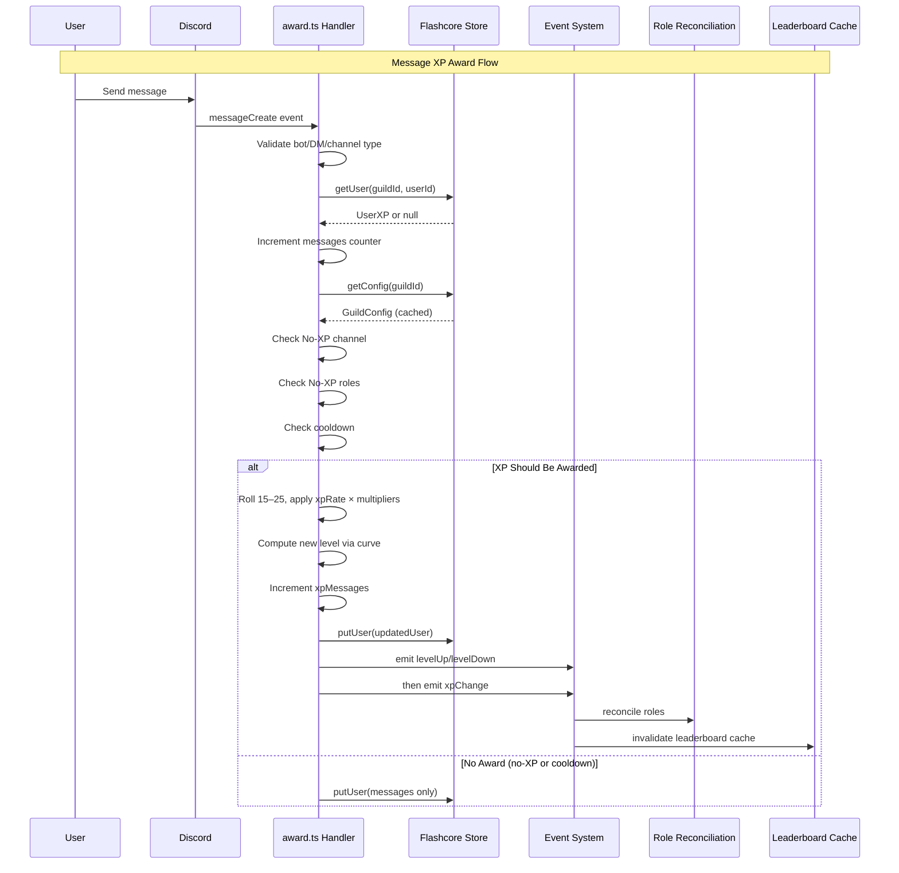

# AGENTS: @robojs/xp

This document equips AI coding agents working in this repository with everything needed to understand, extend, and safely modify the `@robojs/xp` plugin. It captures architectural intent, invariants, hidden gotchas, performance targets, and file-level references so agents can act with confidence without re‑deriving design from code.

Scope: Applies to the entire `packages/@robojs/xp` directory and any code that integrates with it (commands, API routes, tests, seeds). Follow the repo‑root AGENTS.md rules in addition to this file.

## 1. Overview & Purpose

- MEE6‑compatible XP/leveling system for Discord bots built on Robo.js.
- Capabilities: message‑based XP awards, level curve math, role rewards, multipliers, leaderboard with caching, REST API, slash commands, events for automation.
- Install: `npx robo add @robojs/xp`.
- Peer deps: `robo.js` (required). `@robojs/server` is optional for REST API endpoints.
- Package location: `packages/@robojs/xp`.

## 2. MEE6 Parity Features

- XP per message: random 15–25 base XP (scaled by `xpRate`).
- Cooldown: 60 seconds default (per‑user, configurable per guild).
- Level curve: `XP = 5 * level² + 50 * level + 100`.
- Role rewards: Stack mode (accumulate) or Replace mode (highest only).
- Multipliers: server × max(role) × user. Multiplicative, not additive.
- No‑XP zones: exclude roles and channels.
- Leaderboard: cached (top 100), paginated, rank lookup.
- Reference parity: MEE6 docs and public formula (see README notes).

## 3. Architecture Overview

Core modules and their responsibilities:

- `src/core/xp.ts` — XP manipulation primitives: add, remove, set, recalc; level math glue.
- `src/runtime/events.ts` — Typed EventEmitter singleton, xpChange/levelUp/levelDown.
- `src/runtime/rewards.ts` — Role rewards reconciliation with Discord.js safety checks.
- `src/runtime/service.ts` — Leaderboard cache (top 100, TTL, invalidation on events).
- `src/store/index.ts` — Flashcore persistence, members set, config caching, schema.
- `src/math/curve.ts` — Level curve and level/XP conversions.
- `src/math/multiplier.ts` — Server/role/user multiplier resolution.
- `src/config.ts` — Config API, defaults, validation, global vs guild, cache invalidation.
- `src/events/messageCreate/award.ts` — Automatic message award handler with cooldowns and no‑XP checks.

Data flow (message XP award):



Note: The diagram above reflects the `award.ts` pathway (`persist → levelUp/levelDown → xpChange`). The core XP API in `src/core/xp.ts` follows `persist → xpChange → levelUp/levelDown`. Design listeners to be order‑agnostic.

## 4. XP Manipulation API (`src/core/xp.ts`)

Exported primitives and expectations:

- `addXP(guildId, userId, amount, options?)`
  - Adds XP (amount ≥ 0). Emits `xpChange` then `levelUp` if level increases.
  - Returns `{ oldXp, newXp, oldLevel, newLevel, leveledUp }`.
  - Persists before emitting events.
  - Options: `{ reason?: string, storeId?: string }` (defaults to 'default' store).

- `removeXP(guildId, userId, amount, options?)`
  - Removes XP (clamped at 0). Emits `xpChange` then `levelDown` if level decreases.
  - Returns `{ oldXp, newXp, oldLevel, newLevel, leveledDown }`.
  - Options: `{ reason?: string, storeId?: string }` (defaults to 'default' store).

- `setXP(guildId, userId, totalXp, options?)`
  - Sets absolute XP (≥ 0). Emits `xpChange`, may emit levelUp/levelDown.
  - Returns `{ oldXp, newXp, oldLevel, newLevel }`.
  - Options: `{ reason?: string, storeId?: string }` (defaults to 'default' store).

- `recalcLevel(guildId, userId, options?)`
  - Recomputes level from stored total XP and reconciles roles if changed.
  - Returns `{ oldLevel, newLevel, totalXp, reconciled }` and emits events on change.
  - Options: `{ storeId?: string }` (defaults to 'default' store).

- `getXP(guildId, userId, options?)` → number; `getLevel(guildId, userId, options?)` → number; `getUserData(guildId, userId, options?)` → `UserXP | null`.
  - Options: `{ storeId?: string }` (defaults to 'default' store).

Examples:

```ts
// Default store (used by commands)
await addXP('guildId', 'userId', 100)

// Custom reputation store
await addXP('guildId', 'userId', 50, { reason: 'helped_user', storeId: 'reputation' })

// Get data from custom store
const credits = await getXP('guildId', 'userId', { storeId: 'credits' })
```

User data shape (`src/types.ts`):

```ts
interface UserXP {
	xp: number
	level: number
	lastAwardedAt: number
	messages: number
	xpMessages: number
}
```

Important: Two counters — `messages` increments for all valid guild messages; `xpMessages` increments only when XP is awarded.

## 5. Event System (`src/runtime/events.ts`)

- Singleton Node EventEmitter with typed map, `setMaxListeners(0)`.
- All events are emitted after Flashcore persistence completes.

### Emission Order by Pathway

- Core API (`src/core/xp.ts`): persist → `xpChange` → `levelUp`/`levelDown`.
- Award handler (`src/events/messageCreate/award.ts`): persist → `levelUp`/`levelDown` → `xpChange`.

Warning: Do not assume a universal ordering between level and XP events across all sources; design listeners to be order‑agnostic.

Event payloads:

```ts
interface LevelUpEvent {
	guildId: string
	userId: string
  storeId: string
	oldLevel: number
	newLevel: number
	totalXp: number
}
interface LevelDownEvent {
	guildId: string
	userId: string
  storeId: string
	oldLevel: number
	newLevel: number
	totalXp: number
}
interface XPChangeEvent {
	guildId: string
	userId: string
  storeId: string
	oldXp: number
	newXp: number
	delta: number
	reason?: string
}
```

Built‑in listeners register at module load:

- `levelUp` → role rewards reconciliation (default store only).
- `levelDown` → optional reward removal, then reconciliation (default store only).
- All three events → leaderboard cache invalidation (per-store based on `event.storeId`).

## 6. Configuration Management (`src/config.ts`, `src/store/index.ts`)

Hierarchy (highest precedence first):

1. Guild config in Flashcore → 2) Global defaults in Flashcore → 3) System defaults (MEE6 parity).

Note: Each store has independent configuration. Changing config for one store doesn't affect others.

Guild config shape:

```ts
interface GuildConfig {
	cooldownSeconds: number
	xpRate: number
	noXpRoleIds: string[]
	noXpChannelIds: string[]
	roleRewards: { level: number; roleId: string }[]
	rewardsMode: 'stack' | 'replace'
	removeRewardOnXpLoss: boolean
	leaderboard: { public: boolean }
	multipliers?: { server?: number; role?: Record<string, number>; user?: Record<string, number> }
	theme?: { embedColor?: number; backgroundUrl?: string }
}
```

API:

- `getConfig(guildId)` → merged config with defaults, never null.
- `setConfig(guildId, partial)` → validates, merges, writes, returns merged config.
- `setGlobalConfig(config)` / `getGlobalConfig()` → manage global defaults; setting global clears all guild config caches.
- `getDefaultConfig()` → system defaults.
- `validateConfig(config)` → `{ valid, errors }` with strict rules (snowflakes, enums, positive numbers, dedupes, etc.).

Caching: In‑memory Map per guild. Invalidated on guild `setConfig` and globally cleared on `setGlobalConfig`.

## 7. Leaderboard Caching Strategy (`src/runtime/service.ts`)

Cache:

- Map<guildId, top100[]> plus timestamps and totals; TTL = 60s; stable ordering.

Interfaces and functions:

```ts
interface LeaderboardEntry { userId: string; xp: number; level: number; rank: number }
getLeaderboard(guildId, offset=0, limit=10) → { entries, total }
refreshLeaderboard(guildId) → void
getUserRank(guildId, userId) → { rank, total } | null
invalidateCache(guildId) → void
clearAllCaches() → void
```

Performance (targets): cached < 10ms; refresh 10k users ≤ 200ms; deep pagination O(n log n).

Gotcha: Requests with offset ≥ 100 bypass cache and scan/sort the full dataset.

## 8. Role Rewards System (`src/runtime/rewards.ts`)

Reward definition:

```ts
interface RoleReward {
	level: number
	roleId: string
}
```

Modes:

- Stack (default): add all rewards up to current level.
- Replace: keep only highest qualifying role; remove lower ones.

Core function: `reconcileRoleRewards(guildId, userId, newLevel, guildConfig)` — idempotent, permission/hierarchy safe, skips managed roles, dedupes duplicate roleIds by keeping the highest level.

Level down: if `removeRewardOnXpLoss` is true, removes roles above new level (stack) or re‑applies replace mode.

Safety checks: Manage Roles permission; bot highest role above target role; skip managed roles; handle missing roles gracefully with warnings.

## 9. Multipliers System (`src/math/multiplier.ts`)

Types:

1. Server multiplier (all users). 2) Role multipliers (take MAX among user roles). 3) User multiplier (per user).

Resolution: `effective = server × max(role) × user` (multiplicative). Rounds to 3 decimals to avoid FP artifacts.

Helpers: `getServerMultiplier`, `getMaxRoleMultiplier(roleIds)`, `getUserMultiplier(userId)`, `resolveMultiplier(config, roleIds, userId)`.

## 10. No‑XP Zones (`src/events/messageCreate/award.ts`)

- Channels: block award if `channelId ∈ noXpChannelIds`.
- Roles: block award if `any(userRoleId ∈ noXpRoleIds)`.
- Counters: always increment `messages`; only increment `xpMessages` when award succeeds.
- Cooldown: per user, not per channel, via `lastAwardedAt` in user record.

Check order: bot/DM/type → load user + increment messages → load config → no‑XP channel → no‑XP roles → cooldown → award.

## 11. Slash Commands Structure (`src/commands/*`)

### User Commands (No Permissions Required)

- `rank.ts` — Show user rank, XP, level, and progress bar
- `leaderboard.ts` — Paginated server leaderboard
- `xp/rewards.ts` — Public view of all role rewards with pagination (refactored to use `rewards-ui.ts`)

### Admin Commands (`xp/*` — Require ManageGuild Permission)

**XP Manipulation:**
- `xp/give.ts`, `xp/remove.ts`, `xp/set.ts`, `xp/recalc.ts` — Direct XP operations

**Unified Configuration:**
- `xp/config.ts` — Single interactive command for configuration management
  - Uses Discord.js Components V2 (buttons, select menus, modals)
  - Category-based navigation: General Settings, No-XP Zones, Role Rewards
  - Replaces 8 old config subcommands and 4 rewards config subcommands
  - Leverages UI builders from `src/core/config-ui.ts` and `src/core/rewards-ui.ts`
  - All interactions handled by `src/events/interactionCreate/xp-config.ts`
  - **Note:** Multipliers remain as separate slash commands (not in the interactive UI)

**Multipliers (Dedicated Slash Commands):**
- `xp/multiplier/server.ts`, `xp/multiplier/role.ts`, `xp/multiplier/user.ts`
- `xp/multiplier/remove-role.ts`, `xp/multiplier/remove-user.ts`
- Not integrated into `/xp config` UI; managed via traditional slash command subcommands

### Component-Based Configuration Architecture

The plugin uses Discord.js Components V2 for a unified configuration experience:

**UI Builder Modules:**
- `src/core/config-ui.ts` — Builds embeds and components for General Settings, No-XP Zones, and Role Rewards
- `src/core/rewards-ui.ts` — Builds embeds and pagination components for rewards list

**Interaction Handlers:**
- `src/events/interactionCreate/xp-config.ts` — Handles all config interactions (buttons, select menus, modals)
- `src/events/interactionCreate/rewards-pagination.ts` — Handles pagination for public rewards list

**Design Patterns:**
- Stateless interactions with context encoded in customIds
- User validation to prevent cross-user interaction hijacking
- Permission checks on every interaction (not just command invocation)
- Ephemeral responses for errors and confirmations
- Seamless navigation using `interaction.update()`
- Modal-based input collection for text/numeric values
- Select menu-based selection for choosing from lists

**CustomId Schema:**
- Format: `xp_config_{category}_{action}_{userId}[_{payload}]`
- Examples:
  - General: `xp_config_edit_cooldown_123456`, `xp_config_edit_xprate_123456`, `xp_config_toggle_leaderboard_123456`
  - No-XP Zones: `xp_config_noxp_roles_select_123456`, `xp_config_noxp_channels_select_123456`
  - Role Rewards: `xp_config_rewards_role_select_123456`, `xp_config_rewards_remove_123456`, `xp_config_rewards_mode_stack_123456`
  - Navigation: `xp_config_category_123456`, `xp_config_back_main_123456`, `xp_config_refresh_general_123456`
- User ID included for session isolation
- Categories: `general`, `noxp`, `rewards` (multipliers not included in interactive UI)

## 11.1. Components V2 Migration Notes

The `@robojs/xp` plugin migrated from traditional slash command subcommands to Discord.js Components V2 for configuration management in version X.X.X.

### Migration Summary

**Before (v1.x):**
- 8 separate `/xp config/*` subcommands (get, set-cooldown, set-xp-rate, add-no-xp-role, etc.)
- 5 separate `/xp rewards/*` subcommands (list, add, remove, mode, remove-on-loss)
- Each operation required a new command invocation
- Fragmented user experience with 13 total commands

**After (v2.x):**
- Single `/xp config` command with interactive UI
- Single `/xp rewards` command for public listing (no admin permissions)
- Category-based navigation with buttons and select menus
- Modal-based input collection for settings
- Unified, cohesive configuration experience

### Benefits of Components V2 Approach

1. **Reduced Command Pollution:** 13 commands → 2 commands
2. **Better UX:** Navigate settings without re-invoking commands
3. **Contextual UI:** See current settings while making changes
4. **Validation Feedback:** Immediate error messages in ephemeral responses
5. **Discoverability:** Category menu shows all available settings
6. **Maintainability:** Centralized UI logic in builder modules

### Implementation Details

**UI Builders** (`src/core/config-ui.ts`, `src/core/rewards-ui.ts`):
- Pure functions that build embeds and components
- Stateless design for easy testing
- Consistent styling and formatting
- Reusable across command and interaction handlers

**Interaction Handler** (`src/events/interactionCreate/xp-config.ts`):
- Single file handles all config interactions
- Type guards for buttons, select menus, and modals
- Permission validation on every interaction
- User validation prevents cross-user hijacking
- Leverages same public API (`getConfig`, `setConfig`) as old commands

**Logging:**
- Uses shared `xpLogger` from `src/core/logger.ts`
- Consistent log formatting across all handlers
- Error logging with context for debugging

### Developer Notes

- All validation logic from old commands preserved in interaction handlers
- Same permission checks (`hasAdminPermission()`) applied
- Same public API usage (`getConfig`, `setConfig`, `validateConfig`)
- No breaking changes to TypeScript API or event system
- Old command files deleted; functionality fully migrated

## 12. REST API (`src/api/xp/*` — requires `@robojs/server`)

Base path: `/api/xp/`.

- Health: `GET /api/xp/health`.
- Users: `GET /api/xp/users/[guildId]`, `GET /api/xp/users/[guildId]/[userId]`, `POST /api/xp/users/[guildId]/[userId]/recalc`.
- Leaderboard: `GET /api/xp/leaderboard/[guildId]?offset&limit`, `GET /api/xp/leaderboard/[guildId]/[userId]`.
- Config: `GET/PUT /api/xp/config/[guildId]`; `GET/PUT /api/xp/config/global`.
- Multipliers: `GET/PUT /api/xp/config/[guildId]/multipliers`.
- Rewards: `GET/PUT /api/xp/config/[guildId]/rewards`.
- Stats: `GET /api/xp/stats/[guildId]`.

Conventions: JSON success payloads with metadata; consistent error `{ error, code? }` and proper HTTP statuses.

## 13. Flashcore Persistence & Data Model (`src/store/index.ts`)

Namespace structure with multi-store support:

- Array namespaces: `['xp', storeId, guildId, ...]`
- Default store: `['xp', 'default', guildId, 'users']`
- Custom store: `['xp', 'reputation', guildId, 'users']`

Internal Flashcore keys (colon-separated):

- `xp:default:{guildId}:users:{userId}` → `UserXP` (default store)
- `xp:reputation:{guildId}:users:{userId}` → `UserXP` (custom store)
- `xp:default:{guildId}:members` → string[] of tracked userIds
- `xp:default:{guildId}:config` → `GuildConfig`
- `xp:global:config` → Global defaults (shared across all stores)
- `xp:default:{guildId}:schema` → numeric schema version (current: 1)

Each store has independent: user data, config, members list, schema version.

Functions (all accept optional `options?: { storeId?: string }` parameter):

- Users: `getUser`, `putUser`, `deleteUser`, `getAllUsers` (parallelized), members set helpers.
- Guild config: `getOrInitConfig`, `getConfig`, `putConfig`, `updateConfig`.
- Cache management: `invalidateConfigCache(guildId, options?)` — invalidate specific store; `invalidateConfigCache(guildId, { all: true })` — clear all stores for guild; `clearConfigCache()` — clear entire cache.
- Global config: `getGlobalConfig`, `setGlobalConfig`, `clearConfigCache`.
- Schema: `getSchemaVersion`, `setSchemaVersion`.

Config cache structure: `Map<string, GuildConfig>` keyed by composite `'guildId:storeId'` (flat map for simplicity and speed).

Merging and normalization helpers ensure complete configs with defaults and proper deep merges for multipliers.

Schema migrations run automatically when data is accessed. See section 14 for details.

## 14. Schema Migrations & Data Versioning

The XP plugin includes a schema migration system for handling data structure changes across versions.

### Migration Architecture

- **Schema Version Tracking:** Each `(guildId, storeId)` pair has an independent schema version stored in Flashcore
- **Current Version:** `SCHEMA_VERSION = 1` (defined in `src/store/index.ts`)
- **Migration Location:** `src/store/migrations.ts`
- **Execution Strategy:** On-demand (lazy) migrations triggered by data access
- **Isolation:** Migrations are per-guild, per-store (multi-store architecture preserved)

### How Migrations Work

1. **Automatic Trigger:** When `getUser()` or `getConfig()` is called, the system checks if migration is needed
2. **Version Check:** Compares stored schema version with `SCHEMA_VERSION` constant
3. **Sequential Execution:** If outdated, runs migrations sequentially (e.g., v1→v2→v3)
4. **Version Update:** After successful migration, updates schema version in Flashcore
5. **Cache Invalidation:** Config cache is invalidated after migrations to ensure fresh data

### Migration Entry Points

- `getUser(guildId, userId, options?)` - Checks and migrates user data before returning
- `getConfig(guildId, options?)` - Checks and migrates config before caching/returning
- `getOrInitConfig(guildId, options?)` - Alternative config entry point with same migration logic
- `getAllUsers(guildId, options?)` - No migration check needed (calls `getUser()` internally)

### Adding New Migrations

When incrementing `SCHEMA_VERSION`, add a migration function to `src/store/migrations.ts`:

```typescript
// Example: v2 → v3 migration
async function migrateV2ToV3(guildId: string, options?: FlashcoreOptions): Promise<void> {
  const storeId = resolveStoreId(options)
  logger.info(`Migrating guild ${guildId} store ${storeId} from v2 to v3`)

  // 1. Load all users
  const members = await getMembers(guildId, options)

  // 2. Modify data structure
  for (const userId of members) {
    const user = await getUser(guildId, userId, options)
    if (user) {
      // Add new field or transform existing data
      const updated = { ...user, newField: defaultValue }
      await putUser(guildId, userId, updated, options)
    }
  }

  // 3. Schema version is updated automatically by migrateGuildData()
}

// Register migration
migrations.set(3, migrateV2ToV3)
```

### Migration Best Practices

1. **Idempotency:** Migrations should be safe to run multiple times (check before modifying)
2. **Error Handling:** Wrap Flashcore operations in try-catch, log errors with context
3. **Backward Compatibility:** Consider users who skip versions (support v1→v3 directly)
4. **Performance:** For large guilds, use rate limiting (see `getAllUsers()` implementation)
5. **Testing:** Add tests in `__tests__/store.test.ts` for each migration
6. **Documentation:** Update AGENTS.md and DEVELOPMENT.md when adding migrations

### Migration Gotchas

- **Per-Store Isolation:** Each store migrates independently; don't assume shared state
- **Cache Invalidation:** Config cache is cleared after migrations; leaderboard cache is not (rebuilds on next access)
- **No Rollback:** Migrations are forward-only; test thoroughly before deploying
- **Partial Failures:** If migration fails mid-execution, schema version is NOT updated (safe to retry)
- **Concurrent Access:** A per‑guild/store migration lock coalesces simultaneous `getUser()`/`getConfig()` triggers, preventing duplicate concurrent runs.

### Performance Impact

- **Migration Check:** Adds one Flashcore read per `getUser()`/`getConfig()` call (schema version lookup)
- **First Access:** Migration runs once per `(guildId, storeId)` pair on first data access after upgrade
- **Subsequent Access:** Schema version matches `SCHEMA_VERSION`, migration skipped (O(1) check)
- **Large Guilds:** Migrations that modify all users should use rate limiting (see `getAllUsers()` with `p-limit`)

## 15. Custom Level Curves Architecture

This section documents the customizable level progression curves supported by `@robojs/xp`.

### Overview

- Default curve: quadratic with MEE6 parity (a=5, b=50, c=100). Formula: `XP = 5*level² + 50*level + 100`.
- Preset types: `quadratic`, `linear`, `exponential`, `lookup` (all serializable, persisted via Flashcore).
- Advanced dynamic logic: `PluginOptions.levels.getCurve(guildId, storeId)` may return a runtime `LevelCurve` (sync/async).
- Scope: per‑guild and per‑store (multi‑store preserved).

### Curve Resolution Precedence

1) Plugin callback (highest)

- Location: `config/plugins/robojs/xp.ts` → `PluginOptions.levels.getCurve`.
- Type: `(guildId: string, storeId: string) => LevelCurve | null | Promise<LevelCurve | null>`.
- Behavior: called during XP operations by `getResolvedCurve(guildId, storeId)` in `src/math/curves.ts`.
- Return `null` to fall through. Supports sync/async.
- Typical use: per‑store differences, special guilds, dynamic (guild size, time, feature flags).

2) Guild config preset (middle)

- Location: stored in Flashcore at `['xp', storeId, guildId, 'config']` within `GuildConfig.levels`.
- Type: `LevelCurveConfig` (discriminated union of presets).
- Behavior: loaded via `getConfig(guildId, { storeId })`, converted by `buildCurveFromPreset()` in `src/math/curves.ts`.
- Serializable, persisted; adjustable via `config.set()` (and future `/xp config`).

3) Default quadratic (lowest)

- Definition: constants in `src/math/curve.ts` used when no other curve applies.
- Formula: `XP = 5*level² + 50*level + 100` (MEE6 parity).
- Always available as fallback.

### Resolution Flow

```mermaid
flowchart TD
  A[getResolvedCurve(guildId, storeId)] --> B{Cache hit?}
  B -- yes --> R[Return cached LevelCurve]
  B -- no --> C[resolveLevelCurve]
  C --> D{Plugin getCurve?}
  D -- returns LevelCurve --> K[Cache + Return]
  D -- null/absent --> E{Guild preset?}
  E -- yes --> F[buildCurveFromPreset]
  F --> K
  E -- no --> G[Default quadratic]
  G --> K
```

### Caching Behavior

- Structure: in‑memory `Map<string, LevelCurve>` keyed by `'guildId:storeId'` (see `src/math/curves.ts`).
- Population: first call to `getResolvedCurve` resolves and caches; subsequent calls are O(1).
- Invalidation: `invalidateCurveCache(guildId, storeId?)` and `clearAllCurveCache()` provided; integration to call after `config.set()` is planned in `src/store/index.ts`.
- Performance: first resolution ~tens of ms (loading config/building curve); hits are sub‑ms. High hit rates expected in production.

### Integration Points

- `src/core/xp.ts`: `addXP`, `removeXP`, `setXP`, `recalcLevel` fetch a resolved curve before level math and enforce `maxLevel` caps.
- `src/math/curve.ts`: `computeLevelFromTotalXp`, `xpNeededForLevel`, `totalXpForLevel` accept an optional `LevelCurve` and delegate when provided; fall back to default quadratic otherwise.
- `src/config.ts`: validates `LevelCurveConfig` shapes when present (positive params, sorted thresholds, etc.).
- `src/math/curves.ts`: builders `buildQuadraticCurve`, `buildLinearCurve`, `buildExponentialCurve`, `buildLookupCurve` + resolution and cache helpers.

### Type Definitions

- `LevelCurveConfig` (serializable presets): discriminated union with `type` in `src/types.ts`.
- `LevelCurve` (runtime): `{ xpForLevel(level): number; levelFromXp(totalXp): number; maxLevel?: number }`.
- `PluginOptions.levels.getCurve`: `(guildId, storeId) => LevelCurve | null | Promise<...>` (highest precedence).

### Gotchas & Edge Cases

- Resolution timing: curves resolve on first XP operation per guild/store (lazy) and are cached thereafter.
- Inverse correctness: `levelFromXp` must be the mathematical inverse of `xpForLevel`. Presets implement correct inverses; custom callbacks must, too.
- `maxLevel` enforcement: applied in `addXP`, `setXP`, and `recalcLevel`; users cannot exceed caps.
- Cache invalidation: not yet automatically wired to `config.set()`; restart or call invalidation helpers as a workaround.
- Multi‑store independence: changes to one store’s curve do not affect others; cache keys include both guildId and storeId.
- Performance: very steep exponential curves can overflow for large levels; large lookup arrays increase inverse cost (use caps).

### File References

- `src/types.ts` — preset/runtime curve type definitions.
- `src/math/curves.ts` — curve builders, resolution, caching utilities.
- `src/math/curve.ts` — math functions with optional curve parameter.
- `src/core/xp.ts` — XP operations integrating curve resolution and caps.
- `src/config.ts` — validation for curve presets.
- `config/plugins/robojs/xp.ts` — user config site for `getCurve`.

## 16. Performance Targets & Scalability (`PERFORMANCE.md`)

Targets:

- Message award < 50ms end‑to‑end.
- Leaderboard refresh (10k) ≤ 200ms; cached query < 10ms.
- Config read (cached) < 5ms. Role reconciliation < 100ms.

Complexity cheatsheet:

- Award flow O(r) with r = rewards; leaderboard refresh O(n log n); deep pagination O(n log n).

Recommended limits: users/guild < 50k (max 100k), rewards < 20 (max 100), multipliers < 100 (max 1k), concurrent awards < 1k/s (max 5k/s).

Cache tuning knobs: `MAX_CACHE_SIZE` (default 100), `CACHE_TTL` (default 60s).

## 17. Integration Patterns (recipes)

Common recipes:

- Level‑up announcements: listen to `levelUp`, send embed; see `seed/events/_start/level-announcements.ts`.
- Bonus XP awards: `XP.addXP(..., { reason: 'contest_winner' })`, check `leveledUp`.
- Moderation penalties: `XP.removeXP(..., { reason: 'moderation' })`, check `leveledDown`.
- Premium boosts: set `config.multipliers.user[userId]`.
- Analytics: observe `xpChange`, forward to analytics service.
- Custom rewards: observe `levelUp`, grant currency/items.
- Leaderboard commands: `leaderboard.get` and `leaderboard.getRank` for embeds.

Listener best practices: register in `src/events/_start/`; use async/await; never throw from listeners; prefer queues for heavy work; use `reason` for audit.

## 18. Hidden Gotchas & Edge Cases

1. Two counters: `messages` vs `xpMessages` — discrepancy expected (no‑XP/cooldown).

2. Cooldown per user (global across channels), tracked with `lastAwardedAt`.

3. Multipliers multiply; they never add. `server × max(role) × user`.

4. Role multiplier is MAX across user roles, not sum.

5. Rewards deduped by `roleId` — highest `level` wins.

6. Bot role hierarchy: bot top role must be higher than reward roles; Manage Roles permission required.

7. Managed roles skipped (integration‑managed).

8. Cache invalidated on every XP event — tune TTL if thrashing.

9. Deep pagination (offset ≥ 100) triggers full scan.

10. Global config updates clear all guild config caches.

11. Level calculation deterministic; `recalcLevel` is idempotent fixer.

12. Events emitted after persistence; listeners must tolerate failures gracefully.

13. Role ops are async and can rate limit; failures logged, not thrown.

14. No‑XP roles: ANY matching role blocks XP.

15. Formula application: `finalXP = base × xpRate × multiplier`.

16. Level down does not remove roles unless configured; replace mode always reconciles to one role.

17. Flashcore keys isolated under `xp` namespace.

18. Schema version stored for future migrations (current: 1).

19. `getAllUsers` fetches in parallel; be mindful of very large guilds.

20. Stable sort with secondary key userId to avoid rank flicker on ties.

21. Built-in commands (`/rank`, `/leaderboard`, `/xp`) only interact with the default store. Custom stores require building custom commands.

22. Each store has independent config — changing config for one store doesn't affect others.

23. Leaderboard cache is per-store — each store maintains its own top 100 cache.

24. Events include `storeId` field — listeners can filter by store. Role rewards only process default store events.

25. Role rewards only trigger for the default store to avoid conflicts. Custom stores (reputation, credits, etc.) never grant Discord roles, preventing scenarios where multiple progression systems would compete for the same roles.

26. **Component Interaction Timeout:** Discord component interactions (buttons, select menus) expire after 15 minutes. The `/xp config` UI remains functional, but if a user waits >15 minutes before clicking a button, the interaction will fail with "Unknown Interaction". The command must be re-invoked to get fresh components.

27. **Modal Character Limits:** Modal text inputs have strict limits: `TextInputStyle.Short` max 4000 characters, `TextInputStyle.Paragraph` max 4000 characters. The config modals use Short style with validation (cooldown: 1-4 chars, XP rate: 1-5 chars, role/channel IDs: 17-19 chars) to stay well within limits.

28. **Select Menu Limits:** Discord select menus support max 25 options. When removing no-XP roles/channels or rewards, if >25 items exist, the select menu will only show the first 25. Users must remove items in batches. The UI builders in `config-ui.ts` handle this by slicing to first 25 options.

29. **Modal Submission Validation:** Modal submissions in `xp-config.ts` must validate all inputs before calling `setConfig()`. Invalid inputs (non-numeric, out-of-range, invalid snowflakes) should reply with ephemeral error embeds, not throw exceptions. Use `parseInt()`, `parseFloat()`, and regex `/\d{17,19}/` for validation.

30. **Ephemeral vs Public Responses:** Config interactions use ephemeral responses for errors and confirmations to keep the UI clean. The main config message remains non-ephemeral so it persists in the channel. Pagination for `/xp rewards` uses non-ephemeral responses for public visibility.

31. **Component CustomId Length:** Discord customIds have a 100-character limit. The schema `xp_config_{category}_{action}_{userId}` stays well under this limit (typical: 40-50 chars). Avoid encoding large payloads in customIds; use modals or select menus for data collection instead.

32. **Interaction Handler Routing:** The `xp-config.ts` handler uses prefix matching (`xp_config_`) to route interactions. Other plugins' interactions with similar prefixes could conflict. The namespace `xp_config_` is specific enough to avoid collisions, but future handlers should follow the same namespacing pattern.

33. **Permission Checks on Every Interaction:** Unlike slash commands where permissions are checked once at invocation, component interactions require explicit permission checks in the handler. The `xp-config.ts` handler calls `hasAdminPermission()` on every button/select/modal interaction to prevent privilege escalation if a user's permissions change mid-session.

34. **User Validation for Session Isolation:** CustomIds include `userId` to prevent users from clicking others' config buttons. The handler validates `interaction.user.id === userId` extracted from customId. Without this check, any user could hijack another's config session.

35. **Modal Submission Context Loss:** When showing a modal with `interaction.showModal()`, the original message context is lost. The handler must fetch the original config message to update it after modal submission. Use `interaction.message` for button interactions, but for modals, you may need to track the message ID or re-fetch the channel's recent messages.

## 19. Multi-Store Architecture

The XP plugin supports multiple isolated data stores for parallel progression systems.

Purpose and capabilities:

- Each store has independent: user XP data, levels, guild configuration, leaderboard cache, event streams.
- Default store (`'default'`) is used by all built-in commands (`/rank`, `/leaderboard`, `/xp`).
- Custom stores accessed imperatively via the API for building parallel systems.

Flashcore namespace structure:

- Default store: `['xp', 'default', guildId, 'users']`
- Custom store: `['xp', 'reputation', guildId, 'users']`
- Config: `['xp', storeId, guildId]` → stores config, members, schema

Use case examples:

1. Leveling + multiple currencies (e.g., `'default'`, `'gold'`, `'gems'`)
2. Multi-dimensional reputation (e.g., `'combat'`, `'crafting'`, `'trading'`)
3. Seasonal systems (e.g., `'season1'`, `'season2'`, `'season3'`)

Cache structure: `Map<guildId, Map<storeId, GuildConfig>>` (nested maps for isolation).

Important constraints:
- Role rewards only trigger for the `'default'` store. This is enforced by early returns in `src/runtime/rewards.ts` event listeners.
- Built-in commands cannot access custom stores — only imperative API calls.
- Each store requires independent configuration (no config inheritance between stores).

**Implementation Details:**

- Event payloads include `storeId` field (implemented in phase 3).
- Role rewards listeners filter events: `if (storeId !== 'default') return`.
- Leaderboard cache invalidation uses `event.storeId` for per-store invalidation.
- Each store's cache is independent: `Map<guildId, Map<storeId, data>>`.
- Config cache structure: `Map<string, GuildConfig>` keyed by `'guildId:storeId'`.
- Leaderboard cache structure: `Map<guildId, Map<storeId, LeaderboardEntry[]>>`.

**Event Filtering Pattern:**

Listeners can filter events by store:

```typescript
events.on('levelUp', (event) => {
  if (event.storeId === 'reputation') {
    // Handle reputation level-up
  } else if (event.storeId === 'default') {
    // Handle default store level-up (role rewards handled automatically)
  }
})
```

Role rewards listeners use early return:

```typescript
events.on('levelUp', async (event) => {
  if (event.storeId !== 'default') {
    logger.debug('Skipping role rewards for non-default store')
    return
  }
  // ... role reconciliation logic
})
```

## 20. API Design Standards: Options Objects Pattern

**CRITICAL STANDARD:** All new parameters must be added via options objects, never as standalone parameters.

Rationale: Future-proofing for additional options (e.g., remote sources, caching hints, transaction IDs, audit metadata).

Pattern: Functions without existing options should have options objects created:

```ts
// ✅ CORRECT: New parameter in options object
getUser(guildId, userId, options?: { storeId?: string })
addXP(guildId, userId, amount, options?: { reason?: string, storeId?: string })

// ❌ WRONG: New parameter as standalone
getUser(guildId, userId, storeId?: string)
addXP(guildId, userId, amount, options?, storeId?: string)
```

Requirements:

1. All options should have sensible defaults (e.g., `storeId` defaults to `'default'`).
2. Options must be optional (backward compatibility).
3. Never add new parameters after options — always extend the options object.
4. This pattern maintains backward compatibility while enabling extensibility.

This standard applies to all future API additions across the plugin.

## 21. File Structure Reference

Core exports and types:

- `src/index.ts` — top‑level exports (XP, config, leaderboard, events, math, rewards, constants).
- `src/types.ts` — type definitions.
- `src/config.ts` — config API and validation.

Core logic:

- `src/core/xp.ts`, `src/core/utils.ts`.

Runtime:

- `src/runtime/events.ts`, `src/runtime/rewards.ts`, `src/runtime/service.ts`.

Storage:

- `src/store/index.ts`.
- `src/store/migrations.ts` — Schema migration system with version-specific migration functions.

Math:

- `src/math/curve.ts`, `src/math/multiplier.ts`.

Events:

- `src/events/messageCreate/award.ts`.

Commands:
- `src/commands/xp/config.ts` — Unified configuration command (Components V2)
- `src/commands/xp/rewards.ts` — Public rewards list (refactored)
- `src/commands/xp/multiplier/*` — Multiplier management commands
- `src/commands/xp/give.ts`, `src/commands/xp/remove.ts`, `src/commands/xp/set.ts`, `src/commands/xp/recalc.ts` — XP manipulation
- `src/commands/rank.ts`, `src/commands/leaderboard.ts` — User-facing commands

**UI Builders:**
- `src/core/config-ui.ts` — Config interface builders (embeds, buttons, modals, select menus)
- `src/core/rewards-ui.ts` — Rewards list builders (embeds, pagination buttons)

**Interaction Handlers:**
- `src/events/interactionCreate/xp-config.ts` — Config component interactions
- `src/events/interactionCreate/rewards-pagination.ts` — Rewards pagination

API:

- `src/api/xp/health.ts`, `src/api/xp/users/[guildId]/[userId].ts`, `src/api/xp/users/[guildId]/[userId]/recalc.ts`,
  `src/api/xp/leaderboard/[guildId].ts`, `src/api/xp/leaderboard/[guildId]/[userId].ts`,
  `src/api/xp/config/[guildId].ts`, `src/api/xp/config/global.ts`,
  `src/api/xp/config/[guildId]/multipliers.ts`, `src/api/xp/config/[guildId]/rewards.ts`,
  `src/api/xp/stats/[guildId].ts`, `src/api/xp/utils.ts`.

Seeds & tests:

- `seed/events/_start/level-announcements.ts`.
- `__tests__/*.test.ts` and helpers.

Docs:

- `README.md`, `PERFORMANCE.md`, `DEVELOPMENT.md`, and this `AGENTS.md`.

## 22. Logging Standards (required across Robo.js plugins)

Use exactly one forked logger named after the plugin.

- Preferred: centralize in `src/core/logger.ts`:

```ts
import { logger } from 'robo.js/logger.js'
export const xpLogger = logger.fork('xp')
```

- All other files must import and use `xpLogger` — do not create additional forks like `logger.fork('xp:service')` or per‑file forks.

Current state: root logger usage exists in places; migrate gradually to the shared `xpLogger` to meet standards.

Benefits: consistent namespacing, easy filtering, single place to adjust level.

**Components V2 Handlers:**
- `src/events/interactionCreate/xp-config.ts` — Uses `xpLogger` for all logging (interaction routing, validation errors, config updates)
- `src/events/interactionCreate/rewards-pagination.ts` — Uses `xpLogger` for pagination events and errors
- `src/core/config-ui.ts` — Pure UI builder, no logging (stateless functions)
- `src/core/rewards-ui.ts` — Pure UI builder, no logging (stateless functions)

**Migration Status:**
- ✅ New interaction handlers (xp-config.ts, rewards-pagination.ts) use `xpLogger` from day one
- ⚠️ Legacy command files may still use root logger; migrate during refactoring
- ✅ UI builders are pure functions with no logging dependencies

## 23. CRITICAL: Self‑Update Reminder for AI Coding Agents

When modifying `@robojs/xp`, you MUST update this file to reflect changes.

Update triggers:

- Core: XP primitives (add/remove/set/recalc), event payloads or order, rewards reconciliation, leaderboard cache strategy, storage schema, curve math.
- Curves: new curve types, resolution precedence changes, caching behavior, `getCurve` callback signature, validation rules.
- Config: new fields, validation rules, defaults, multiplier shapes.
- API: new endpoints, request/response changes, slash commands or permissions.
- API design: new options objects, parameter patterns, extensibility changes.
- Multi-store: new store-related options, namespace changes, cache structure updates.
- Performance: cache sizes/TTLs, complexity shifts, targets/benchmarks.
- Features: new listeners/hooks, integration patterns.
- Gotchas: new edge cases, behavior changes, workarounds.
- Docs: README/PERFORMANCE/DEVELOPMENT updates, new examples, changed types.
- Schema: new migrations, SCHEMA_VERSION increments, migration patterns, data structure changes.
- Components V2: new interaction handlers, UI builder changes, customId schema updates, component limits, modal/button/select menu patterns.

How to update:

1. Review the relevant section(s) here with your code changes in mind.
2. Update signatures, behavior notes, file references (e.g., mention function location).
3. Document new gotchas, edge cases, and any breaking changes.
4. Adjust performance notes and cache tuning guidance if applicable.
5. Keep the File Structure Reference accurate when files are added/removed.

Verification checklist:

- [ ] Signatures and return types updated
- [ ] New config options documented
- [ ] Gotchas/edge cases updated
- [ ] Performance characteristics current
- [ ] File references correct
- [ ] Integration recipes accurate
- [ ] Breaking changes and migrations noted
- [ ] Multi-store documentation updated (README.md)
- [ ] Event payloads include storeId field
- [ ] Role rewards filtering documented (default-store-only)
- [ ] Per-store caching documented
- [ ] Schema migrations documented with examples
- [ ] Custom curve documentation updated (README.md, AGENTS.md, types.ts)
- [ ] Curve resolution precedence documented
- [ ] Caching behavior documented
- [ ] Components V2 UI builders documented (config-ui.ts, rewards-ui.ts)
- [ ] Interaction handlers documented (xp-config.ts, rewards-pagination.ts)
- [ ] CustomId schema and namespacing patterns documented
- [ ] Component-specific gotchas added (timeouts, limits, validation)
- [ ] Old command files removed from file structure reference

This is a living document. Keep it current so humans and AI agents can maintain high velocity without regressions.
