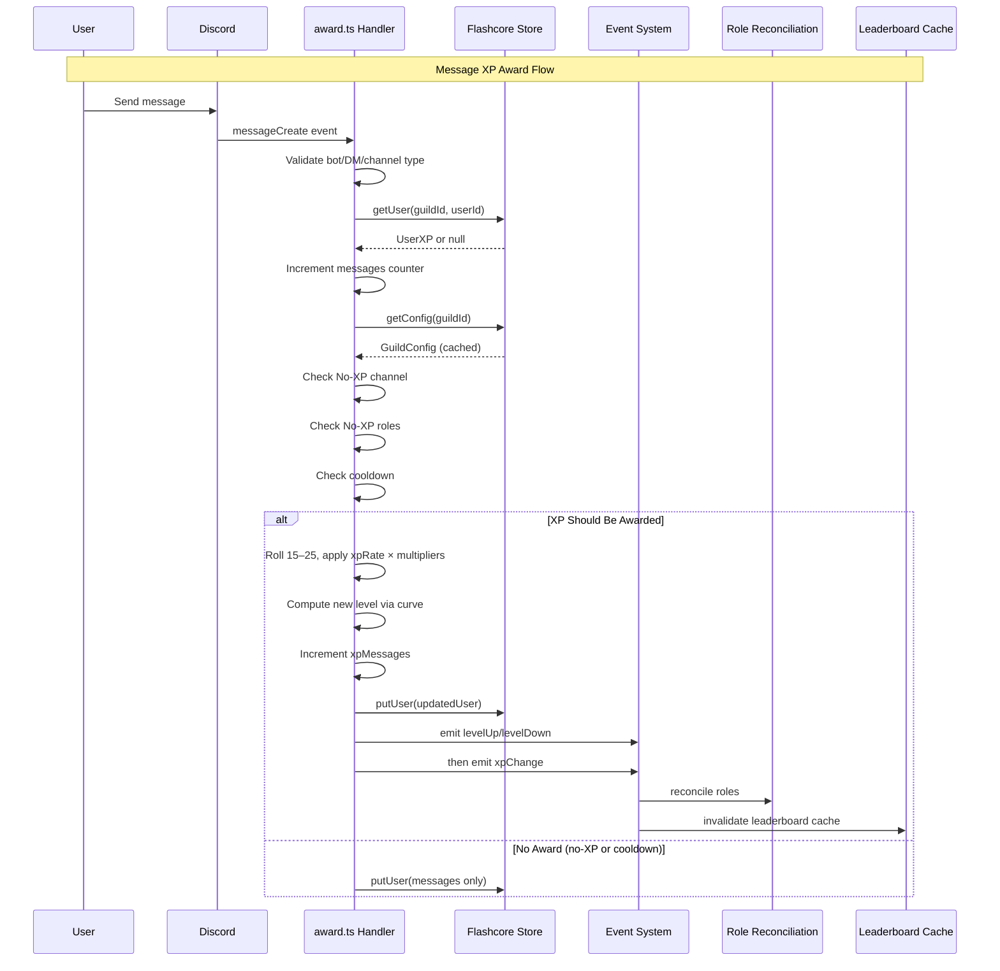

# AGENTS: @robojs/xp

This document equips AI coding agents working in this repository with everything needed to understand, extend, and safely modify the `@robojs/xp` plugin. It captures architectural intent, invariants, hidden gotchas, performance targets, and file-level references so agents can act with confidence without re‑deriving design from code.

Scope: Applies to the entire `packages/@robojs/xp` directory and any code that integrates with it (commands, API routes, tests, seeds). Follow the repo‑root AGENTS.md rules in addition to this file.

## 1. Overview & Purpose

- MEE6‑compatible XP/leveling system for Discord bots built on Robo.js.
- Capabilities: message‑based XP awards, level curve math, role rewards, multipliers, leaderboard with caching, REST API, slash commands, events for automation.
- Install: `npx robo add @robojs/xp`.
- Peer deps: `robo.js` (required). `@robojs/server` is optional for REST API endpoints.
- Package location: `packages/@robojs/xp`.

## 2. MEE6 Parity Features

- XP per message: random 15–25 base XP (scaled by `xpRate`).
- Cooldown: 60 seconds default (per‑user, configurable per guild).
- Level curve: `XP = 5 * level² + 50 * level + 100`.
- Role rewards: Stack mode (accumulate) or Replace mode (highest only).
- Multipliers: server × max(role) × user. Multiplicative, not additive.
- No‑XP zones: exclude roles and channels.
- Leaderboard: cached (top 100), paginated, rank lookup.
- Reference parity: MEE6 docs and public formula (see README notes).

## 3. Architecture Overview

Core modules and their responsibilities:

- `src/core/xp.ts` — XP manipulation primitives: add, remove, set, recalc; level math glue.
- `src/runtime/events.ts` — Typed EventEmitter singleton, xpChange/levelUp/levelDown.
- `src/runtime/rewards.ts` — Role rewards reconciliation with Discord.js safety checks.
- `src/runtime/service.ts` — Leaderboard cache (top 100, TTL, invalidation on events).
- `src/store/index.ts` — Flashcore persistence, members set, config caching, schema.
- `src/math/curve.ts` — Level curve and level/XP conversions.
- `src/math/multiplier.ts` — Server/role/user multiplier resolution.
- `src/config.ts` — Config API, defaults, validation, global vs guild, cache invalidation.
- `src/events/messageCreate/award.ts` — Automatic message award handler with cooldowns and no‑XP checks.

Data flow (message XP award):



Note: The diagram above reflects the `award.ts` pathway (`persist → levelUp/levelDown → xpChange`). The core XP API in `src/core/xp.ts` follows `persist → xpChange → levelUp/levelDown`. Design listeners to be order‑agnostic.

## 4. XP Manipulation API (`src/core/xp.ts`)

Exported primitives and expectations:

- `addXP(guildId, userId, amount, options?)`
  - Adds XP (amount ≥ 0). Emits `xpChange` then `levelUp` if level increases.
  - Returns `{ oldXp, newXp, oldLevel, newLevel, leveledUp }`.
  - Persists before emitting events.
  - Options: `{ reason?: string, storeId?: string }` (defaults to 'default' store).

- `removeXP(guildId, userId, amount, options?)`
  - Removes XP (clamped at 0). Emits `xpChange` then `levelDown` if level decreases.
  - Returns `{ oldXp, newXp, oldLevel, newLevel, leveledDown }`.
  - Options: `{ reason?: string, storeId?: string }` (defaults to 'default' store).

- `setXP(guildId, userId, totalXp, options?)`
  - Sets absolute XP (≥ 0). Emits `xpChange`, may emit levelUp/levelDown.
  - Returns `{ oldXp, newXp, oldLevel, newLevel }`.
  - Options: `{ reason?: string, storeId?: string }` (defaults to 'default' store).

- `recalcLevel(guildId, userId, options?)`
  - Recomputes level from stored total XP and reconciles roles if changed.
  - Returns `{ oldLevel, newLevel, totalXp, reconciled }` and emits events on change.
  - Options: `{ storeId?: string }` (defaults to 'default' store).

- `getXP(guildId, userId, options?)` → number; `getLevel(guildId, userId, options?)` → number; `getUserData(guildId, userId, options?)` → `UserXP | null`.
  - Options: `{ storeId?: string }` (defaults to 'default' store).

Examples:

```ts
// Default store (used by commands)
await addXP('guildId', 'userId', 100)

// Custom reputation store
await addXP('guildId', 'userId', 50, { reason: 'helped_user', storeId: 'reputation' })

// Get data from custom store
const credits = await getXP('guildId', 'userId', { storeId: 'credits' })
```

User data shape (`src/types.ts`):

```ts
interface UserXP {
	xp: number
	level: number
	lastAwardedAt: number
	messages: number
	xpMessages: number
}
```

Important: Two counters — `messages` increments for all valid guild messages; `xpMessages` increments only when XP is awarded.

## 5. Event System (`src/runtime/events.ts`)

- Singleton Node EventEmitter with typed map, `setMaxListeners(0)`.
- All events are emitted after Flashcore persistence completes.

### Emission Order by Pathway

- Core API (`src/core/xp.ts`): persist → `xpChange` → `levelUp`/`levelDown`.
- Award handler (`src/events/messageCreate/award.ts`): persist → `levelUp`/`levelDown` → `xpChange`.

Warning: Do not assume a universal ordering between level and XP events across all sources; design listeners to be order‑agnostic.

Event payloads:

```ts
interface LevelUpEvent {
	guildId: string
	userId: string
  storeId: string
	oldLevel: number
	newLevel: number
	totalXp: number
}
interface LevelDownEvent {
	guildId: string
	userId: string
  storeId: string
	oldLevel: number
	newLevel: number
	totalXp: number
}
interface XPChangeEvent {
	guildId: string
	userId: string
  storeId: string
	oldXp: number
	newXp: number
	delta: number
	reason?: string
}
```

Built‑in listeners register at module load:

- `levelUp` → role rewards reconciliation (default store only).
- `levelDown` → optional reward removal, then reconciliation (default store only).
- All three events → leaderboard cache invalidation (per-store based on `event.storeId`).

## 6. Configuration Management (`src/config.ts`, `src/store/index.ts`)

Hierarchy (highest precedence first):

1. Guild config in Flashcore → 2) Global defaults in Flashcore → 3) System defaults (MEE6 parity).

Note: Each store has independent configuration. Changing config for one store doesn't affect others.

Guild config shape:

```ts
interface GuildConfig {
	cooldownSeconds: number
	xpRate: number
	noXpRoleIds: string[]
	noXpChannelIds: string[]
	roleRewards: { level: number; roleId: string }[]
	rewardsMode: 'stack' | 'replace'
	removeRewardOnXpLoss: boolean
	leaderboard: { public: boolean }
	multipliers?: { server?: number; role?: Record<string, number>; user?: Record<string, number> }
	theme?: { embedColor?: number; backgroundUrl?: string }
}
```

API:

- `getConfig(guildId)` → merged config with defaults, never null.
- `setConfig(guildId, partial)` → validates, merges, writes, returns merged config.
- `setGlobalConfig(config)` / `getGlobalConfig()` → manage global defaults; setting global clears all guild config caches.
- `getDefaultConfig()` → system defaults.
- `validateConfig(config)` → `{ valid, errors }` with strict rules (snowflakes, enums, positive numbers, dedupes, etc.).

Caching: In‑memory Map per guild. Invalidated on guild `setConfig` and globally cleared on `setGlobalConfig`.

## 7. Leaderboard Caching Strategy (`src/runtime/service.ts`)

Cache:

- Map<guildId, top100[]> plus timestamps and totals; TTL = 60s; stable ordering.

Interfaces and functions:

```ts
interface LeaderboardEntry { userId: string; xp: number; level: number; rank: number }
getLeaderboard(guildId, offset=0, limit=10) → { entries, total }
refreshLeaderboard(guildId) → void
getUserRank(guildId, userId) → { rank, total } | null
invalidateCache(guildId) → void
clearAllCaches() → void
```

Performance (targets): cached < 10ms; refresh 10k users ≤ 200ms; deep pagination O(n log n).

Gotcha: Requests with offset ≥ 100 bypass cache and scan/sort the full dataset.

## 8. Role Rewards System (`src/runtime/rewards.ts`)

Reward definition:

```ts
interface RoleReward {
	level: number
	roleId: string
}
```

Modes:

- Stack (default): add all rewards up to current level.
- Replace: keep only highest qualifying role; remove lower ones.

Core function: `reconcileRoleRewards(guildId, userId, newLevel, guildConfig)` — idempotent, permission/hierarchy safe, skips managed roles, dedupes duplicate roleIds by keeping the highest level.

Level down: if `removeRewardOnXpLoss` is true, removes roles above new level (stack) or re‑applies replace mode.

Safety checks: Manage Roles permission; bot highest role above target role; skip managed roles; handle missing roles gracefully with warnings.

## 9. Multipliers System (`src/math/multiplier.ts`)

Types:

1. Server multiplier (all users). 2) Role multipliers (take MAX among user roles). 3) User multiplier (per user).

Resolution: `effective = server × max(role) × user` (multiplicative). Rounds to 3 decimals to avoid FP artifacts.

Helpers: `getServerMultiplier`, `getMaxRoleMultiplier(roleIds)`, `getUserMultiplier(userId)`, `resolveMultiplier(config, roleIds, userId)`.

## 10. No‑XP Zones (`src/events/messageCreate/award.ts`)

- Channels: block award if `channelId ∈ noXpChannelIds`.
- Roles: block award if `any(userRoleId ∈ noXpRoleIds)`.
- Counters: always increment `messages`; only increment `xpMessages` when award succeeds.
- Cooldown: per user, not per channel, via `lastAwardedAt` in user record.

Check order: bot/DM/type → load user + increment messages → load config → no‑XP channel → no‑XP roles → cooldown → award.

## 11. Slash Commands Structure (`src/commands/*`)

User:

- `rank.ts` — show user rank, XP, level, progress.
- `leaderboard.ts` — paginated leaderboard.

Admin (`xp/*`):

- `xp/give.ts`, `xp/remove.ts`, `xp/set.ts`, `xp/recalc.ts`.

Config (`xp/config/*`):

- Get/set cooldown, xp rate, leaderboard visibility, manage no‑XP roles/channels.

Rewards (`xp/rewards/*`):

- List/add/remove rewards, set mode, toggle remove on loss.

Permissions: user commands open; admin commands require ManageGuild/Administrator.

## 12. REST API (`src/api/xp/*` — requires `@robojs/server`)

Base path: `/api/xp/`.

- Health: `GET /api/xp/health`.
- Users: `GET /api/xp/users/[guildId]`, `GET /api/xp/users/[guildId]/[userId]`, `POST /api/xp/users/[guildId]/[userId]/recalc`.
- Leaderboard: `GET /api/xp/leaderboard/[guildId]?offset&limit`, `GET /api/xp/leaderboard/[guildId]/[userId]`.
- Config: `GET/PUT /api/xp/config/[guildId]`; `GET/PUT /api/xp/config/global`.
- Multipliers: `GET/PUT /api/xp/config/[guildId]/multipliers`.
- Rewards: `GET/PUT /api/xp/config/[guildId]/rewards`.
- Stats: `GET /api/xp/stats/[guildId]`.

Conventions: JSON success payloads with metadata; consistent error `{ error, code? }` and proper HTTP statuses.

## 13. Flashcore Persistence & Data Model (`src/store/index.ts`)

Namespace structure with multi-store support:

- Array namespaces: `['xp', storeId, guildId, ...]`
- Default store: `['xp', 'default', guildId, 'users']`
- Custom store: `['xp', 'reputation', guildId, 'users']`

Internal Flashcore keys (colon-separated):

- `xp:default:{guildId}:users:{userId}` → `UserXP` (default store)
- `xp:reputation:{guildId}:users:{userId}` → `UserXP` (custom store)
- `xp:default:{guildId}:members` → string[] of tracked userIds
- `xp:default:{guildId}:config` → `GuildConfig`
- `xp:global:config` → Global defaults (shared across all stores)
- `xp:default:{guildId}:schema` → numeric schema version (current: 1)

Each store has independent: user data, config, members list, schema version.

Functions (all accept optional `options?: { storeId?: string }` parameter):

- Users: `getUser`, `putUser`, `deleteUser`, `getAllUsers` (parallelized), members set helpers.
- Guild config: `getOrInitConfig`, `getConfig`, `putConfig`, `updateConfig`.
- Cache management: `invalidateConfigCache(guildId, options?)` — invalidate specific store; `invalidateConfigCache(guildId, { all: true })` — clear all stores for guild; `clearConfigCache()` — clear entire cache.
- Global config: `getGlobalConfig`, `setGlobalConfig`, `clearConfigCache`.
- Schema: `getSchemaVersion`, `setSchemaVersion`.

Config cache structure: `Map<string, GuildConfig>` keyed by composite `'guildId:storeId'` (flat map for simplicity and speed).

Merging and normalization helpers ensure complete configs with defaults and proper deep merges for multipliers.

Schema migrations run automatically when data is accessed. See section 14 for details.

## 14. Schema Migrations & Data Versioning

The XP plugin includes a schema migration system for handling data structure changes across versions.

### Migration Architecture

- **Schema Version Tracking:** Each `(guildId, storeId)` pair has an independent schema version stored in Flashcore
- **Current Version:** `SCHEMA_VERSION = 1` (defined in `src/store/index.ts`)
- **Migration Location:** `src/store/migrations.ts`
- **Execution Strategy:** On-demand (lazy) migrations triggered by data access
- **Isolation:** Migrations are per-guild, per-store (multi-store architecture preserved)

### How Migrations Work

1. **Automatic Trigger:** When `getUser()` or `getConfig()` is called, the system checks if migration is needed
2. **Version Check:** Compares stored schema version with `SCHEMA_VERSION` constant
3. **Sequential Execution:** If outdated, runs migrations sequentially (e.g., v1→v2→v3)
4. **Version Update:** After successful migration, updates schema version in Flashcore
5. **Cache Invalidation:** Config cache is invalidated after migrations to ensure fresh data

### Migration Entry Points

- `getUser(guildId, userId, options?)` - Checks and migrates user data before returning
- `getConfig(guildId, options?)` - Checks and migrates config before caching/returning
- `getOrInitConfig(guildId, options?)` - Alternative config entry point with same migration logic
- `getAllUsers(guildId, options?)` - No migration check needed (calls `getUser()` internally)

### Adding New Migrations

When incrementing `SCHEMA_VERSION`, add a migration function to `src/store/migrations.ts`:

```typescript
// Example: v2 → v3 migration
async function migrateV2ToV3(guildId: string, options?: FlashcoreOptions): Promise<void> {
  const storeId = resolveStoreId(options)
  logger.info(`Migrating guild ${guildId} store ${storeId} from v2 to v3`)

  // 1. Load all users
  const members = await getMembers(guildId, options)

  // 2. Modify data structure
  for (const userId of members) {
    const user = await getUser(guildId, userId, options)
    if (user) {
      // Add new field or transform existing data
      const updated = { ...user, newField: defaultValue }
      await putUser(guildId, userId, updated, options)
    }
  }

  // 3. Schema version is updated automatically by migrateGuildData()
}

// Register migration
migrations.set(3, migrateV2ToV3)
```

### Migration Best Practices

1. **Idempotency:** Migrations should be safe to run multiple times (check before modifying)
2. **Error Handling:** Wrap Flashcore operations in try-catch, log errors with context
3. **Backward Compatibility:** Consider users who skip versions (support v1→v3 directly)
4. **Performance:** For large guilds, use rate limiting (see `getAllUsers()` implementation)
5. **Testing:** Add tests in `__tests__/store.test.ts` for each migration
6. **Documentation:** Update AGENTS.md and DEVELOPMENT.md when adding migrations

### Migration Gotchas

- **Per-Store Isolation:** Each store migrates independently; don't assume shared state
- **Cache Invalidation:** Config cache is cleared after migrations; leaderboard cache is not (rebuilds on next access)
- **No Rollback:** Migrations are forward-only; test thoroughly before deploying
- **Partial Failures:** If migration fails mid-execution, schema version is NOT updated (safe to retry)
- **Concurrent Access:** A per‑guild/store migration lock coalesces simultaneous `getUser()`/`getConfig()` triggers, preventing duplicate concurrent runs.

### Performance Impact

- **Migration Check:** Adds one Flashcore read per `getUser()`/`getConfig()` call (schema version lookup)
- **First Access:** Migration runs once per `(guildId, storeId)` pair on first data access after upgrade
- **Subsequent Access:** Schema version matches `SCHEMA_VERSION`, migration skipped (O(1) check)
- **Large Guilds:** Migrations that modify all users should use rate limiting (see `getAllUsers()` with `p-limit`)

## 15. Math Utilities & Level Calculations (`src/math/curve.ts`)

Curve: `XP = 5 * L² + 50 * L + 100`.

Exports:

- `xpNeededForLevel(level)` — XP required to advance one level.
- `totalXpForLevel(level)` — cumulative XP at the start of level.
- `computeLevelFromTotalXp(totalXp)` — `{ level, inLevel, toNext }`.
- `progressInLevel(totalXp)` — `{ current, needed, percentage }`.
- `isValidLevel(level)`, `isValidXp(xp)`, `xpDeltaForLevelRange(from, to)`.

Deterministic and idempotent: same total XP → same level. Level is derived; stored level acts as cache.

## 15. Performance Targets & Scalability (`PERFORMANCE.md`)

Targets:

- Message award < 50ms end‑to‑end.
- Leaderboard refresh (10k) ≤ 200ms; cached query < 10ms.
- Config read (cached) < 5ms. Role reconciliation < 100ms.

Complexity cheatsheet:

- Award flow O(r) with r = rewards; leaderboard refresh O(n log n); deep pagination O(n log n).

Recommended limits: users/guild < 50k (max 100k), rewards < 20 (max 100), multipliers < 100 (max 1k), concurrent awards < 1k/s (max 5k/s).

Cache tuning knobs: `MAX_CACHE_SIZE` (default 100), `CACHE_TTL` (default 60s).

## 16. Integration Patterns (recipes)

Common recipes:

- Level‑up announcements: listen to `levelUp`, send embed; see `seed/events/_start/level-announcements.ts`.
- Bonus XP awards: `XP.addXP(..., { reason: 'contest_winner' })`, check `leveledUp`.
- Moderation penalties: `XP.removeXP(..., { reason: 'moderation' })`, check `leveledDown`.
- Premium boosts: set `config.multipliers.user[userId]`.
- Analytics: observe `xpChange`, forward to analytics service.
- Custom rewards: observe `levelUp`, grant currency/items.
- Leaderboard commands: `leaderboard.get` and `leaderboard.getRank` for embeds.

Listener best practices: register in `src/events/_start/`; use async/await; never throw from listeners; prefer queues for heavy work; use `reason` for audit.

## 17. Hidden Gotchas & Edge Cases

1. Two counters: `messages` vs `xpMessages` — discrepancy expected (no‑XP/cooldown).

2. Cooldown per user (global across channels), tracked with `lastAwardedAt`.

3. Multipliers multiply; they never add. `server × max(role) × user`.

4. Role multiplier is MAX across user roles, not sum.

5. Rewards deduped by `roleId` — highest `level` wins.

6. Bot role hierarchy: bot top role must be higher than reward roles; Manage Roles permission required.

7. Managed roles skipped (integration‑managed).

8. Cache invalidated on every XP event — tune TTL if thrashing.

9. Deep pagination (offset ≥ 100) triggers full scan.

10. Global config updates clear all guild config caches.

11. Level calculation deterministic; `recalcLevel` is idempotent fixer.

12. Events emitted after persistence; listeners must tolerate failures gracefully.

13. Role ops are async and can rate limit; failures logged, not thrown.

14. No‑XP roles: ANY matching role blocks XP.

15. Formula application: `finalXP = base × xpRate × multiplier`.

16. Level down does not remove roles unless configured; replace mode always reconciles to one role.

17. Flashcore keys isolated under `xp` namespace.

18. Schema version stored for future migrations (current: 1).

19. `getAllUsers` fetches in parallel; be mindful of very large guilds.

20. Stable sort with secondary key userId to avoid rank flicker on ties.

21. Built-in commands (`/rank`, `/leaderboard`, `/xp`) only interact with the default store. Custom stores require building custom commands.

22. Each store has independent config — changing config for one store doesn't affect others.

23. Leaderboard cache is per-store — each store maintains its own top 100 cache.

24. Events include `storeId` field — listeners can filter by store. Role rewards only process default store events.

25. Role rewards only trigger for the default store to avoid conflicts. Custom stores (reputation, credits, etc.) never grant Discord roles, preventing scenarios where multiple progression systems would compete for the same roles.

## 21. Multi-Store Architecture

The XP plugin supports multiple isolated data stores for parallel progression systems.

Purpose and capabilities:

- Each store has independent: user XP data, levels, guild configuration, leaderboard cache, event streams.
- Default store (`'default'`) is used by all built-in commands (`/rank`, `/leaderboard`, `/xp`).
- Custom stores accessed imperatively via the API for building parallel systems.

Flashcore namespace structure:

- Default store: `['xp', 'default', guildId, 'users']`
- Custom store: `['xp', 'reputation', guildId, 'users']`
- Config: `['xp', storeId, guildId]` → stores config, members, schema

Use case examples:

1. Leveling + multiple currencies (e.g., `'default'`, `'gold'`, `'gems'`)
2. Multi-dimensional reputation (e.g., `'combat'`, `'crafting'`, `'trading'`)
3. Seasonal systems (e.g., `'season1'`, `'season2'`, `'season3'`)

Cache structure: `Map<guildId, Map<storeId, GuildConfig>>` (nested maps for isolation).

Important constraints:
- Role rewards only trigger for the `'default'` store. This is enforced by early returns in `src/runtime/rewards.ts` event listeners.
- Built-in commands cannot access custom stores — only imperative API calls.
- Each store requires independent configuration (no config inheritance between stores).

**Implementation Details:**

- Event payloads include `storeId` field (implemented in phase 3).
- Role rewards listeners filter events: `if (storeId !== 'default') return`.
- Leaderboard cache invalidation uses `event.storeId` for per-store invalidation.
- Each store's cache is independent: `Map<guildId, Map<storeId, data>>`.
- Config cache structure: `Map<string, GuildConfig>` keyed by `'guildId:storeId'`.
- Leaderboard cache structure: `Map<guildId, Map<storeId, LeaderboardEntry[]>>`.

**Event Filtering Pattern:**

Listeners can filter events by store:

```typescript
events.on('levelUp', (event) => {
  if (event.storeId === 'reputation') {
    // Handle reputation level-up
  } else if (event.storeId === 'default') {
    // Handle default store level-up (role rewards handled automatically)
  }
})
```

Role rewards listeners use early return:

```typescript
events.on('levelUp', async (event) => {
  if (event.storeId !== 'default') {
    logger.debug('Skipping role rewards for non-default store')
    return
  }
  // ... role reconciliation logic
})
```

## 22. API Design Standards: Options Objects Pattern

**CRITICAL STANDARD:** All new parameters must be added via options objects, never as standalone parameters.

Rationale: Future-proofing for additional options (e.g., remote sources, caching hints, transaction IDs, audit metadata).

Pattern: Functions without existing options should have options objects created:

```ts
// ✅ CORRECT: New parameter in options object
getUser(guildId, userId, options?: { storeId?: string })
addXP(guildId, userId, amount, options?: { reason?: string, storeId?: string })

// ❌ WRONG: New parameter as standalone
getUser(guildId, userId, storeId?: string)
addXP(guildId, userId, amount, options?, storeId?: string)
```

Requirements:

1. All options should have sensible defaults (e.g., `storeId` defaults to `'default'`).
2. Options must be optional (backward compatibility).
3. Never add new parameters after options — always extend the options object.
4. This pattern maintains backward compatibility while enabling extensibility.

This standard applies to all future API additions across the plugin.

## 18. File Structure Reference

Core exports and types:

- `src/index.ts` — top‑level exports (XP, config, leaderboard, events, math, rewards, constants).
- `src/types.ts` — type definitions.
- `src/config.ts` — config API and validation.

Core logic:

- `src/core/xp.ts`, `src/core/utils.ts`.

Runtime:

- `src/runtime/events.ts`, `src/runtime/rewards.ts`, `src/runtime/service.ts`.

Storage:

- `src/store/index.ts`.
- `src/store/migrations.ts` — Schema migration system with version-specific migration functions.

Math:

- `src/math/curve.ts`, `src/math/multiplier.ts`.

Events:

- `src/events/messageCreate/award.ts`.

Commands:

- `src/commands/rank.ts`, `src/commands/leaderboard.ts`, `src/commands/xp/*`, `src/commands/xp/config/*`, `src/commands/xp/rewards/*`.

API:

- `src/api/xp/health.ts`, `src/api/xp/users/[guildId]/[userId].ts`, `src/api/xp/users/[guildId]/[userId]/recalc.ts`,
  `src/api/xp/leaderboard/[guildId].ts`, `src/api/xp/leaderboard/[guildId]/[userId].ts`,
  `src/api/xp/config/[guildId].ts`, `src/api/xp/config/global.ts`,
  `src/api/xp/config/[guildId]/multipliers.ts`, `src/api/xp/config/[guildId]/rewards.ts`,
  `src/api/xp/stats/[guildId].ts`, `src/api/xp/utils.ts`.

Seeds & tests:

- `seed/events/_start/level-announcements.ts`.
- `__tests__/*.test.ts` and helpers.

Docs:

- `README.md`, `PERFORMANCE.md`, `DEVELOPMENT.md`, and this `AGENTS.md`.

## 19. Logging Standards (required across Robo.js plugins)

Use exactly one forked logger named after the plugin.

- Preferred: centralize in `src/core/logger.ts`:

```ts
import { logger } from 'robo.js/logger.js'
export const xpLogger = logger.fork('xp')
```

- All other files must import and use `xpLogger` — do not create additional forks like `logger.fork('xp:service')` or per‑file forks.

Current state: root logger usage exists in places; migrate gradually to the shared `xpLogger` to meet standards.

Benefits: consistent namespacing, easy filtering, single place to adjust level.

## 20. CRITICAL: Self‑Update Reminder for AI Coding Agents

When modifying `@robojs/xp`, you MUST update this file to reflect changes.

Update triggers:

- Core: XP primitives (add/remove/set/recalc), event payloads or order, rewards reconciliation, leaderboard cache strategy, storage schema, curve math.
- Config: new fields, validation rules, defaults, multiplier shapes.
- API: new endpoints, request/response changes, slash commands or permissions.
- API design: new options objects, parameter patterns, extensibility changes.
- Multi-store: new store-related options, namespace changes, cache structure updates.
- Performance: cache sizes/TTLs, complexity shifts, targets/benchmarks.
- Features: new listeners/hooks, integration patterns.
- Gotchas: new edge cases, behavior changes, workarounds.
- Docs: README/PERFORMANCE/DEVELOPMENT updates, new examples, changed types.
- Schema: new migrations, SCHEMA_VERSION increments, migration patterns, data structure changes.

How to update:

1. Review the relevant section(s) here with your code changes in mind.
2. Update signatures, behavior notes, file references (e.g., mention function location).
3. Document new gotchas, edge cases, and any breaking changes.
4. Adjust performance notes and cache tuning guidance if applicable.
5. Keep the File Structure Reference accurate when files are added/removed.

Verification checklist:

- [ ] Signatures and return types updated
- [ ] New config options documented
- [ ] Gotchas/edge cases updated
- [ ] Performance characteristics current
- [ ] File references correct
- [ ] Integration recipes accurate
- [ ] Breaking changes and migrations noted
- [ ] Multi-store documentation updated (README.md)
- [ ] Event payloads include storeId field
- [ ] Role rewards filtering documented (default-store-only)
- [ ] Per-store caching documented
- [ ] Schema migrations documented with examples

This is a living document. Keep it current so humans and AI agents can maintain high velocity without regressions.
