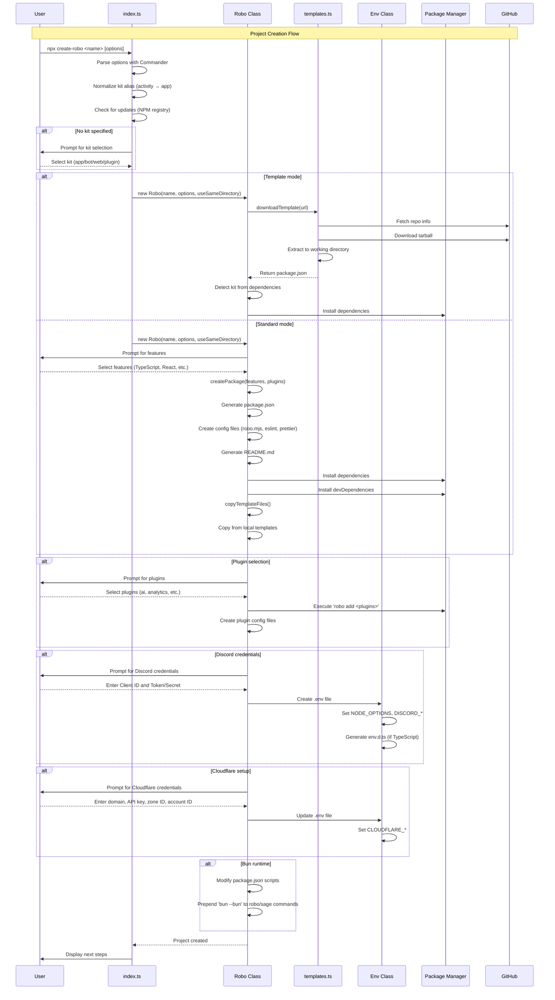

# AGENTS: create-robo CLI

This file documents the create-robo CLI for AI coding agents and maintainers. It explains the architecture, flows, flags, templates, edge cases, and integration points so agents can work confidently without re-reading the entire source.

> Scope: Everything under `packages/create-robo/` and its templates/docs referenced below.


## 1. Overview & Purpose
- Project scaffolding CLI for Robo.js that creates Discord bots, Discord activities, web apps, and plugins.
- Capabilities: interactive project creation, template system (local + GitHub), plugin installation, feature selection, credential setup, environment file generation, update check, Bun runtime handling.
- Usage: `npx create-robo <projectName>` or `npx create-robo` (same-directory mode).
- Package location: `packages/create-robo`.
- Entry point: `dist/index.js` compiled from `src/index.ts`.
- Key deps: `@inquirer/prompts`, `async-retry`, `discord.js`, `got`, `robo.js`, `tar`.


## 2. CLI Command Structure

Command syntax:

```bash
npx create-robo <projectName> [options]
```

Positional arguments:
- `<projectName>` — optional. If omitted, uses current directory and enables same-directory mode.

Options (from `src/index.ts` lines 44–60):
- `-e, --env` — Inline env vars `KEY1=val1,KEY2=val2`.
- `-f, --features` — Comma-separated features (bypass prompts).
- `-js, --javascript` — Force JavaScript (mutually exclusive with `--typescript`).
- `-p, --plugins` — Pre-install plugins (comma or space separated).
- `-P, --plugin` — Create a Robo plugin (sets kit to `plugin`).
- `-pm, --package-manager` — npm | yarn | pnpm | bun.
- `-n, --name` — Project name (alt to positional arg).
- `-nf, --no-features` — Skip optional features selection.
- `-ni, --no-install` — Skip dependency install.
- `-np, --no-plugins` — Skip plugin install.
- `-nu, --no-update` — Skip version/update check.
- `-t, --template` — Use an online/local template (GitHub URL or local template key).
- `-ts, --typescript` — Force TypeScript (mutually exclusive with `--javascript`).
- `-v, --verbose` — Verbose output and raw command logs.
- `-rv, --robo-version` — Pin Robo.js version (e.g., `@0.10.0`).
- `-k, --kit` — Choose kit: activity | app | bot | web | plugin.
- `-nc, --no-creds` — Do not prompt for credentials.
- `--version` — Print create-robo version and exit.

Option defaults (lines 99–120):
- `creds: true` (unless `--no-creds`).
- `install: true` (unless `--no-install`).
- `plugins: []` (unless `--no-plugins`).
- `update: true` (unless `--no-update`).


## 3. Kits System

Available kits (from `src/index.ts` line 13–14):
- `activity` — Alias for `app` (see alias handling below).
- `app` — Discord Activity (embedded apps).
- `bot` — Discord Bot.
- `web` — Web App.
- `plugin` — Robo Plugin.

Selection flow:
1. `--plugin`/`-P` forces `kit = 'plugin'`.
2. `--kit`/`-k` selects kit if provided.
3. `--template` infers kit from template if possible.
4. Else prompt interactively.

Alias handling (lines 122–125):

```ts
if (options.kit === 'activity') {
  options.kit = 'app'
}
```

Display name resolution (`src/utils/kit.ts`):
- `getKitName(kit, template?)` → Pretty name.
- Maps activity/app → “Discord Activity”, bot → “Discord Bot”, plugin → “Robo Plugin”, web → “Web App”. Can infer from template path prefix.


## 4. Template System

Local templates in `/templates`:

Discord Activities (`templates/discord-activities/`):
- `react-js`, `react-ts`, `vanilla-js`, `vanilla-ts`.

Discord Bots (`templates/discord-bots/`):
- `starter-js`, `starter-ts`.

Web Apps (`templates/web-apps/`):
- `react-js`, `react-ts`.

Selection logic (`src/robo.ts` lines 975–989):
- Web kit → `web-apps/react-ts` or `web-apps/react-js`.
- App kit + React → `discord-activities/react-ts` or `discord-activities/react-js`.
- App kit w/o React → `discord-activities/vanilla-ts` or `vanilla-js`.
- Bot kit → `discord-bots/starter-ts` or `starter-js`.
- Chooses by `_useTypeScript` and `_selectedFeatures.includes('react')`.

GitHub template support (`src/templates.ts`):
- `getRepoInfo(url, examplePath?)` → { username, name, branch, filePath }.
- `hasRepo(repoInfo)` — validates repo path via API.
- `existsInRepo(nameOrUrl)` — allows `URL` or `Wave-Play/robo.js/templates/<name>`.
- `downloadAndExtractRepo(root, repoInfo)` — downloads tarball and extracts subset; returns template `package.json`.
- `downloadAndExtractExample(root, name)` — downloads from `Wave-Play/robo.js/templates/<name>`.

Download flow (`src/robo.ts` lines 428–581):
1. Normalize URL (prepend default GitHub path for template keys).
2. Parse to RepoInfo.
3. Validate origin and existence.
4. Stream tarball to tmp.
5. Extract with `tar.x` (strip based on depth).
6. Cleanup temp.
7. Read package.json from extracted template.
8. Copy `example.env` → `.env` if present.
9. Rename package to project name.
10. Detect kit from dependencies.
11. Install dependencies when `--install` true.

Retry logic: 3 retries via `async-retry` (lines 493–495).


## 5. Plugin Installation Flow

Plugin database (in `src/robo.ts` lines 169–209):

```ts
interface PluginData {
  config?: Record<string, unknown>
  keywords: string[]
  package: string
}
```

Available plugins and notes:
- `ai` (`@robojs/ai`) — config includes `openaiKey: process.env.OPENAI_API_KEY`, `commands`, `instructions`, `whitelist`.
- `analytics` (`@robojs/analytics`) — GA/Plausible; envs `GOOGLE_ANALYTICS_*`, `PLAUSIBLE_DOMAIN`.
- `server` (`@robojs/server`) — config `{ cors: true }`, env `PORT`.
- `sync` (`@robojs/sync`).
- `maintenance` (`@robojs/maintenance`).
- `modtools` (`@robojs/moderation`).
- `patch` (`@robojs/patch`) — required for app kit.

Per-kit selection UI (lines 326–426):
- App: AI, Analytics, Sync; required: Patches, Web Server.
- Bot: AI, Analytics, Moderation, Web Server.

Installation sequence:
1. Checkbox prompt (unless `--plugins`/`--no-plugins`).
2. Add plugin keywords to `package.json`.
3. Execute `robo add <packages>` via package executor (`npx`, `pnpm`, etc.).
4. Create plugin config files for plugins with default `config` in DB.
5. Replace `{{name}}` placeholders with project name in configs.

Plugin config creation (`src/robo.ts` lines 1200–1224):
- `createPluginConfig(pluginName, config)` writes `config/plugins/<scope>/<name>.(ts|mjs)`.
- Scoped packages create folder (e.g., `config/plugins/@robojs/`).
- Uses `prettyStringify` to preserve `process.env.*` without quotes.


## 6. Feature Selection System

Optional features (`src/robo.ts` lines 50–89):
- TypeScript (recommended, checked) — adds TS toolchain, keywords, `env.d.ts`, affects templates.
- React (recommended, checked) — app/web only; adds `react` + SWC plugin and typings.
- Prettier (recommended, checked) — dev dep + `.prettierrc.mjs` + scripts.
- ESLint (unchecked) — ESLint 9 setup, TS/React add-ons as needed; config in `config/eslint.(ts|mjs)`.
- Extensionless (unchecked) — non-plugins; adds `extensionless`, sets `NODE_OPTIONS`, replaces `robo` with `robox` in scripts.
- Static Cloudflare Tunnels (unchecked) — app only; triggers Cloudflare credential prompts.

Flow (`src/robo.ts` lines 583–625):
1. Filter features by kit (e.g., React only for app/web; Extensionless not for plugins).
2. Filter TypeScript if forced via flags.
3. Checkbox prompt unless overridden by flags.
4. Determine `_useTypeScript` if not set already.
5. Return selection.


## 7. Package Manager Detection & Support

Detection (`src/utils.ts` lines 137–149):
- `getPackageManager()` reads `npm_config_user_agent` and returns `npm | yarn | pnpm | bun`.

Executor mapping (`src/utils.ts` lines 153–163):
- `getPackageExecutor(pm?)` → `npx | yarn | pnpm | bunx` for `robo add`.

Install commands (`src/robo.ts` lines 909–924):
- npm: `npm install`, `npm install --save-dev`.
- yarn: `yarn add`, `yarn add --dev`.
- pnpm: `pnpm add`, `pnpm add --save-dev`.
- bun: `bun add`, `bun add --dev`.

Script prefix for `lint` composition (line 771):
- npm uses `npm run `; others use `<pm> `.


## 8. Credential Setup

Discord credentials (`src/robo.ts` lines 1020–1106):
- Prompted for non-plugin, non-web projects unless `--no-creds`.
- `DISCORD_CLIENT_ID` (all), `DISCORD_TOKEN` (bot), `DISCORD_CLIENT_SECRET` (app), `VITE_DISCORD_CLIENT_ID` (app).
- Links displayed: Discord Dev Portal and Robo docs.
- Missing entries set `_missingEnv` flag; written to `.env`.

Cloudflare (`src/robo.ts` lines 1108–1174):
- For app + Static Cloudflare Tunnels feature unless `--no-creds`.
- `CLOUDFLARE_DOMAIN`, `CLOUDFLARE_API_KEY`, `CLOUDFLARE_ZONE_ID`, `CLOUDFLARE_ACCOUNT_ID`, `CLOUDFLARE_TUNNEL_ID`, `CLOUDFLARE_TUNNEL_TOKEN`.
- Missing entries set `_missingEnv` flag; written to `.env`.


## 9. Environment File Generation

Env class (`src/env.ts`):
- `new Env(filePath = '.env', basePath = process.cwd())`.
- `load()`, `get(key)`, `set(key, value, comment?)`, `commit(typescript = false)`.
- Types: `variable`, `comment`, `empty` entries.

Parsing/writing:
- Parses quoted/unquoted values, escapes backslashes/quotes, last occurrence wins.
- `commit(true)` also writes `env.d.ts` with strongly typed `ProcessEnv`.

Defaults (`src/robo.ts` lines 1059–1101):
- `NODE_OPTIONS` includes `--enable-source-maps` plus optional `--import=extensionless/register`.
- Discord + plugin-specific envs; Cloudflare envs if applicable.


## 10. Template Download & Extraction

Implementation (`src/templates.ts`):
- `RepoInfo` = `{ username, name, branch, filePath }`.
- `isUrlOk(url)` HEAD-checks 200.
- `getRepoInfo(url, examplePath?)` parses GitHub URLs and fetches default branch if omitted.
- `hasRepo(repoInfo)` checks `package.json` presence via GitHub API path.
- `existsInRepo(nameOrUrl)` supports URL or `Wave-Play/robo.js/templates/<name>`.
- `downloadAndExtractRepo(root, repoInfo)` streams tarball from `codeload.github.com`, extracts subset, returns template `package.json`.
- `downloadAndExtractExample(root, name)` extracts from `robo.js-main/templates/<name>/` stripping 3 levels.


## 11. package.json Generation

Core (`src/robo.ts` lines 627–973):

```ts
{
  name: string,
  description: '',
  version: '1.0.0',
  type: 'module',
  private: !isPlugin,
  keywords: ['robo', 'robo.js'],
  main: isPlugin ? '.robo/build/index.js' : undefined,
  license: isPlugin ? 'MIT' : undefined,
  author: isPlugin ? 'Your Name <email>' : undefined,
  contributors: isPlugin ? ['Your Name <email>'] : undefined,
  files: isPlugin ? ['.robo/', 'src/', 'LICENSE', 'README.md'] : undefined,
  publishConfig: isPlugin ? { access: 'public', registry: 'https://registry.npmjs.org/' } : undefined,
  scripts: isPlugin ? pluginScripts : roboScripts,
  dependencies: {},
  devDependencies: {}
}
```

Scripts:
- Robo scripts: `build`, `deploy`, `dev` (uses `robox`), `doctor`, `invite`, `start`, `upgrade`.
- Plugin scripts: `build`/`prepublishOnly` (`robo build plugin`), `dev` (`robo build plugin --watch`).

App kit tweaks (lines 683–686):
- `dev` adds ` --tunnel`.
- `tunnel`: `.robo/bin/cloudflared tunnel --url http://localhost:3000`.

Keywords:
- Base + per-kit: app (+activity/sdk/embed), web (+web/server/http/vite), bot (+bot/discord.js), plus TypeScript/JavaScript.
- Plugin keywords appended from Plugin DB.

Dependencies:
- Non-plugin: `robo.js@<version>`, plus `discord.js` (bot) or `@discord/embedded-app-sdk` (app).
- Plugin: `robo.js` and Discord deps as dev deps; peer `robo.js ^0.10.1`.
- Features add their deps/devDeps accordingly (TS, React, ESLint, Prettier, Extensionless, Vite for app/web).

Install + sort:
- Installs regular and dev deps (with PM-specific flags).
- On error, sets `_installFailed` and writes `latest` placeholders.
- `keywords`, `scripts`, `dependencies`, `devDependencies` sorted alphabetically.


## 12. Config File Creation

Robo config (`src/robo.ts` lines 835–849) using templates from `src/utils.ts` (lines 66–95):

ROBO_CONFIG (bot/plugin):
```js
// @ts-check
/** @type {import('robo.js').Config} */
export default {
  clientOptions: { intents: ['Guilds', 'GuildMessages'] },
  plugins: [],
  type: 'robo'
}
```

ROBO_CONFIG_APP (app):
```js
// @ts-check
/** @type {import('robo.js').Config} */
export default {
  experimental: { disableBot: true },
  plugins: [],
  type: 'robo',
  watcher: { ignore: ['src/app', 'src/components', 'src/hooks'] }
}
```

Notes:
- Plugin projects set `type: 'plugin'`.
- TypeScript variant uses `import type { Config } from 'robo.js'` and `export default <Config>{ ... }`.
- Windows watcher ignore uses backslashes when `IS_WINDOWS` is true.
- File path: `config/robo.ts` or `config/robo.mjs`.

ESLint config (lines 793–806):
- `config/eslint.(ts|mjs)` using `@eslint/js`, `globals`, plus `typescript-eslint` and React plugins as needed.
- Scripts: `lint`, `lint:eslint`.

Prettier config (lines 808–819):
- `.prettierrc.mjs` with: `printWidth: 120`, `semi: false`, `singleQuote: true`, `trailingComma: 'none'`, `tabWidth: 2`, `useTabs: true`.

Plugin configs (lines 389–397, 1200–1224):
- `config/plugins/<scope>/<name>.(ts|mjs)`; creates scope folder for `@` packages.
- Content is `export default <prettyStringified config>` with `{{name}}` → project name.


## 13. Documentation Generation

README creation (`src/robo.ts` lines 742–769) from `packages/create-robo/docs/` templates:
- Plugin: `docs/plugin-readme.md` (placeholders `{{projectName}}`, `{{pluginVariableName}}`).
- Bot: `docs/robo-readme.md` (`{{projectName}}`).
- App: `docs/robo-readme-app.md` (`{{projectName}}`).
- Plugin-only `DEVELOPMENT.md` from `docs/plugin-development.md`.


## 14. Update Checking Mechanism

When executed (before project creation, unless `--no-update`) — `src/index.ts` lines 379–410:
1. Fetch `https://registry.npmjs.org/create-robo/latest`.
2. Compare with current version from local `package.json`.
3. If newer: print re-run message preserving original args.

Command examples (lines 388–398):
- npm: `npx create-robo@latest <args>`.
- yarn: `yarn dlx create-robo@latest <args>`.
- pnpm: `pnpx create-robo@latest <args>`.
- bun: `bunx create-robo@latest <args>`.


## 15. Bun Runtime Special Handling

Detection (`src/utils.ts` line 151):
- `IS_BUN_RUNTIME = process.versions.bun`.

Application (`src/index.ts` lines 318–322):
- After setup, if truthy, call `bun()`.

Script modification (`src/robo.ts` lines 1176–1198):
- Prepend `bun --bun ` to scripts starting with `robo` or `sage`.
- Example: `robo dev` → `bun --bun robo dev`.

Rationale: ensures correct module resolution under Bun.


## 16. Hidden Gotchas & Edge Cases

1) Commander kit arg bug (lines 86–97):
- `-k activity myProject` may read as `"activity myProject"`.
- Workaround: split on spaces; first token is kit, remainder pushed back to args.

2) Kit alias: `activity` → `app` (lines 122–125).

3) Same-directory mode (lines 182–203):
- When no name provided; uses `cwd` as project root and name; affects “Next steps” output.

4) Plugin detection from project name (lines 252–254):
- If name includes “plugin”, confirm plugin creation.

5) Plugins flag coercion (lines 87–89):
- Plugins may arrive as a single string; split by space/comma safely.

6) Template kit detection (lines 527–535):
- Detects `app` if `@discord/embedded-app-sdk`, `bot` if `discord.js`; overrides `--kit`.

7) TypeScript inferred from template (line 524).

8) Feature filtering (lines 585–604):
- React only for app/web; Extensionless not for plugins; TypeScript removed when forced.

9) Dependency spec parsing (lines 858–875):
- Splits `pkg@version` at the last `@` only.

10) Robox vs Robo (line 35):
- `dev` uses `robox`; Extensionless replaces `robo` with `robox` across scripts.

11) App tunnel script (lines 683–686):
- Adds `--tunnel` to `dev` and a separate `tunnel` script.

12) Spinner (`src/robo.ts` line 246):
- Imported from `robo.js/dist/cli/utils/spinner.js`; disabled in verbose mode.

13) Env parsing (`src/env.ts` lines 146–182):
- Quoted/unquoted support; escapes; last occurrence wins.

14) Plugin config scoping (lines 1207–1214):
- `@scope/name` creates folder for scope.

15) `prettyStringify` env handling (`src/utils.ts` lines 180–216):
- Leaves `process.env.*` unquoted.

16) ESLint peer dep workaround (lines 920–923):
- Writes `.npmrc` with `legacy-peer-deps=true` when needed.

17) Install failure handling (lines 947–959):
- Sets `_installFailed`; writes `latest` placeholders; user must install manually.

18) Missing env flag (lines 1047–1049, 1142–1144):
- Shows “Add missing variables: .env” in next steps.

19) Verbose mode (line 64):
- Logger level `debug`; spinner stopped; exec uses `stdio: 'inherit'`.

20) Windows path handling (`src/utils.ts` line 55):
- `IS_WINDOWS` toggles watcher ignore slashes.


## 17. File Structure Reference

Source files:
- `src/index.ts` — CLI entry and flow (≈411 lines).
- `src/robo.ts` — Project creation core (≈1225 lines).
- `src/templates.ts` — Remote template download/extract (≈115 lines).
- `src/utils.ts` — PM detection, exec, stringify, config templates (≈226 lines).
- `src/env.ts` — `.env` parsing/generation (≈184 lines).
- `src/utils/kit.ts` — Kit name resolution (≈36 lines).
- `src/core/constants.ts` — Shared constants (gitignore/colors/indent) (≈53 lines).
- `src/core/loggers.ts` — Env logger fork (≈4 lines).

Documentation templates:
- `docs/plugin-readme.md`, `docs/robo-readme.md`, `docs/robo-readme-app.md`, `docs/plugin-development.md`.

Local templates:
- `templates/discord-activities/{react-js,react-ts,vanilla-js,vanilla-ts}`.
- `templates/discord-bots/{starter-js,starter-ts}`.
- `templates/web-apps/{react-js,react-ts}`.

Configuration:
- `package.json`, `tsconfig.json`, `tsup.config.ts`.


## 18. Logging Standards

- Uses the main `logger` from `robo.js`. Verbose mode sets level to `debug` and disables spinner.
- Env logger fork: `envLogger = logger.fork('env')` in `src/core/loggers.ts`.
- Preferred formatting helpers from `robo.js`: `color`, `composeColors`, and standardized highlight styles.
- Indentation constants: `Indent = ' '.repeat(3)`, `Space = ' '.repeat(8)`.


## 19. Integration Points

- Robo.js core: Config files (`config/robo.(ts|mjs)`) typed via `import type { Config } from 'robo.js'` (TS) or JSDoc (JS). CLI commands (`robo build/dev/...`) generated in scripts.
- @inquirer/prompts: `input`, `select`, `checkbox`, `Separator` with `clearPromptOnDone` for clean output.
- Package managers: detection via `npm_config_user_agent`; install via `spawn` with PM-specific args.
- Discord.js: dependency for bots; devDependency for apps/plugins; templates use it where appropriate.
- Vite: devDependency for app/web; templates include `vite.mjs` config and React plugin when selected.
- GitHub: templates fetched via GitHub API + `codeload.github.com` tarballs with filtering/strip.
- NPM registry: update check against `create-robo` latest.


## 20. CRITICAL: Self‑Update Reminder for AI Coding Agents

When modifying the create-robo CLI, you MUST update this AGENTS.md to reflect changes.

Update whenever any of the following change:
- CLI: new flags/options, defaults, validation, positional args, flow changes.
- Kits: new kits/aliases, selection logic, template rules.
- Templates: added/removed/renamed local templates; download/extraction logic; GitHub integration.
- Plugins: Plugin DB entries (packages/config/keywords), install flow, config generation.
- Features: new features; dependency matrices; filtering rules; behavior tweaks.
- Package managers: detection, supported PMs, install/exec changes.
- Credentials: new prompts/vars; validation; when they’re requested.
- Env: `Env` API, parsing/writing details, TS `env.d.ts` generation.
- Config generation: new files, templates, structure; plugin config logic.
- Docs generation: README templates and placeholders.
- Update mechanism: registry URL, payload format, comparison logic.
- Bun runtime: detection, script mutation rules.
- Gotchas: bugs/workarounds/edge cases; breaking changes.

How to update:
1. Edit affected sections here with concise, exact changes.
2. Cross‑reference modified files and line ranges where meaningful.
3. Capture new edge cases and migrations.
4. Update examples/commands to match new behavior.
5. Adjust file structure references if files moved/renamed.

Verification checklist:
- [ ] Options and defaults updated
- [ ] Kits/templates/plugins documented
- [ ] Features and dependency effects covered
- [ ] Package manager support current
- [ ] Credential prompts and env vars correct
- [ ] Env generation logic accurate
- [ ] Config file generation documented
- [ ] Edge cases and workarounds listed
- [ ] File structure reference current
- [ ] Integration points verified
- [ ] Breaking changes and migrations noted
- [ ] Examples/commands reflect latest behavior


## Appendix: Creation Flow Diagram



