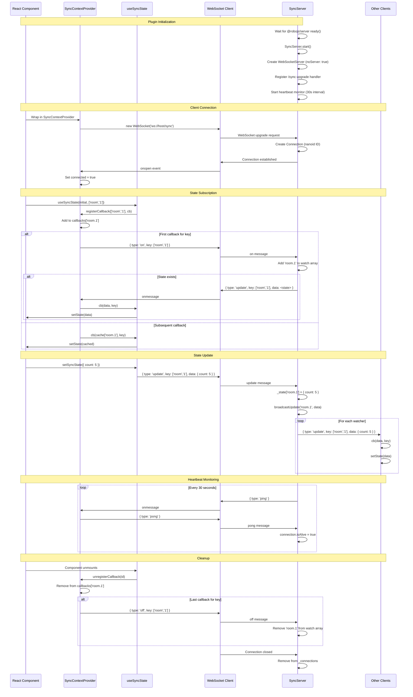

# AGENTS: @robojs/sync

This document equips AI coding agents working in this repository with everything needed to understand, extend, and safely modify the `@robojs/sync` plugin. It captures architecture, invariants, hidden gotchas, performance traits, and file‑level references so agents can act with confidence without re‑deriving design from code.

Scope: Applies to the entire `packages/plugin-sync` directory and any code that integrates with it. Follow the repo‑root AGENTS.md rules in addition to this file.

## 1. Overview & Purpose

- Real‑time state synchronization for Robo.js using WebSockets.
- Capabilities: React hook API (`useSyncState`), automatic state broadcasting, connection heartbeat and cleanup, lightweight protocol.
- Install: `npx robo add @robojs/sync`.
- Peer dep: `@robojs/server` is REQUIRED (not optional).
- Package location: `packages/plugin-sync`.
- Use cases: multiplayer state, chat/typing indicators, collaborative cursors, live dashboards, polls.

## 2. Architecture Overview

Core components:
- `src/core/server.ts` — WebSocket server; connection + state registry; broadcast.
- `src/core/context.tsx` — React context/provider with WS setup and callback routing.
- `src/core/useSyncState.ts` — React hook API similar to `useState` with server sync.
- `src/core/types.ts` — Message protocol types.
- `src/core/utils.ts` — Key normalization to dot‑notation.
- `src/core/logger.ts` — Shared logger fork (`sync`).
- `src/events/_start.ts` — Plugin lifecycle; waits for `@robojs/server` then starts WS.
- `src/index.ts` — Public exports.

Data flow (high level):
1) Plugin starts → waits for `@robojs/server` → `SyncServer.start()`.
2) `WebSocketServer` created with `{ noServer: true }`; Node engine registers upgrade handler at `/sync`.
3) App wraps UI in `SyncContextProvider` which opens `ws(s)://{host}/sync`.
4) Components call `useSyncState(initial, keyArray)`.
5) Hook registers a callback with the context. First callback for a key sends `on` to server; subsequent ones get cached state.
6) Client `update` messages mutate server state; server broadcasts to all watchers of that key.
7) Heartbeat `ping`/`pong` every 30s; dead connections are terminated and removed.

## 3. Real‑Time WebSocket Architecture

Server‑side (`src/core/server.ts`):

- `export const SyncServer = { getSocketServer, start }` (singleton, not a class).
- Internal state:
  - `_connections: Array<{ id: string; isAlive: boolean; watch: string[]; ws: WebSocket }>`
  - `_state: Record<string, unknown>` — server cache per normalized key.
  - `_wss: WebSocketServer | undefined`.
- `start()`:
  - Creates `WebSocketServer({ noServer: true })`.
  - `setInterval(monitorConnections, 30_000)` — heartbeat monitor.
  - Registers `'connection'` → `handleConnection`.
  - `getServerEngine<NodeEngine>().registerWebsocket('/sync', handler)`; handler calls `wss.handleUpgrade(...); wss.emit('connection', ws, req)`.
- `getSocketServer()` returns underlying `WebSocketServer` (may be `undefined` if not started).
- Message handling (`handleMessage`): parses `MessagePayload`, validates, normalizes key via `normalizeKey`, then handles:
  - `pong` → mark connection alive.
  - `get` → send one‑shot `update` for current state.
  - `on` → add key to `watch`; if server has state, send `update` immediately.
  - `off` → remove key from `watch`.
  - `update` → set `_state[cleanKey] = data` then `broadcastUpdate(cleanKey, data, key)`.
- Broadcasting (`broadcastUpdate`) iterates connections with `watch.includes(cleanKey)` and sends `{ type: 'update', key, data }`.
- Monitoring (`monitorConnections`) pings each connection; if `isAlive` was false on the previous round, terminates and removes it.

Client‑side (`src/core/context.tsx`):

- `SyncContext` exposes `{ cache, connected, registerCallback, unregisterCallback, ws }`.
- `SyncContextProvider({ children, loadingScreen? })` renders `loadingScreen` until `connected===true` AND `ws` exists.
- `setupSyncState()` (invoked once by provider):
  - Establishes WS to `ws(s)://{location.host}/sync`.
  - Handles `onopen`/`onclose`/`onerror`/`onmessage`.
  - On `update`, normalizes the key, invokes callbacks for that key, then updates `cache[cleanKey]`.
  - `registerCallback(key, cb)` returns an id; first callback per key sends `{ type:'on', key }`; otherwise calls `cb(cache[cleanKey])` immediately.
  - `unregisterCallback(id)` removes mapping; if last callback for the key, sends `{ type:'off', key }`.

Hook (`src/core/useSyncState.ts`):

- `useSyncState<T>(initial, keyArray)` returns `[state, setSyncState]`.
- `setSyncState(partialOrUpdater)` sends `{ type:'update', key, data }` when connected; otherwise queues update until connected.
- On connection established, registers a callback that sets local `state` on updates and cleans up on unmount.
- Known bug: comparison uses `key.join('.') === key.join('.')` (always `true`), so callbacks don’t filter by payload key; treat as broadcast for all keys until fixed.

## 4. Message Protocol (`src/core/types.ts`)

```ts
interface MessagePayload<T = unknown | undefined> {
  data: T
  key?: string[]
  type: 'get' | 'off' | 'on' | 'ping' | 'pong' | 'update'
}
```

Types:
- `ping` (server → client); client responds `pong`.
- `pong` (client → server) marks connection alive.
- `get` one‑shot fetch; server replies with `update` but doesn’t subscribe.
- `on` subscribe to `key`; server replies with current `update` if available.
- `off` unsubscribe from `key`.
- `update` bidirectional state update (client→server; server→clients/watcher broadcast).

## 5. Key Normalization (`src/core/utils.ts`)

- `normalizeKey(key: string | (string | null)[] | undefined): string`
- Arrays become dot‑notation: `['channel','123']` → `'channel.123'`.
- Strings pass through; `undefined` coerces via `String(undefined)` when used.

## 6. SyncContextProvider Usage

```tsx
import { SyncContextProvider } from '@robojs/sync'

export function App() {
  return (
    <SyncContextProvider loadingScreen={<Loading />}> {/* blocks until connected && ws */}
      <Activity />
    </SyncContextProvider>
  )
}
```

Behavior:
- Shows `loadingScreen` when provided and either `connected` is `false` or `ws` is `null`.
- Context value is stable after first run (internal guard prevents multiple WS setups).

## 7. `useSyncState` API (`src/core/useSyncState.ts`)

Signature:

```ts
function useSyncState<T>(initialState: T, key: (string | null)[]): readonly [
  T,
  (newState: Partial<T> | ((prev: T) => T)) => void
]
```

- `key` is a dependency array that scopes the state. Components using the same normalized key share the same synchronized state.
- `setSyncState` accepts a partial object or an updater function; when offline, updates are queued and flushed upon reconnection.

Examples:

```ts
// Shared state per channel
const [messages, setMessages] = useSyncState<string[]>([], ['chat', channelId, 'messages'])

// Per-user position in a room
const [pos, setPos] = useSyncState({ x: 0, y: 0 }, ['room', roomId, 'cursor', userId])

// Global counter
const [count, setCount] = useSyncState(0, ['global', 'counter'])
```

## 8. Server Integration with `@robojs/server`

- Required peer dependency; plugin waits for server readiness in `src/events/_start.ts`:
  - `import { ready } from '@robojs/server'`
  - `await ready()` then `SyncServer.start()`.
- Node engine integration (`getServerEngine<NodeEngine>()`): registers the WebSocket upgrade handler at path `/sync`.
- Server can also be started manually:

```ts
import { SyncServer } from '@robojs/sync/server.js'
SyncServer.start()
const wss = SyncServer.getSocketServer()
```

## 9. Connection Lifecycle

1) Client connects → server creates `Connection { id: nanoid(), isAlive: true, watch: [], ws }`.
2) Client registers callbacks; first registration per key triggers `{ type:'on' }`.
3) Server optionally replies with current state via `{ type:'update' }`.
4) Client updates send `{ type:'update' }` to server, which updates cache and broadcasts to watchers.
5) Heartbeat loop pings every 30s; missing `pong` marks connection dead on next round and it is terminated.
6) `'close'` removes connection from `_connections`.

## 10. Performance Characteristics

- Heartbeat interval: 30 seconds.
- Broadcast: immediate, per‑key; no batching.
- Memory: O(n) connections; O(k) keys; O(n×w) watch entries.
- CPU: JSON parse/stringify + O(n) broadcast per update.
- Scaling: single server instance; no clustering; no persistence.

Optimization tips:
- Use specific keys rather than global keys.
- Limit high‑frequency updates; batch on client where possible.

### Use Cases

- Multiplayer positions
  - Key: `['room', roomId, 'players', userId, 'pos']`
  - State: `{ x: number, y: number }`

- Chat messages per channel
  - Key: `['chat', channelId, 'messages']`
  - State: `string[]` or `{ id: string; userId: string; text: string; ts: number }[]`

- Collaborative cursors
  - Key: `['doc', docId, 'cursor', userId]`
  - State: `{ x: number, y: number, color?: string }`

- Live dashboards/metrics
  - Key: `['dashboard', guildId, 'stats']`
  - State: `{ online: number; cpu: number; mem: number; errors: number }`

- Polls/voting
  - Key: `['poll', pollId, 'votes']`
  - State: `Record<string /* optionId */, number /* count */>`

## 11. Hidden Gotchas & Edge Cases

1) `@robojs/server` is required; without it, `_start.ts` can’t register the WS path.
2) WebSocket path is hardcoded to `/sync` (both server and client).
3) No reconnection logic; refresh to reconnect.
4) Offline updates are queued only in memory; lost on refresh.
5) First callback sends `on`; later callbacks get cached state immediately.
6) Last callback sends `off`; server state persists after unwatch (no GC of `_state`).
7) Key normalization: dots in key parts can collide (`['a.b']` vs `['a','b']`).
8) Heartbeat may false‑positive with long pauses; window is 30–60s to detect.
9) No authentication; any client can connect and send updates.
10) No rate limiting; high‑frequency updates can overwhelm clients.
11) No ordering/ack; packets can be lost; last write wins.
12) Watch array has no deduplication; repeated `on` can add duplicates.
13) Known bug in `useSyncState`: callback filter compares the same `key` variable to itself; treat as broadcast for all keys until fixed.

14) Dead connection cleanup (splice indices): when removing multiple indices from `_connections`, splicing in ascending order can shift indices. Recommend iterating indices in descending order or filtering the array when this behavior is modified in code.

## 12. Logging Standards

- Single shared logger fork for the plugin lives in `src/core/logger.ts`:

```ts
import { logger as defaultLogger } from 'robo.js'
export const syncLogger = defaultLogger.fork('sync')
```

- All files in this plugin import and use `syncLogger`. Do not create additional forks (e.g., `logger.fork('sync:sub')`).

## 13. File Structure Reference

- `src/index.ts` — public exports (`MessagePayload`, `SyncContextProvider`, `useSyncState`).
- `src/core/server.ts` — `SyncServer` implementation (state, connections, WS start/upgrade, broadcast).
- `src/core/context.tsx` — `SyncContext`, provider, and client WS logic.
- `src/core/useSyncState.ts` — synchronized hook API.
- `src/core/types.ts` — protocol types.
- `src/core/utils.ts` — `normalizeKey` helper.
- `src/core/logger.ts` — logger fork (`sync`).
- `src/events/_start.ts` — waits for server ready, then starts WS server.

## 14. Comparison with Colyseus

When to use `@robojs/sync`:
- Simple real‑time sync with minimal server logic.
- Prototypes, game jams, hackathons, quick proofs of concept.
- Small apps and activities where best‑effort delivery and last‑write‑wins are acceptable.

When to prefer Colyseus:
- Rooms/lobbies, authoritative server state, and schema‑based state.
- Matchmaking, reconnection, presence, and message ordering/acknowledgements.
- Persistence, scaling across processes, and clustering.
- Complex multiplayer games needing deterministic server logic and latency compensation.

Links:
- Colyseus: https://colyseus.io/
- Colyseus template in this repo: ../../templates/discord-activities/react-colyseus-ts

Migration path from `@robojs/sync` to Colyseus (brief):
- Model your current sync keys and state shape as a Colyseus `Room` schema.
- Replace client `useSyncState` usage with Colyseus client state subscriptions (e.g., `room.onStateChange`).
- Move update logic from client‑driven `update` messages to authoritative room handlers on the server.
- Run both side‑by‑side during transition: keep `@robojs/sync` for legacy consumers while new clients join a Colyseus room.
- Decommission `@robojs/sync` keys once all clients read/write via Colyseus.

## 14. Mermaid: End‑to‑End Flow



## 15. CRITICAL: Self‑Update Reminder for AI Coding Agents

When modifying `@robojs/sync`, you MUST update this file to reflect your changes.

Update triggers:
- Protocol: new message types, payload changes, or validation rules.
- Client WS: connection lifecycle, reconnection, queuing semantics.
- Server WS: broadcast rules, connection monitoring, key handling, persistence.
- API: `useSyncState` signature/behavior; `SyncContextProvider` props/behavior; `SyncServer` methods.
- Integration: `@robojs/server` engine path/registration; lifecycle timing.
- Performance: heartbeat interval, caching strategy, batching.
- Bugs/Edge cases: callback filtering, deduplication, cleanup, auth.
- New features: authentication, persistence, rate limiting, clustering, configurable path.

Verification checklist:
- [ ] Signatures/return types updated
- [ ] New protocol types documented
- [ ] Hidden gotchas updated
- [ ] Performance characteristics current
- [ ] File references and paths correct
- [ ] Integration points accurate
- [ ] Breaking changes and migration notes added
- [ ] Examples align with behavior

This is a living document; keep it current so humans and AI agents can maintain high velocity without regressions.
